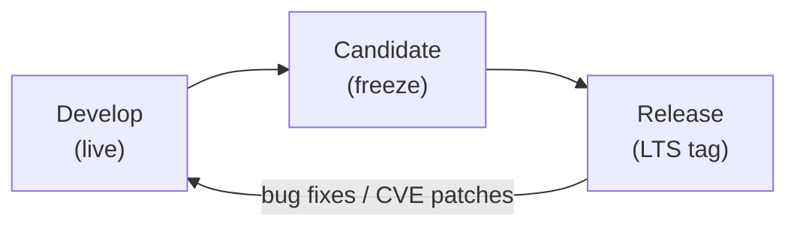
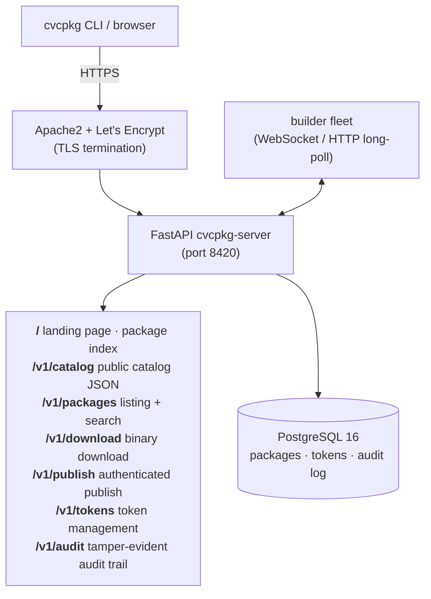
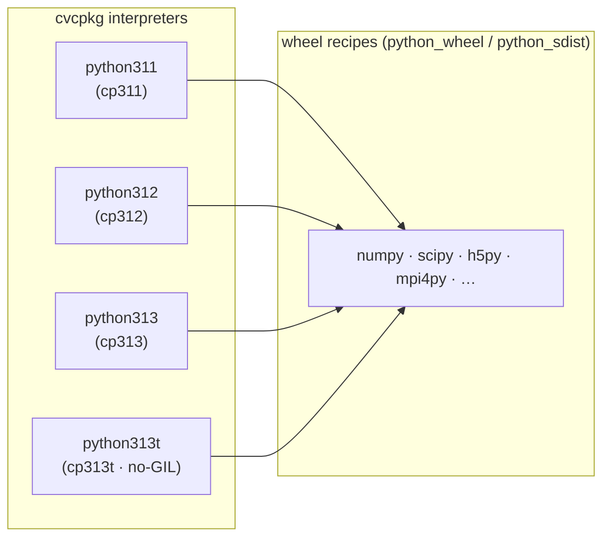
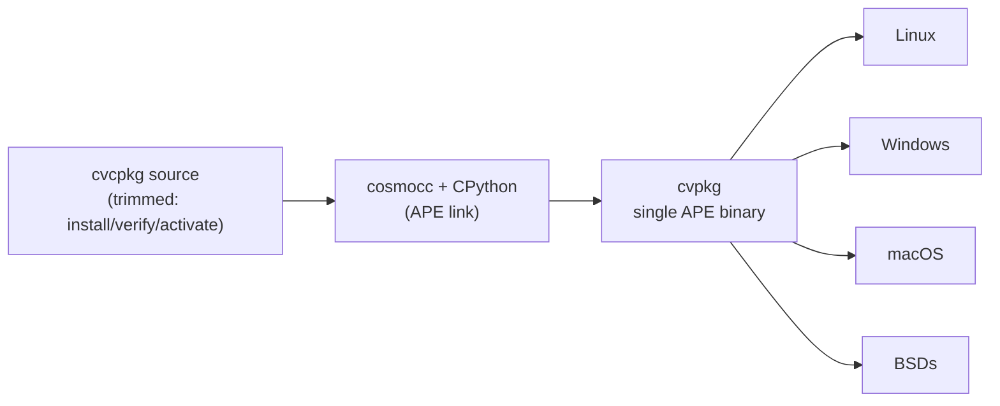

# cvcpkg Roadmap

> A cross-platform, language-agnostic binary package archive
> for the scientific computing community.

*Last updated: 2026-07-18*

---

## Project Rename — `libcvc-deps` → `cvcpkg`

The project is being renamed to **`cvcpkg`** in its entirety; the
`libcvc-deps` name is being dropped.  `cvcpkg` — the CLI, the server, the
recipe archive, and the PyPI distribution — becomes the single name for the
project going forward.

- The Python distribution is already published as **`cvcpkg`** (not
  `libcvc-deps`).
- The GitHub repository will be renamed **`transfix/libcvc-deps` →
  `transfix/cvcpkg`** *before* the first PyPI publish (see Phase 1.5).
- Backward compatibility is retained where downstream consumers depend on
  the old name — e.g. the `libcvc-depsConfig.cmake` compatibility wrapper
  stays so existing `find_package(libcvc-deps)` calls keep working.

> **Release ordering:** the PyPI publish is the **final phase of the entire
> roadmap** (Phase 20), not an early milestone.  It happens only after the
> rename (project + repo), the trusted publisher is configured, and **every
> other roadmap phase — including the pre-release hardening phases 12–14 and
> the v2.0.0 product phases 15–19 — is closed**.  Publishing to PyPI claims a
> name and makes a community-facing commitment, so it is deliberately last.

---

## Vision

cvcpkg exists because existing package management systems have failed the
scientific computing community in one or more critical ways: they are bound to
a single language, locked to one operating system, overcomplicated, unreliable,
or unable to guarantee reproducible builds across platforms.

**cvcpkg is different.**  It is:

- **Language-agnostic** — packages are pre-built binaries (C, C++, Fortran,
  and eventually any compiled language).  There is no requirement to adopt a
  particular build system, runtime, or language ecosystem.
- **OS-agnostic** — first-class support for Linux, macOS, and Windows.
  Recipes declare platform-specific build logic; the archive serves every
  variant from a single namespace.
- **Simple but robust** — a single CLI (`cvcpkg`) handles building, publishing,
  installing, and verifying packages.  The server is a lightweight FastAPI
  application backed by PostgreSQL.
- **Reproducible** — each cvcpkg *release* pins a curated snapshot of recipes
  at known-good versions, giving downstream projects a stable foundation.
- **Community-extensible** — anyone can contribute recipes via pull request or
  publish packages to the archive through the authenticated API.

---

## Release Model

### Long-Term Support (LTS) Releases

Each **cvcpkg release** (e.g. v1.3.0, v2.0.0) is a curated, tested set of
recipes and the pre-built binary packages they produce.  A release is treated
as an LTS snapshot:

| Property | Description |
|---|---|
| **Recipe lockdown** | All recipes in the release are pinned to specific versions with verified SHA-256 checksums. |
| **Cross-platform matrix** | Every recipe is built and tested on Linux (x86_64), macOS (x86_64, arm64), and Windows (x64). |
| **Stability guarantee** | Packages in a release are immutable — once published, they do not change.  Broken packages are *yanked*, not updated in place. |
| **Downstream reproducibility** | Projects depending on a cvcpkg release can rebuild at any time and get identical binary artifacts. |
| **Security patching** | Critical CVEs can trigger a point release (e.g. v1.3.1) that replaces only the affected package while keeping everything else identical. |

### Live Recipes

Between releases, **updated and new recipes are available live** in the
repository and on the archive server.  This allows:

- Recipe authors to iterate on build scripts before a release freeze.
- Community contributors to submit new recipes that are not yet part of an
  official release.
- Downstream users to opt in to bleeding-edge packages by explicitly
  requesting them (e.g. `cvcpkg install boost@live`).

When the next release is being hardened, live recipes that meet quality
standards are promoted into the release manifest.

### Release Workflow



1. **Development phase** — recipes land on `main`, are built by CI, and
   published to the archive as live packages.
2. **Candidate phase** — a release branch is cut, only bug fixes are merged,
   full cross-platform CI matrix runs, community testing is solicited.
3. **Release** — the branch is tagged, all packages are signed, the release
   manifest is published.  The `prod` branch is updated and the production
   server deploys automatically.

---

## Architecture

### Current (v2.0.0)



### Deployment

- **Primary:** cvcpkg.org
- **Mirror:** pkg.tx.wtf (read-only mirror with hourly catalog sync)
- **Containerization:** Docker Compose (postgres + backend)
- **CI/CD:** GitHub Actions → `prod` branch push → self-hosted runner →
  auto-deploy script → zero-downtime restart
- **TLS:** Let's Encrypt via certbot, auto-renewal
- **Builders:** 13+ builder agents across 7 platforms:
  - Linux x86_64: 4× self-hosted (also wasm/wasi/cosmo cross-builders)
  - FreeBSD x86_64: 2× Incus VMs
  - NetBSD x86_64: 2× Incus VMs
  - OpenBSD x86_64: 2× Incus VMs
  - Windows x86_64: 2× self-hosted (+ a WSL2 windows-cross builder)
  - macOS (x86_64 + arm64): GitHub-hosted runners via workflow_dispatch

---

## Roadmap Phases

### Status Snapshot (2026-07-18)

| Phase | Title | Status |
|---|---|---|
| 1 | Foundation | ✅ Complete (v2.0.0) |
| 1.5 | Release Engineering Readiness | ✅ Complete — the *engineering* prerequisites for a wheel release (build backend, recipe bundling, wheel smoke, admin CLI, testing, CMake, docs). The actual publish is the **final phase**, not here. |
| 2 | Analytics & Telemetry | ✅ Complete — download analytics, bandwidth, platform/version distribution, and opt-in client telemetry all shipped (server + client + dashboard) |
| 3 | Admin Dashboard | ✅ Complete — `/admin` overview, packages, tokens, audit, releases, health (release *creation* workflow is the one follow-up) |
| 4 | Multi-Language & Ecosystem | ⬜ Future |
| 5 | Federation & Scaling | 🔶 Partially Done — cluster roles (primary/mirror/edge), pull-only populate, and public-vs-org namespace invariants landed (2026-07); CDN/sharding/replicas still future |
| 6 | Community & Governance | 🔶 Partially Done — org namespaces + private-visibility isolation shipped |
| 7 | Python Ecosystem (hermetic wheels, no-GIL) | 🔶 Partially Done — `python_wheel`/`python_sdist` source types, the `python:` block, the GIL-disabled test harness, and the first full matrix (`numpy` × cp311/cp312/cp313/cp313t) landed; more wheels + CUDA-math recipes + manifest freeze remain |
| 8 | Self-Hosting & Universal Bootstrap (`cvpkg`) | ⬜ Planned — `mingw-w64` toolchain recipe is the first concrete step (landed 2026-07) |
| 9 | Fleet & Platform Expansion (GhostBSD/DragonflyBSD, qemu) | 🔶 In Progress — DragonflyBSD platform + provisioning underway in a parallel track |
| 10 | Peer Providers & Hardware-Aware Concretization | ⬜ Planned |
| 11 | Self-Hosting Toolchains (extends Phase 8) | ⬜ Proposed |
| 12 | Federation Hardening — Selective Mirroring & Authoritative Resolution | ✅ Complete — mirror allow/deny policy, size budget with usage-based eviction, and top-down root-authoritative resolution |
| 13 | Identity & Access — OIDC / External Providers | ✅ Complete — OIDC login for the admin dashboard (code flow + PKCE, claim→role mapping); HMAC tokens remain for machines |
| 14 | Source Recipes — File-Artifact Packages | ✅ Complete — `platform: any` file artifacts consumed by downstream platform recipes, canonized by an end-to-end test |
| 15 | CLI UX & the Recipe-First Workflow | ⬜ Planned — deprecate `cvc-requirements.yaml`, `~/.cvcpkg/` defaults (settings/recipes/build/install/cache), install-prefix registry (`~/.cvcpkg/local.db`) with aliases + delete/inspect/modify, recipe generation from existing projects, clean/activate commands, terminal graphics, offline source cache |
| 16 | Prefix Provenance & Server Seeding | ⬜ Planned — install prefixes carry catalog info + recipes in `share/cvcpkg/` so a prefix can seed a cvcpkg-server; org/private status explicit with warnings |
| 17 | Recipe Archives — Declared Artifacts & Package-Page UX | ⬜ Planned — schema-declared recipe artifacts, full recipe directories on the server, downloadable recipe archives, collapsible artifact viewer, package-list layout rework |
| 18 | Server Backups & Restore | ⬜ Planned — first-class recipe/package backup + restore commands, admin-managed scheduled backup jobs to the storage backends |
| 19 | Application Packaging & Desktop Delivery | ⬜ Planned — recipe entry points, desktop assets, exe/MSI + AppImage + dmg installer commands from a prefix |
| 20 | **PyPI Release** | ⬜ **Final phase** — the project/repo rename, trusted-publisher config, and the gated publish. Deliberately last: `pip install cvcpkg` ships only after the roadmap is otherwise complete. |

**Road to PyPI (`pip install cvcpkg`):** the PyPI publish is the **last phase of the
roadmap** (Phase 20), not an early step.  The *engineering* readiness for it (Phase 1.5)
is done, but the release itself happens only after the remaining phases — including the
pre-release hardening phases (12–14) and the v2.0.0 product phases (15–19) — are
closed.  This is a deliberate correction: publishing to PyPI is a one-way,
name-claiming, community-facing commitment, so it comes at the very end.

### Phase 1 — Foundation

**Status: Complete (v2.0.0)**

- [x] Recipe-based build system with 99 component recipes
- [x] `cvcpkg` CLI (build, install, publish, verify, validate)
- [x] FastAPI server with PostgreSQL backend + Alembic migrations
- [x] HMAC-SHA256 token authentication with role-based access
- [x] Chained-hash tamper-evident audit trail
- [x] Ed25519 package signing
- [x] Docker production deployment (cvcpkg.org + pkg.tx.wtf mirror)
- [x] Apache2/Let's Encrypt TLS on cvcpkg.org
- [x] Landing page with package index, search, sorting, and org scoping
- [x] CI/CD deploy pipeline (prod branch → auto-deploy to both hosts)
- [x] Self-hosted GitHub runners (catx-03, star-00, star-01, lat, rebota)
- [x] 13 builder agents across Linux, FreeBSD, NetBSD, OpenBSD, Windows, macOS
- [x] Cross-platform CI build matrix (Linux, macOS, Windows, 3 BSDs)
- [x] 650+ published packages on cvcpkg.org
- [x] Organization namespaces with member management
- [x] Remote builder orchestration (submit-dag, follow-dag, monitor)
- [x] `cvcpkg install --from cvc-requirements.yaml` workflow
- [x] Activation scripts (bash, zsh, fish, PowerShell) setting CMAKE_PREFIX_PATH
- [x] CMake integration (cvcpkgConfig.cmake, libcvc-deps compat, toolchain file)
- [x] cvcpkg promoted to repo root (pyproject.toml at root)
- [x] Cosmopolitan (cosmo) cross-compilation platform support
- [x] WASM/WASI build platform support
- [x] GTK4 dependency stack (pixman → cairo → pango → gdk-pixbuf → gtk4)
- [x] Recipe validation (JSON schema, dependency graph, CI checks)
- [x] Source-fallback builds (build from source when no binary available)
- [x] Build caching (server-cache for CI and builders)
- [x] Mirror protocol (pkg.tx.wtf mirrors cvcpkg.org with sync loop)

### Phase 1.5 — Release Engineering Readiness

**Status: Complete**

The *engineering* prerequisites for a wheel release — everything that has to
work before a `pip install cvcpkg` is even buildable.  All of these are done
(including Windows CI integration tests and a full server-side security
hardening pass — private-data isolation, tenant scoping, tar-slip and
reflected-XSS fixes).

> **The actual PyPI publish is not here.**  It moved to **Phase 20 — PyPI
> Release**, the final phase of the roadmap.  The rename (project + repo),
> trusted-publisher configuration, and the gated publish all happen there,
> after every other phase is closed.  See the release-ordering note at the top
> of this document.

#### Packaging & Distribution (engineering — done)

- [x] pyproject.toml at repo root with poetry-core backend
- [x] `cvcpkg` and `cvcpkg-server` entry points
- [x] Recipes bundled into wheel via CI publish workflow
      (fixed: the publish workflow's bundle step now creates the target
      dir, fails loudly, and verifies the built wheel contains recipes)
- [x] Build + live-smoke the wheel on Linux/macOS/Windows via a release
      candidate tag (`cvcpkg-v2.0.0rc6`: 129 recipes bundled, all green)
- [x] Verify `cvcpkg --version` and `cvcpkg-server --version` from the
      installed wheel
- [x] Publish workflow (`cvcpkg-publish.yml`) wired for PyPI trusted
      publishing (OIDC), gated behind the `CVCPKG_PUBLISH_TO_PYPI` repo
      variable so a stable tag cannot publish until Phase 20 flips it on

#### Admin CLI Completeness

- [x] `cvcpkg token` — create, list, revoke, approve/deny requests
- [x] `cvcpkg builder` — list, status, run, unregister
- [x] `cvcpkg builds` — submit, submit-dag, list, cancel, pause, resume, follow-dag, monitor
- [x] `cvcpkg server` — stop, status
- [x] `cvcpkg org` — members, add-member, remove-member
- [x] `cvcpkg recipe` — push (sync recipes to server DB)
- [x] `cvcpkg server stats` — server resource + catalog statistics (DB backend, package/org/builder/job/audit counts, storage)
- [x] `cvcpkg server backup` — trigger a server-side database backup from CLI (sqlite/pg_dump/mysqldump)
- [x] `cvcpkg builder logs` — view recent build jobs / tail a job's log without the full monitor
- [x] `cvcpkg doctor` — diagnose the local toolchain (Python, CMake, Ninja, compiler, git) and server reachability

#### Testing & Quality

- [x] 927 unit tests passing
- [x] 16 integration test modules (server, browser UI, build cache, e2e lifecycle, etc.)
- [x] Integration tests for cvc-requirements.yaml install workflow
- [x] Integration tests for dummy recipe build lifecycle
- [x] CMake integration tests (configure, install, downstream find_package)
- [x] E2E live test (Docker Compose + real server + builder + compile consumer)
- [x] Recipe validation via JSON schema in CI
- [x] Source-fallback integration tests (Linux, macOS)
- [x] Windows CI integration tests (the full non-Docker integration suite
      runs on windows-latest in the CI test matrix; server/Docker-bound
      modules auto-skip via conftest, bash-only modules skip on win32)
- [x] Automated upgrade/migration test (v1.x → v2.0.0)
      (migration-chain integrity + legacy-lockfile read; live PostgreSQL migration runs in the Docker job)
- [x] Performance benchmarks for install/resolve with large catalogs (resolver regression guard on a 400-component chain)

#### CMake Integration

- [x] `cvcpkgConfig.cmake` — sets CMAKE_PREFIX_PATH + PKG_CONFIG_PATH
- [x] `libcvc-depsConfig.cmake` — backward-compat wrapper
- [x] `cvcpkg-toolchain.cmake` — for `-DCMAKE_TOOLCHAIN_FILE=` usage
- [x] Activation scripts set CMAKE_PREFIX_PATH on `source activate`
- [x] Document CMake integration in README and docs/ (docs/cmake-integration.md)
- [x] `cvcpkg install` writes cvcpkgConfig.cmake into the prefix automatically
      (also a libcvc-deps compat config + version files)

#### Documentation

- [x] README.md (quick start, install, build, publish)
- [x] docs/api-reference.md
- [x] docs/ci-cd-pipeline.md
- [x] docs/deployment-guide.md
- [x] docs/organizations.md
- [x] docs/cmake-integration.md — CMake usage guide for downstream projects
- [x] docs/recipe-authoring.md — how to create new recipes
- [x] docs/pypi-install.md — pip install guide and extras reference
- [x] CHANGELOG.md — release notes for v2.0.0

#### Gap Analysis

The following items were identified as potential gaps before the PyPI
release.  These are the gaps to close **before** the final publish step.

1. ~~**No CHANGELOG.md**~~ — ✅ Done.  `CHANGELOG.md` carries a full
   v2.0.0 entry: the rename note, the release-readiness tool changes
   (doctor, init, upgrade, admin CLI, signature enforcement), the
   recipe-bundling and NullPool fixes, and the postgresql recipes.
2. ~~**No `cvcpkg doctor` command**~~ — ✅ Done.  `cvcpkg doctor` checks
   Python, pip, CMake, Ninja, a C/C++ compiler, git, and (optionally)
   server reachability.
3. ~~**No `cvcpkg init` command**~~ — ✅ `cvcpkg init <name>` scaffolds a
   schema-valid recipe (recipe.yaml + build scripts) for cmake, meson, or
   autotools.
4. ~~**No `cvcpkg upgrade` command**~~ — ✅ `cvcpkg upgrade [components]`
   checks the catalog for newer versions of the installed components and
   re-installs just those, updating the lockfile (`--dry-run` previews).
5. ~~**No offline mode documentation**~~ — ✅ documented in
   docs/pypi-install.md (local catalog + `--local` source builds + cache).
6. **Recipe test coverage** — building and testing every recipe on all
   platforms is builder-fleet work.  `scripts/recipe_coverage.py` now
   reports declared build-matrix coverage per platform and can gate CI
   (`--require linux,macos,windows`); the actual cross-platform builds
   remain a fleet task.
7. ~~**Signature verification not enforced**~~ — ✅ `cvcpkg install
   --require-signatures` now fails on any unsigned or invalidly-signed
   package; `--verify-signatures` verifies when a signature is present.
   (Making enforcement the default remains a future policy decision.)
8. ~~**No dependency version constraints**~~ — ✅ dependencies carry
   version ranges (e.g. `^3.0`, `==1.3.0`) in the recipe/catalog, and the
   resolver enforces them — user + transitive constraints, with
   intersection and conflict rejection (see test_resolver.py).

### Phase 2 — Analytics & Telemetry

**Status: Complete (2026-07)**

Package administrators need visibility into how the archive is being used
to make informed decisions about resource allocation, deprecation, and
support priorities.

**Shipped:**

- [x] `download_events` extended with `arch`, salted `client_ip_hash`,
      `user_agent`, `cvcpkg_version`, `bytes_sent` (migration 013); the
      `/v1/download` endpoint records all of them.
- [x] Admin analytics API: `GET /v1/analytics/downloads` (totals + top
      packages), `/bandwidth` (daily byte series), `/platforms`
      (platform/arch + client-version mix), `/trends` (daily counts).
- [x] Opt-in client telemetry: `cvcpkg telemetry status|send`, the
      `CVCPKG_TELEMETRY=1` post-install ping, `telemetry_events`
      (migration 014), public `POST /v1/telemetry`, admin
      `GET /v1/analytics/telemetry`.  Anonymous by construction; the
      client sends a `cvcpkg/<version>` User-Agent so downloads attribute
      to a client version.
- [x] Displayed on the admin dashboard (Phase 3).

**Deferred:** geo-IP bucketing (needs a GeoIP data source decision) and
install success/failure telemetry.  The privacy model below is implemented
(salted IP hashes; telemetry stores nothing derived from the connection).

#### Download Analytics

- **Per-package download counts** — total, last 7/30/90 days, all time.
- **Per-version breakdown** — which versions are actively consumed vs. stale.
- **Platform distribution** — what fraction of downloads are Linux vs. macOS
  vs. Windows.  This drives build priority decisions.
- **Geographic distribution** — coarse geo-IP bucketing (continent/country)
  for CDN planning.
- **Temporal patterns** — download trends over time, spike detection.

#### Bandwidth Accounting

- **Per-package bandwidth** — total bytes served per package, per version.
- **Aggregate bandwidth** — daily/weekly/monthly totals for capacity planning.
- **Top consumers** — identify heavy-usage patterns (CI farm vs. individual
  developer downloads).

#### Client Telemetry (Opt-In)

- **Client version distribution** — track cvcpkg CLI versions in the wild to
  inform deprecation timelines.
- **Build environment fingerprints** — OS, architecture, compiler, CMake
  version — anonymized and aggregated.  Helps recipe authors understand the
  environments their packages actually run on.
- **Install success/failure rates** — per-package, per-platform.  Surfaces
  broken recipes quickly.
- **Resolution time** — how long dependency resolution takes as the catalog
  grows.

#### Implementation Plan

1. Add a `download_events` table: `(id, package_id, timestamp, client_ip_hash,
   user_agent, platform, arch, cvcpkg_version, bytes_sent)`.
2. Record download events in the `/v1/download` endpoint asynchronously
   (non-blocking to the download itself).
3. Add admin API endpoints:
   - `GET /v1/analytics/downloads` — filterable download counts
   - `GET /v1/analytics/bandwidth` — bandwidth usage summaries
   - `GET /v1/analytics/platforms` — platform distribution
   - `GET /v1/analytics/trends` — time-series data
4. Display analytics on the landing page and admin dashboard.
5. Client-side telemetry: add an opt-in `cvcpkg telemetry` command that sends
   anonymized build environment data on install.  Controlled by
   `CVCPKG_TELEMETRY=1` env var.  Off by default — never phone home without
   explicit consent.

#### Privacy

- IP addresses are salted-hashed, never stored in plain text.
- Client telemetry is strictly opt-in.
- No personal data is collected — only technical environment metadata.
- All analytics are aggregate; no individual user tracking.

### Phase 3 — Admin Dashboard

**Status: Complete (2026-07)**

A web-based administration interface at `/admin` for managing the cvcpkg
archive without CLI access.

**Shipped** — server-rendered (Bulma, no SPA), admin-token → HMAC-signed
session cookie (HttpOnly, `/admin`-scoped), every mutation audit-logged,
zero admin credentials in browser JS:

- [x] **Overview** — stat cards + downloads sparkline + top packages +
      platform/client/telemetry mixes (delivers Phase 2's "display
      analytics" item).
- [x] **Packages** — filterable variant list (yanked included); per-variant
      yank / unyank / delete.
- [x] **Tokens** — list, create (raw token shown once), revoke.
- [x] **Audit** — latest entries newest-first + one-click tamper-evident
      chain verification.
- [x] **Health** — uptime, DB backend, archive storage, counts, and a live
      builder-fleet table.
- [x] **Releases** — release-tag list with per-tag variant view.

**One follow-up:** release *creation / promotion* (freezing live recipes
into an LTS manifest) needs a freeze-process design and is tracked
separately; the release *view* is shipped.

#### Features

- **Package management** — browse, search, yank, unyank, delete packages.
  Inspect signatures, checksums, download counts.
- **Token management** — create, revoke, list API tokens.  View token
  usage history.
- **Audit trail viewer** — search and filter the tamper-evident audit log.
  Verify chain integrity from the UI.
- **Analytics dashboard** — real-time charts: download trends, platform
  distribution, bandwidth usage, top packages, geographic distribution.
- **Release management** — create and manage LTS releases.  Promote live
  recipes into release manifests.  Trigger cross-platform CI builds.
- **Health monitoring** — server uptime, database stats, disk usage,
  certificate expiry.
- **User/org management** (future) — manage publisher accounts, organization
  namespaces, permission scopes.  **Delivered by Phase 13 (Identity & Access —
  OIDC):** rather than build local account management, user registration /
  login / permissions come from an external OIDC identity provider.

#### Technical Approach

- Server-side rendered HTML with lightweight JS (htmx or Alpine.js) — no
  heavy SPA framework.  Keeps the deployment simple.
- Admin routes protected by admin-role token auth (cookie-based session after
  initial token login).
- Built into the existing FastAPI application as a sub-router — no separate
  service to deploy.

### Phase 4 — Multi-Language & Ecosystem Expansion

**Status: Future**

cvcpkg currently focuses on C/C++ libraries, but the architecture is
deliberately language-agnostic.  Future expansion:

#### Language Support

- **Fortran** — scientific computing staple, many legacy codebases.
- **Rust** — pre-built native libraries with C-compatible ABI.
- **Python C extensions** — pre-compiled wheels for scientific packages that
  are notoriously hard to build (BLAS, LAPACK, HDF5 bindings).
- **Julia artifacts** — native library packages for Julia's Pkg system.

#### Recipe Ecosystem

- **Recipe templates** — `cvcpkg init` generates a recipe from a template
  (CMake, Meson, Autotools, custom).
- **Recipe validation** — `cvcpkg lint` checks recipes for common errors,
  missing fields, insecure patterns.
- **Dependency resolution** — recipes declare build-time and runtime
  dependencies on other cvcpkg packages.  The resolver computes a dependency
  graph and builds packages in the correct order.
- **Build caching** — cache intermediate build artifacts (object files, CMake
  configs) to speed up CI builds.

#### Interoperability

- **CMake `find_package` integration** — `cvcpkg install` generates
  `cvcpkgConfig.cmake` so downstream CMake projects can
  `find_package(cvcpkg)` and then `find_package(Boost)` transparently.
  *(Partially done — config files exist, auto-install into prefix pending.)*
- **pkg-config support** — generate `.pc` files for each installed package.
  *(Partially done — toolchain sets PKG_CONFIG_PATH, recipes generate .pc files.)*
- **Spack compatibility layer** — import/export recipes from Spack specs.
- **Conan compatibility layer** — consume Conan recipes as cvcpkg recipes.
- **vcpkg manifest mode** — read `vcpkg.json` and resolve packages from the
  cvcpkg archive.
- **cpkg integration** ([getcpkg.net](https://getcpkg.net/)) — cpkg is a
  Lua + Ninja project/dependency tool for C/C++ (decentralized, script-driven
  builds; Windows + Linux).  Two-way friendliness with that community:
  1. a **`cpkg` recipe** so the tool itself installs from the cvcpkg archive
     (see Planned Recipes), and
  2. a **cvcpkg Lua helper for `cpkg.lua` scripts** — e.g.
     `cvcpkg.dependency("boost")` inside `add_dependency()` resolves a
     pinned, prebuilt binary from cvcpkg.org into the project prefix instead
     of re-building from source.  cpkg keeps its build scripting; cvcpkg
     supplies the full-fledged binary package manager underneath (catalog,
     signing, reproducible LTS pins, cross-platform archive).

#### Build-Prefix Hygiene (build vs runtime placement)

When building for a target that needs cross-compilation, the build-time
**host tools** (cmake, ninja, bazel/bazelisk, cross-toolchains) are a
byproduct — they must not pollute the deliverable install prefix that a
downstream project (e.g. a C# consumer) ingests.

- **Separate build prefix (done).** `cvcpkg build --build-prefix` installs the
  whole build-dependency closure into its own prefix (default `<prefix>.build`,
  a sibling of the deliverable `--prefix`); the deliverable gets only the
  runtime closure.  Passing the same path as `--prefix` disables the separation
  (legacy behaviour).  This fixes the bazel/bazelisk leak into `bin/`.
- **Placement by dependency edge (done).** `depends.build`/`depends.host_tools`
  closure → build prefix; `depends.runtime` closure → install prefix.  Neither
  `platform: any` nor "source-ness" affects placement, so an `any` runtime dep
  still ships.  Source packages stage to `<build-prefix>/src/<name>` purely by
  being build deps.  `CVC_BUILD_PREFIX` is exposed to build scripts alongside
  `CVC_DEPS_PREFIX`.  NOTE: this makes the build/runtime split load-bearing —
  mis-filed deps are now real bugs.
- **Manifest-flagged (done).** Host-tool bundles carry `bundle.host_tool: true`
  in their `manifest.yaml` (derived from a recipe's `cross_toolchain`
  declaration).  The deliverable prefix records the separation in
  `share/libcvc-deps/host-tools.yaml` (`present`, `prefix`, `tools`,
  `stripped`).
- **Strip on install (done).** On install we strip the recorded build prefix
  **unless `--keep-build-prefix` is passed** — the install command reads the
  record to know a build prefix exists and where.  `cvcpkg build` strips by
  default at the end of a build; `cvcpkg install` honours the record on
  finalize; `--keep-build-prefix` retains it (reuse a toolchain, or ship the
  staged sources).  `--host-tools-prefix`/`--keep-host-tools` remain as
  deprecated aliases.
- **Future.** Thread the same host-tools separation through
  `cvcpkg install`'s from-source fallback (`build_from_source_fallback`), so
  host tools built *during* an install are also recorded and stripped; and a
  server/requirements-level default policy for the strip.

### Phase 5 — Federation & Scaling

**Status: Partially Done** — the cluster-role model (primary / mirror /
edge-satellite), pull-only public-catalog populate, and the
public-vs-organization namespace invariants landed in 2026-07.  CDN
offload, federated multi-registry query, sharded storage, and read
replicas remain future work.

As the archive grows, a single server won't suffice.  Plan for horizontal
scaling and federation:

- **CDN integration** — serve package archives from CloudFlare R2, AWS S3,
  or similar.  The server becomes a metadata/API layer; binaries are served
  from edge locations.
- **Cluster roles & catalog authority** — three deployment roles, distinguished
  by how each treats the **public namespace** (`org_slug == ""`):
  - **Primary** (e.g. `cvcpkg.org`) — the canonical source of truth for public
    packages; accepts public publishes.
  - **Mirror** (e.g. `pkg.tx.wtf`, `--mirror-mode`) — a read-only replica of a
    primary; rejects *all* publishes.
  - **Edge / Satellite** (`CVCPKG_POPULATE_UPSTREAM` set) — a read-write cluster
    that **populates** its public catalog *from* an upstream primary while
    hosting its **own private org packages locally**. This is the enterprise /
    air-gapped deployment shape (e.g. the dev cluster, a licensed-host builder).

  Invariants (implemented 2026-07):
  - **Upstream is canonical for the public namespace.** An edge cluster only
    *imports* public packages — populate is pull-only, there is no push to
    upstream — and it **hard-rejects local publishes into the public namespace**
    (HTTP 409). Public packages can therefore never diverge from upstream. Local
    publishes must target an organization (`--org`).
  - **Org packages are a separate namespace.** The package unique key includes
    `org_slug`, so `shell/foo==1.0` and public `foo==1.0` coexist. Org packages
    are local-authoritative: private-capable, never populated from or pushed to
    upstream. The populate diff is namespace-scoped to the public catalog, so a
    private package can never shadow a public upstream one.
  - Private org packages (`is_private`) are visible only to org members; the
    chunked-upload path is org-aware so large private packages are supported.

  Still open: populate imports *missing* public variants only — syncing upstream
  *updates* (a re-published public variant, same key, new content) and
  multi-upstream fan-in are future work; the invariants above keep the public
  catalog safe in the meantime.
- **Mirror protocol** — institutions can run local read-only mirrors
  (`--mirror-mode`) that sync from a primary. Useful for pure read-only
  air-gapped caches; the read-write variant is the *edge* role above.
- **Federated registries** — multiple independent cvcpkg servers can
  cross-reference packages.  A client can query multiple registries
  with fallback.
- **Storage backends & named volumes** — let artifacts live on many
  backends at once, with recipes choosing where.

  *Already built (harden, don't rebuild):* a pluggable `StorageBackend`
  protocol (`cvcpkg/backends/`) with **9 backends** — `s3` (S3/MinIO/Garage
  via boto, honoring `CVCPKG_S3_ENDPOINT_URL`), `gcs`, `azure`, `sftp`,
  `rsync`, `rclone`, `https`, `file`, `gh-release` — dispatched **by URI
  scheme** (`cvcpkg.storage.get_backend`), with per-scheme options
  (`backends:` in config) and third-party registration via the
  `cvcpkg.storage_backends` entry point. **Reads are already multi-backend:**
  a catalog can mix `s3://…`, `https://…`, `gh-release://…` freely and each
  package downloads through its own backend. The **write** side is the gap —
  the server stores every archive under a single `storage_uri`.

  *To build — server-defined named volumes:*
  - The **cvcpkg-server config declares named volumes**, each a
    `{name, backend URI/scheme, options, tier, org scope}`. Example:
    `garage-hot` → `s3://cvcpkg@garage`, `gh-cold` → `gh-release://…`.
  - **Volumes are advertised to clients/recipes** via the API and are
    **valid only in the context of that server's domain** — a volume name is
    resolved against the server it was fetched from; the same name on another
    domain is unrelated. (Downloads still use the fully-resolved URI recorded
    in package metadata, so a moved/renamed volume never breaks existing
    installs.)
  - **Recipes (and `publish`) select a target volume by name**; the server
    writes the artifact to that volume's backend and records the resolved URI
    in the package row. Falls back to a server default volume when unset.
  - **SLA / provider tiers** — volumes carry tier metadata (hot/cold,
    durability, region, provider). Different providers can expose different
    volumes; users pick per-recipe. Opens an SLA/billing hook (a provider can
    price or gate a premium `--volume`).
  - **Hardening tasks:** wire the server publish path to write through any
    backend (not just `file://`), add publish/download round-trip tests per
    backend, validate/authorize volume selection, and migrate the server
    `storage_uri` off `file://` onto Garage (S3) — proven on the dev cluster
    first (a small Garage there), then prod (HA Garage, see the fleet-storage
    plan in vm-provisioning `docs/FLEET-STORAGE.md`).
- **Read replicas** — PostgreSQL streaming replication for read-heavy
  workloads.

### Phase 6 — Community & Governance

**Status: Partially Done**

- [x] **Organization namespaces** — `@org/package` scoping for institutional
  publishers, with member management CLI and API.
- [ ] **Package ownership model** — maintainers, co-maintainers, transfer
  process.
- **Review workflow** — community recipe PRs go through automated CI +
  manual review before being merged.
- **Quality tiers** — packages rated by test coverage, platform coverage,
  maintainer responsiveness.
- **Advisory database** — track CVEs affecting published packages, automatic
  yank + advisory notification for affected versions.
- **Documentation hosting** — render recipe README.md on the package page.

---

### Phase 7 — Python Ecosystem Integration (Hermetic Python + Native Prefixes)

**Status: Partially Done** — the `python_wheel`/`python_sdist` source types, the
`python:` block, the per-interpreter test harness (incl. the GIL-disabled
assertion), and the first full matrix (`numpy` × cp311/cp312/cp313/cp313t) have
landed.  Remaining: more wheel packages (scipy/h5py/mpi4py), the CUDA-math
prerequisite recipes, and the release-manifest freeze.

cvcpkg already ships CPython interpreters as recipes (`python311`/`312`/`313`) that install
`libpython`, the interpreter, and the stdlib into a prefix under `CVC_INSTALL_DIR`. Phase 7
closes the loop: **cvcpkg installs upstream Python wheels *into that same prefix*** so a
downstream project gets one activatable prefix carrying both the native C/C++ libraries
(`find_package`-able) *and* a complete, pinned Python environment (`import`-able) — with minimum
system dependencies. This extends cvcpkg's "any compiled language" vision to the Python packages
layered on top of those libraries, and gives the CVC science stack (volrover, MolSurf, TexMol,
F2Dock) a single reproducible **Python + native** environment.

**Two new `source.type` values (additive, schema_version 1):**

- **`python_wheel`** — stage a pinned, sha256-verified prebuilt wheel (numpy, torch, sionna,
  warp-lang, physicsnemo) via `pip install --no-deps --no-index --prefix $CVC_INSTALL_DIR` into the
  prefix interpreter's own `lib/pythonX.Y/site-packages`. The wheel analogue of the `prebuilt`
  C-source type; never re-hosted (fetched from PyPI/`download.pytorch.org` at build time).
- **`python_sdist`** — build a C-extension wheel from a pinned sdist with **build-isolation off**
  so the extension links the prefix's **cvcpkg** C libraries (h5py→cvcpkg `hdf5`, an FFTW/CUDA-
  linking extension→cvcpkg `fftw3`/`cufft`, mpi4py→cvcpkg MPI) via `depends.build` on the cvcpkg C
  recipes + `HDF5_DIR`/`CMAKE_PREFIX_PATH` env. This is the hermeticity payoff: no `apt install
  libhdf5-dev`; the extension binds cvcpkg's copy.

Recipes add a top-level **`python:`** block (`interpreter`, `abi`, `manylinux_min`,
`build_isolation`, pinned `build_requires`); a "resolve like pip from requirements.txt" mode is
**rejected** for release artifacts — every wheel/sdist is pinned by filename + sha256, transitive
Python deps are themselves cvcpkg Python recipes resolved by the existing `depends` graph.

**Hermeticity goals:** every wheel/sdist sha256-pinned and frozen in the LTS release manifest
alongside the C recipes; offline/air-gapped install via a local mirror (`--no-index`); the only
system requirement is a C toolchain + the manylinux glibc floor. Composes with Phase 1.5
(`pip install cvcpkg`): the tool is pip-installable; the tool then installs other wheels into a
target prefix. Known tension: the `torch` wheel bundles its own CUDA and will not share cvcpkg's —
ship it self-contained as `python_wheel`; reserve cvcpkg CUDA-math recipes for C++ consumers and
`python_sdist` extensions we build.

**Planned CUDA-math recipes (prerequisite for the C++/sdist side).** Prebuilt-staging recipes for
the NVIDIA redistributable math libs (download `.tar.xz`, sha256-verify, generate a relocatable
`Config.cmake`): a `cuda-cudart` base + `cufft`, `cublas`, `cusparse`, `cusolver`. Dep order
`cudart → cublas/cusparse → cusolver`; Linux-first, Windows-optional (NVIDIA ships no macOS/wasm).
Highest cross-value is `cufft` (F2Dock's FFT-correlation docking; `libcufftw` is a near drop-in for
the existing `fftw3` recipe), then `cublas`/`cusolver`/`cusparse` for volrover/MolSurf dense &
sparse solves.

#### Per-Interpreter Wheel Matrix (incl. Free-Threaded / No-GIL)

cvcpkg ships **five** CPython interpreters as recipes — `python311`,
`python312`, `python313`, and `python313t` (built with `--disable-gil`),
plus the `python3` meta-recipe.  The wheel work above is not a single
recipe per package: it is a **matrix** of wheel recipes, one per shipped
interpreter ABI, so any prefix interpreter gets a complete, pinned wheel
set built for *exactly* its ABI tag:



- [x] **`python_wheel` / `python_sdist` source types** — additive to
      `schema_version: 1`, plus the top-level `python:` block
      (`interpreter`, `abi`, `manylinux_min`, `build_isolation`,
      `build_requires`).  cvcpkg fetches and sha256-verifies the artifact
      itself instead of trusting each build script to do it, so an unpinned
      wheel is a hard error and the install runs offline (`--no-index`).
- [x] **Wheel recipes for every shipped interpreter** — each wheel package
      gets variants for cp311 / cp312 / cp313 / cp313t, resolved through the
      normal `depends` graph against the matching `python31x` recipe.
      Shipped: `numpy-cp311/cp312/cp313/cp313t`, 5 platforms pinned each.
- [x] **Free-threaded (no-GIL) wheel channel** — the `python313t` (cp313t)
      column is the flagship: every cp313t wheel is built against the
      free-threaded interpreter **and its test suite is executed with the
      GIL disabled on the builder fleet** as part of the recipe `test:`
      step.  cvcpkg can therefore deliver packages that **provably work
      without the GIL** — not "should work", but *demonstrated on every
      platform we publish for*, which general-purpose indexes cannot claim.
- [x] **Per-interpreter test harness** — `_common/python-wheel.{sh,ps1}`
      installs into and runs the check under the exact target interpreter.
      For a free-threaded ABI it asserts `Py_GIL_DISABLED` *and* that
      `sys._is_gil_enabled()` is false before running the snippet — CPython
      silently re-enables the GIL for extensions not marked
      free-threading-safe, so without that assertion the no-GIL claim would
      be unproven (`PYTHON_GIL=0`, `-X gil=0`).
- [ ] **Wheel matrix beyond numpy** — scipy, h5py (`python_sdist` against
      cvcpkg `hdf5`), mpi4py; plus the CUDA-math prerequisite recipes.
- [ ] **Release-manifest freeze** — the LTS manifest pins the full
      interpreter × wheel matrix (filenames + sha256) alongside the C
      recipes, so a release describes one reproducible Python stack per
      interpreter.

> **Interpreter coverage moves upstream.**  numpy **2.5.x dropped both
> `cp311` and `cp313t`** (its free-threaded column is now `cp314t`).  The
> matrix is pinned to **numpy 2.4.6**, the newest release still carrying all
> four ABIs cvcpkg ships.  Advancing the pin needs either a numpy covering
> every shipped interpreter or a `python314t` recipe first — the same
> tension will recur for every wheel, so the matrix tracks *our*
> interpreters, not upstream's latest.

See [docs/python-wheels.md](docs/python-wheels.md).

---

### Phase 8 — Self-Hosting & Universal Bootstrap (`cvpkg`)

**Status: Planned** — see also Phase 11, which develops the
platform-toolchain-recipe thread (the `mingw-w64` cross-toolchain recipe
landed 2026-07 as the first step).

Close the loop on distribution: cvcpkg should be installable *by* cvcpkg,
and bootstrappable on a bare machine with **zero prerequisites** — no
Python, no compiler, no package manager.

#### cvcpkg self-install recipe

- [ ] **A `cvcpkg` recipe** that installs the cvcpkg wheel into a prefix
      using cvcpkg's own Python packages: `depends` on a shipped
      interpreter (`python313` by default) plus `python_wheel` recipes for
      the runtime deps (click, httpx, PyYAML, cryptography, …).
      `cvcpkg install cvcpkg` then produces a self-contained, activatable
      prefix whose `bin/cvcpkg` runs on the prefix interpreter — fully
      hermetic, no system Python involved.
- [ ] Dogfoods the Phase 7 machinery end-to-end (interpreter recipe +
      wheel matrix + entry-point shims) and becomes the recommended
      install path for build machines.

**Dependency survey (2026-07-16).** Auditing cvcpkg's own non-optional
runtime closure against PyPI turned up two constraints that shape this work:

| dependency | shape | note |
|---|---|---|
| click, httpx, httpcore, h11, certifi, idna, anyio, sniffio, typing_extensions | pure Python (`py3-none-any`) | one `platform: any` recipe each — no matrix |
| sqlalchemy | pure Python **and** cp-tagged speedups | either column works |
| **cryptography** | **`cp311-abi3`** (26/45 wheels) | stable ABI — one wheel serves cp311+ |
| **PyYAML**, **greenlet** | cp-tagged, **no cp313t**, no abi3 | free-threaded column does not exist upstream |

1. **abi3 collapses the matrix.**  A stable-ABI wheel is version-independent,
   so `cryptography` is *one* recipe, not four.  The `python:` block accepts
   `abi: abi3` for exactly this case.
2. **cvcpkg cannot yet self-install onto `python313t`.**  PyYAML and greenlet
   publish no free-threaded wheels, and the 3.13 free-threaded build does not
   implement the stable ABI, so `cryptography`'s abi3 wheel does not cover it
   either.  The self-install recipe therefore targets **`python313`** (as
   this phase already specifies); a `python313t` self-install needs those
   dependencies built from sdist via `python_sdist` — which is the concrete
   next step, not a blocker on the default path.

   There is an irony worth stating plainly: Phase 7 lets cvcpkg *prove* numpy
   works with the GIL disabled, while cvcpkg itself cannot yet run GIL-disabled
   from wheels.  That gap is upstream's, and it is exactly the gap the
   `python_sdist` type exists to close.

#### `cvpkg` — an Actually Portable Executable bootstrap

- [ ] **APE build toolchain** — use `cosmocc` (already a cvcpkg recipe and
      cross-platform target) with CPython to compile a Python application
      into a single **Actually Portable Executable** (αcτµαlly pδrταblε
      εxεcµταblε) that runs unmodified on Linux, macOS, Windows, and the
      BSDs.
- [ ] **`cvpkg` recipe** — a trimmed cut of cvcpkg (install / verify /
      activate / doctor; no server, no builder) compiled as a completely
      self-contained APE.  One binary, every supported platform, no
      installed Python required.
- [ ] **Zero-dependency bootstrap** — publish the APE on cvcpkg.org so a
      bare machine can go from nothing to a working build environment:

      ```
      curl -LO https://cvcpkg.org/cvpkg && chmod +x cvpkg
      ./cvpkg install --prefix ./deps boost hdf5 fftw3
      ```

- [ ] **Fleet smoke test** — CI builds the APE via the cosmocc recipe
      infrastructure and executes it on every builder platform in the
      fleet (linux, windows, macos, freebsd, netbsd, openbsd) each release.



### Phase 9 — Fleet & Platform Expansion

**Status: Planned**

- [ ] **GhostBSD builders** — GhostBSD is FreeBSD-based (binary-compatible
      userland, `pkg` packages), so a builder validates the desktop-BSD
      story cheaply.  Decide whether GhostBSD consumes the existing
      `freebsd` platform packages (compat mode) or warrants a distinct
      `ghostbsd` platform tag; provision as an Incus VM on the star
      cluster alongside the existing BSD fleet (see the vm-provisioning
      repo, `docs/CVCPKG-BUILDERS.md`, for capacity notes and the
      provisioning plan).
- [ ] **DragonflyBSD builders** — a genuinely new platform (`dragonflybsd`
      tag): its own kernel, HAMMER2 filesystem, DPorts/`pkg` packages.
      Requires porting the `_common` build helpers and platform detection,
      then an Incus VM pair like the other BSDs.
- [ ] **qemu recipe stack** (see Planned Recipes below) — beyond its value
      as a package, qemu unlocks **emulated builders** for platforms and
      architectures we lack hardware for (arm64/riscv64 Linux, exotic
      BSDs), and reproducible VM images for builder provisioning.
- [ ] **Emulated-arch pilot** — once qemu recipes land, trial a
      qemu-system-aarch64 Linux builder VM to extend the fleet beyond
      x86_64 without new hardware.

---

### Phase 10 — Peer Providers & Hardware-Aware Concretization

**Status: Planned**

Some libraries have **multiple interchangeable implementations behind one ABI** — BLAS/LAPACK
(OpenBLAS, Intel MKL, BLIS, Apple Accelerate, Arm PL), FFT (FFTW3, MKL's FFTW3 wrapper), an
SSL/TLS ABI (OpenSSL, …), an OpenMP runtime, and so on. Today a recipe must hard-depend on one
concrete provider (`openblas`), which bakes a portability/performance choice into every
downstream package. Phase 10 makes providers **swappable peers**: downstream packages depend on
the *capability* (the ABI contract), and cvcpkg **concretizes** it to the best provider available
for the target platform, architecture, and **CPU hardware profile**.

This is the established pattern from Spack (*virtual dependencies + providers + `archspec`
microarchitecture concretization*), Conda (*mutex metapackages* like `blas * mkl` + virtual
packages `__avx2` / `__cuda`), Gentoo (*virtuals*), and Debian (*Provides* + *alternatives*) —
adapted to cvcpkg's pinned, cross-platform, reproducible model.

#### Concepts

1. **Virtual capability** — a named ABI contract defined once in `capabilities/<name>.yaml`: the
   headers, soname(s), the CMake target consumers link (e.g. `BLAS::BLAS`), an ABI/interface
   version, the ranked list of candidate providers, and a **mutex** rule (exactly one provider of
   a virtual may be active in a prefix — two BLAS libraries colliding on the same soname is an
   error, not a merge).
2. **`provides:` (peers)** — a recipe declares which virtuals it satisfies. `openblas` →
   `provides: [blas, lapack, cblas]`; `mkl` → `provides: [blas, lapack, cblas, fftw3]`. Recipes
   providing the same virtual are **peers**: ABI-compatible and swappable. Peers must honour the
   capability's ABI contract (same target, same headers/soname), which `cvcpkg validate` checks.
3. **Eligibility gating** — each provider entry carries `platforms:` (arch/OS availability — MKL
   is `linux-x86_64` / `windows-x64` only) and `requires_isa:` (CPU instruction sets it needs to
   *run/perform* — an AVX-512 MKL variant requires `avx512f`; a baseline build requires `sse4_2`).
   Providers whose platform or ISA requirements the target can't meet are pruned **before**
   selection.
4. **Meta-package shim** — downstream depends on the **virtual**, not a provider:
   `depends: { runtime: [blas, lapack] }`. Resolution replaces the virtual with the concretized
   peer. A thin `blas` meta-recipe (depends only on the virtual) is shipped for users who just want
   "the sane default for my machine."
5. **Hardware-aware concretization** — the solver: (a) filters providers to those whose
   `platforms` include the target and whose `requires_isa ⊆` the target **hardware profile**;
   (b) ranks the survivors by the capability's `default_priority`, overridable per-user
   (`providers: { blas: mkl }` in config, or `--provider blas=mkl`); (c) enforces the mutex and
   reports conflicts. A **HardwareProfile** descriptor — `{arch, isa: [avx2, avx512f, fma, neon…],
   gpu: {vendor, arch}}` — is **probed from the local target by default** (cpuid / `/proc/cpuinfo`
   / `sysctl`), or **supplied explicitly** to concretize a runtime pack for *other* hardware
   (cross-target builds; mirrors Conda `__`-virtuals / archspec).
6. **Provenance & reproducibility** — the concretized choice (which peer, and *why*: platform +
   satisfied ISA + priority) is recorded in the lockfile / release manifest **per target profile**.
   Re-resolving on the same profile is deterministic; a *different* profile may legitimately
   resolve a different peer. An LTS release therefore pins provider resolution per profile, not a
   single global provider.

#### recipe.yaml / schema additions (additive, backward-compatible)

```yaml
# capabilities/blas.yaml — the virtual ABI contract (new recipe kind)
kind: capability
capability:
  name: blas
  abi_version: "3"                 # netlib BLAS interface
  cmake_target: BLAS::BLAS         # what consumers link; every provider must export it
  mutex: true                      # exactly one provider per prefix
providers:                         # ranked; first eligible wins unless overridden
  - { name: mkl,        platforms: [linux-x86_64, windows-x64], requires_isa: [avx2], priority: 30 }
  - { name: blis,       platforms: [linux-x86_64, windows-x64], requires_isa: [avx2], priority: 20 }
  - { name: armpl,      platforms: [linux-aarch64],             requires_isa: [neon], priority: 20 }
  - { name: accelerate, platforms: [macos-arm64, macos-x86_64],                       priority: 25 }
  - { name: openblas,   platforms: ["*"],                       requires_isa: [],     priority: 10 }  # portable default
default: openblas
```

```yaml
# recipes/openblas/recipe.yaml — a peer provider
recipe: { name: openblas, ... }
provides: [ { virtual: blas, abi_version: "3" }, { virtual: lapack, abi_version: "3.1" }, cblas ]
requires_isa: []            # runs anywhere; a per-arch build matrix handles kernels internally

# recipes/mkl/recipe.yaml — a peer provider (x86-64 only)
recipe: { name: mkl, ... }        # prebuilt-staging; ships MKLConfig.cmake
provides: [ { virtual: blas, abi_version: "3" }, { virtual: lapack, abi_version: "3.1" }, cblas,
            { virtual: fftw3, abi_version: "3" } ]     # MKL also satisfies the FFTW3 ABI
requires_isa: [avx2]

# downstream — depend on the capability, not a provider
# recipes/numpy/recipe.yaml  (a Phase-7 python_sdist)
depends: { build: [ { virtual: blas }, { virtual: lapack } ],
           runtime: [ { virtual: blas }, { virtual: lapack } ] }
```

#### CLI

```
cvcpkg install --provider blas=mkl numpy scipy     # force a peer
cvcpkg providers blas                              # list eligible/selected peers for this host
cvcpkg profile                                     # show detected HardwareProfile (arch + ISA + gpu)
cvcpkg install --hardware-profile lonestar6.yaml … # concretize for a *different* target
```

#### Worked example — BLAS on three targets

With `numpy`, `scipy`, and `F2Dock` all declaring `depends: [blas, lapack]`:

- **Lonestar6 (x86-64, AVX-512):** eligible = {mkl, blis, openblas} → **mkl** (highest priority,
  ISA satisfied). numpy/scipy/F2Dock link MKL; F2Dock also gets MKL's FFTW3 ABI for free.
- **Apple M-series (macos-arm64):** eligible = {accelerate, openblas} → **accelerate**.
- **Linux aarch64 server:** eligible = {armpl, openblas} → **armpl** if present, else **openblas**.
- **Older x86-64 without AVX2:** mkl/blis pruned by `requires_isa` → **openblas** (the portable
  default always survives).

#### Composition with the rest of the roadmap

- **Phase 7 (Python).** A numpy/scipy `python_sdist` that `depends: [blas]` builds against whichever
  peer is concretized — "MKL numpy vs OpenBLAS numpy" becomes a **provider choice, not two
  recipes**, and the whole hermetic Python+native prefix shares the one selected BLAS.
- **Provider families.** The same mechanism generalizes the ad-hoc `CVC_BLAS_PROVIDER` /
  `CVC_FFT_PROVIDER` switches discussed for the Intel-MKL work into a first-class,
  hardware-aware selector — and extends to any single-ABI/many-implementations library (FFT, SSL,
  OpenMP runtime, malloc, …).
- **Releases.** An LTS release records the resolved provider per `HardwareProfile`, keeping
  cross-platform reproducibility while letting each target get its best-available implementation.

---

### Phase 11 — Self-Hosting Toolchains + `cvpkg` (Zero-System-Dependency Deploys)

**Status: Proposed** — extends Phase 8 (Self-Hosting & Universal Bootstrap)
with the platform-toolchain-recipe angle; the `mingw-w64` recipe (landed
2026-07) is the first concrete step.

The end-state of cvcpkg's "minimum system dependencies" goal is to deploy onto a **bare
base-system userland** — no system compiler, no system SDK, nothing but the OS libc and
shell — with cvcpkg supplying the whole toolchain *and* dependency graph. Two threads:

**1. Platform-toolchain recipes.** Recipes for the compilers/SDKs themselves, so a build
host needs only cvcpkg + a base system. Prioritize the **redistributable, self-hostable**
links first (they unblock most recipes), and treat non-redistributable SDKs as
builder-provisioning requirements (recorded in vm-provisioning), *not* recipes:

| Target | Redistributable → recipe | Not redistributable → provisioning dep |
|---|---|---|
| **Cross C/C++** | `llvm`/`clang` (exists), `binutils`, `lld`, `libc++` | — |
| **Linux** | pinned glibc/musl sysroot floor (manylinux-style), `make`/`cmake`/`ninja` (exist) | — |
| **Windows** | **mingw-w64 + clang** as the portable toolchain | **MSVC + Windows SDK** (can't be re-hosted; e.g. `openssh-win` stays MSVC-native — see vm-provisioning) |
| **macOS** | clang | **Apple macOS SDK** (reference the Xcode/CLT SDK, don't re-host) |
| **BSD** | pin `gmake`/autotools (partly done) | base compiler ships with the OS |

Recommendation: start with clang/LLVM + binutils + lld + mingw-w64 + the build tools —
these are freely self-hostable and cover the bulk of the catalog. MSVC, the Windows SDK,
and the macOS SDK are licensing-encumbered and stay host prerequisites; that's an accepted
boundary of "zero system deps," not a failure of it.

**2. `cvpkg` — cvcpkg building itself.** Once the toolchain recipes exist, add a recipe that
builds **cvcpkg itself** into a self-contained, zero-system-dependency artifact — the
`cvpkg` bootstrap distribution (cf. Phase 1.5's `pip install cvcpkg`, but with no Python
system requirement). **Once the `cvpkg` build + recipe are working, release the `cvpkg`
artifact as a versioned GitHub release asset** so a fresh machine can fetch a single
self-contained `cvpkg` (`curl … | sh`) and bootstrap the rest of the catalog with zero
prior dependencies.

#### Compiler, toolchain & assembler recipe expansion (pre-2.0.0)

Concrete recipe work queued for the v2.0.0 (pre-PyPI) window, building on the
`llvm`, `llvm20`, `mingw-w64`, `nasm`, and `rust` recipes already in the tree:

- [ ] **`clang` recipe** — layered on the existing `llvm` recipe (the compiler
      front end is not yet packaged, only the LLVM libraries/tools are).
- [ ] **`clang20` recipe** — same shape, depending on the legacy `llvm20`
      recipe, for consumers pinned to the LLVM 20 line.
- [ ] **GCC-family feasibility** — evaluate `gcc` and `gfortran` recipes
      (three-stage bootstrap, target libraries, per-platform viability; ties
      into Phase 4's Fortran language support).
- [ ] **Other toolchain feasibility** — survey the remaining compiler
      toolchains against the redistributable-vs-provisioning boundary above:
      **Intel oneAPI** C/C++ (`icx`) and Fortran (`ifx`) — licensing decides
      prebuilt-staging recipe vs provisioning dep; **VS2022/MSVC** — stays a
      builder-provisioning dependency (not redistributable, per the table
      above); **Rust** — grow the existing `rust` recipe into a full toolchain
      story with first-class Rust *package* (cargo/crates) support (ties into
      Phase 4's Rust language support).
- [ ] **Assemblers beyond x86** — `nasm` covers x86; add recipes for
      assemblers targeting the other common CPUs — per-target GNU `as` via
      cross-`binutils` (aarch64, riscv64, …) and standalone retargetable
      assemblers (e.g. `vasm`) — so bare-metal and cross-arch builds can be
      served from the catalog.

---

### Phase 12 — Federation Hardening (Selective Mirroring & Authoritative Resolution)

**Status: Complete** — mirror allow/deny policy, mirror size budget with
usage-based eviction, and top-down root-authoritative resolution all shipped.

Phase 5 stood up the cluster-role model (primary / mirror / edge-satellite) and
the public-vs-org namespace invariants.  Phase 12 hardens the edge/satellite
story for real deployments, where an operator follows an upstream root but does
**not** want to mirror everything, and where clients must get a consistent
answer regardless of which server they hit.

#### Selective mirroring (allow / deny lists)

- A server that follows an upstream (edge/satellite, `CVCPKG_POPULATE_UPSTREAM`)
  can configure a **whitelist or blacklist** of packages it mirrors from
  upstream.  Primary use case: **very large packages** an operator would rather
  not cache (e.g. `qt6`, `vtk`, CUDA libs) while still mirroring the rest.
- Lists match by package name (and optionally platform/arch/variant), evaluated
  during the populate/sync loop so excluded packages are simply never pulled.
- Managed via the admin API, the `/admin` dashboard, and a `cvcpkg server
  mirror-policy` CLI.  Org-local packages are unaffected (they are locally
  authoritative, never mirrored).

#### Bounded mirror + usage-based eviction

- Admins set a **maximum mirror size** (bytes) for the upstream-mirrored cache.
- When the mirror exceeds its budget, cvcpkg **evicts upstream-origin packages
  by usage** (least-recently / least-frequently downloaded first, informed by
  the Phase 2 download analytics).  A re-request re-populates on demand.
- Org-local and pinned/release packages are never evicted — only the pull-only
  public cache is subject to the budget.

#### Top-down authoritative resolution

- When a client resolves packages it queries **from the root down**: the root
  server is **authoritative** for the public namespace (default `cvcpkg.org`,
  but the root can be any configured server).  A satellite defers to its
  upstream root for public packages and answers locally only for its own org
  packages.
- This guarantees the public namespace is **consistent no matter which
  satellite a client talks to** — a satellite can never present a divergent or
  stale public package as authoritative — while still serving private org
  packages locally and offline.
- Composes with the Phase 5 invariant that edge clusters hard-reject public
  publishes: the root is the single source of truth, satellites are caches.

### Phase 13 — Identity & Access (OIDC / External Providers)

**Status: Complete (2026-07)**

**Shipped** — see [docs/oidc-identity.md](docs/oidc-identity.md):

- [x] **OIDC login** for the `/admin` dashboard: standard authorization-code
      flow for a confidential client, with **state** (CSRF), **nonce**, and
      **PKCE S256**.  The PKCE verifier rides in a signed, HttpOnly, 10-minute
      transaction cookie — never in `state`.
- [x] **Authorization from claims** — `CVCPKG_OIDC_ADMIN_GROUPS` /
      `PUBLISHER_GROUPS` / `ADMIN_EMAILS` map IdP claims onto cvcpkg roles
      (configurable groups claim).  A user who authenticates but matches no
      mapping is **refused**, never silently downgraded.
- [x] **Tokens remain for machines** — the admin token form always stays
      available for CI and break-glass access; OIDC is additive and only
      offered when the provider is fully configured (otherwise `/admin/oidc/*`
      is 404 and nothing changes).
- [x] Logins are audit-logged with the user's email/username as the actor.
- [x] 28 tests: config gating, claim→role precedence, PKCE S256, signed-txn
      tamper/expiry, and the full flow against a stubbed IdP (state mismatch,
      missing txn, IdP error, and unentitled-user refusal all covered).

Deliberately **no JWT/JWKS dependency**: tokens are obtained by direct
server-to-server TLS exchange with the token endpoint, so per OIDC Core
§3.1.3.7 TLS server validation stands in for id_token signature checking;
claims come from the userinfo endpoint.  Local id_token signature
verification, OIDC-authenticated publishing, and IdP-group→org-membership
sync are documented follow-ups.

Delivers the **User/org management** capability flagged as future in Phase 3 —
but by **delegating identity to an external OIDC provider** instead of building
account management, password handling, and permission UX from scratch.

- **OIDC authentication** — sign in with an external identity provider (Google,
  GitHub, GitLab, or any generic/enterprise OIDC IdP).  The web UX (landing
  page + `/admin`) gains real **user registration, login, and sessions**
  without cvcpkg storing passwords.
- **Authorization from claims** — map OIDC identities and group/claim data onto
  cvcpkg **roles, organization membership, and permission scopes**, so access
  control is driven by the IdP the institution already runs.
- **Tokens remain for machines.** HMAC-SHA256 API tokens stay the mechanism for
  CI, builders, and scripted publishes (they are the right tool there); OIDC is
  for **human users and the browser UX**.  This revisits — and scopes — the
  "HMAC-SHA256 tokens are simpler than OAuth" design principle: simple tokens
  for machines, delegated OIDC for people.
- Aligns with Phase 6 (org namespaces + governance) and Phase 3 (the admin
  dashboard's cookie session becomes an OIDC session).

### Phase 14 — Source Recipes (File-Artifact Packages)

**Status: Complete** — source recipes announce as `platform: any` / `noarch`
file artifacts, downstream recipes consume the staged tree, and an end-to-end
integration test canonizes the workflow.

Some deliverables are **just source files** — a header-only tree, a vendored
source drop, a patch set, a data blob — with no compilation.  cvcpkg should
publish and consume these directly, reusing existing infrastructure rather than
inventing a new recipe type.

- **No new `source` recipe type.**  A source recipe is an ordinary recipe that
  **announces it is a file artifact**: `platform: any`, `arch: any` (source is
  valid everywhere), a files-only package, and no toolchain — leaning on the
  existing `platform: any` build class (already handled in the builder's
  build-order and matrix logic) and the existing `source.type`/`prebuilt`
  staging.  The only processing is **patches and optional packaging scripts**;
  the output archive *is* the source tree.
- **Published once, valid everywhere.**  Because the artifact is `any/any`, it
  is built once and served to every platform — no per-platform fan-out.
- **Downstream recipes consume sources to produce binaries.**  A platform/arch
  recipe declares a build dependency on a source recipe; the builder stages the
  source artifact (instead of re-fetching upstream) and compiles per-platform.
  This gives a clean split: one authoritative, checksummed source package feeding
  many binary variants — reproducible and mirror-friendly.
- **End-to-end integration tests canonize the workflow.**  A test publishes a
  source recipe (`any/any`), publishes a downstream recipe that consumes it and
  builds a real binary on at least one platform, installs both, and verifies the
  binary — locking in the source→binary contract so it cannot regress.

---

### Phase 15 — CLI UX & the Recipe-First Workflow

**Status: Planned — required before the v2.0.0 PyPI release**

The developer-facing polish pass: make recipes (not requirements files) the
one way to describe a build, give cvcpkg a stable per-user home under
`~/.cvcpkg/`, make install prefixes first-class managed objects, and make
the terminal experience worthy of the web front end.

#### Recipe-first: deprecate the `cvc-requirements.yaml` build style

- [ ] **Flag `cvc-requirements.yaml` for deprecation** and lean only on
      recipes.  `cvcpkg install --from cvc-requirements.yaml` keeps working
      through v2.0.0 but emits a deprecation warning and a pointer to the
      migration path; the docs and quick-starts stop leading with it.
- [ ] **Downstream projects maintain recipes in their own source.**  The
      supported model: a project carries its recipes and the related
      scripts/media as part of its source tree, exactly like this repo's
      `recipes/` directory (composes with Phase 17's declared artifacts).
- [ ] **Developer loop for downstream users** — an easy workflow to do a
      local build of a project, debug it, and generate + add recipe patches
      (`cvcpkg`-assisted patch generation rather than hand-maintained diffs).
- [ ] **Recipe generation from existing projects** — `cvcpkg` commands that
      scaffold a working recipe from an existing autotools, CMake, qmake,
      cpkg, Conan, or similar project (extends `cvcpkg init`'s current
      cmake/meson/autotools templates with build-system detection/import).

#### `~/.cvcpkg/` — settings, search paths, and default prefixes

- [ ] **Recipe discovery** — by default, look for a `recipes/` directory in
      the current working directory, then in a list of paths from an
      environment variable (e.g. `CVCPKG_RECIPES_PATH`), then in hardcoded
      defaults like `~/.cvcpkg/recipes`.  (Today: bundled wheel recipes →
      repo walk-up → CWD fallback; this makes the CWD-first overlay story
      explicit and user-extensible.)
- [ ] **User settings in `~/.cvcpkg/settings.yaml`** — user settings override
      built-in defaults *and* environment variables.  (Today config lives in
      `~/.config/cvcpkg/config.yaml`; consolidate the user-facing home under
      `~/.cvcpkg/` as part of this phase.)
- [ ] **Default build prefix `~/.cvcpkg/build`** — builds no longer require
      an explicit `--prefix` to have a sane, stable home.
- [ ] **Default install prefix `~/.cvcpkg/install`** — likewise for
      installs; `--prefix` remains the override.
- [ ] **`cvcpkg clean` for build trees** — make it easy to clean the whole
      build directory or the build directories of specific packages only.
      (Today's `clean` only sweeps orphaned temp work dirs.)
- [ ] **First-class prefix activation** — a command that makes it easy to
      activate an install prefix so the user can run the apps and runtime
      libs installed there.  Today install writes venv-style
      `bin/activate*` scripts; add a `cvcpkg activate <prefix>` front door
      (spawn a subshell or print eval-able environment) so users don't need
      to know the script paths per shell.
- [ ] **Headers land in `<install prefix>/inc`** — make sure library recipes
      correctly put headers in the prefix's `inc` directory, and that
      libraries are *never* classified as build tools: headers and libs are
      deliverables and must survive the build-prefix strip (see Phase 4's
      Build-Prefix Hygiene — mis-filing a library as a host tool is a bug).

#### Install prefix management (`~/.cvcpkg/local.db`)

cvcpkg currently has **no machine-level record of the prefixes it has
installed**: every command takes `--prefix <path>` (default `./deps`) and
all state lives inside each prefix tree
(`share/libcvc-deps/lockfile.yaml` + per-bundle manifests).  The gap has
real consequences — `cvcpkg gc` documents pruning archives "no longer
referenced by any installed prefix" but cannot enumerate prefixes, so it
treats the referenced set as empty; and an install-conflict error message
already points users at a `cvcpkg uninstall` that does not exist yet.
Phase 15 gives prefixes a first-class management story:

- [ ] **Track install prefixes in a local database** — when a user installs
      an install prefix with a bunch of packages, keep track of it in an
      sqlite database file (by default **`~/.cvcpkg/local.db`**) that maps
      install prefix names to install prefix locations.  The per-prefix
      lockfile remains canonical *inside* the prefix; `local.db` is the
      machine-level index over them.  (This would be the client's first
      sqlite use — client state today is YAML + a file cache.  Not to be
      confused with `registries.yaml`, which maps *federated package
      registries*.)
- [ ] **Alias shorthand** — a command-line option to set an install
      prefix's alias shorthand.  (Today the closest thing to a prefix name
      is the activation prompt tag, which defaults to the directory
      basename.)
- [ ] **Delete an install prefix** — a command to delete an install prefix:
      deregister it from `local.db` and remove the tree.
- [ ] **Inspect an install prefix** — a command to inspect an install
      prefix: show installed packages, settings, metadata, etc.  (The
      lockfile header — platform/arch/config/link, catalog revision — the
      per-bundle entries, and the host-tools record are the natural data
      sources.)
- [ ] **Modify install prefix settings** — commands to modify an install
      prefix's settings.
- [ ] **Path or alias everywhere** — when referring to install prefixes,
      allow using their path as well as their alias in every prefix-taking
      command (install, list, verify, sync, upgrade, world, build) —
      **including when activating an install prefix in the shell**: the
      `cvcpkg activate` front door above resolves aliases through
      `local.db`.
- [ ] **Stale-entry tolerance** — prefixes are deliberately portable
      (self-contained activation scripts, copyable trees), so the database
      must tolerate prefixes moved, copied, or deleted out-of-band:
      detect, repair, or prune stale entries rather than break.
- [ ] **Registry-powered `gc`** — with prefixes enumerable, `cvcpkg gc`
      computes the real referenced-hash set from each registered prefix's
      lockfile instead of pruning against an empty set.

#### Terminal experience

- [ ] **Nice terminal graphics when the terminal supports it** — progress
      bars for package downloads and installs, colorized status/summaries,
      spinners for resolution — using the **same color palette as the web
      front end** (the Bulma-dark landing/package pages: link blue
      `#3273dc`, success green `#48c774`, warning yellow `#ffdd57`, danger
      red `#ff3838`, on the `#0a0a0a`/`#1a1a2e` dark ground).  Degrade
      gracefully: plain output on dumb terminals/CI pipes, honor
      `NO_COLOR`.

#### Source-complete & offline builds

- [ ] **End-to-end from-source builds for downstream projects** — make sure
      a downstream project's recipe build builds *everything* correctly
      from sources when the packages aren't available on a cvcpkg-server
      (the Phase 1 source-fallback path, canonized by an end-to-end
      downstream-project test so it cannot regress).
- [ ] **Pre-download for air-gapped machines** — an option to pre-download
      the recipe sources/archives *referred to* by recipes (as opposed to
      the scripts/docs/media packaged *with* the recipe, which Phase 17
      covers) and look them up in the cache **by hash** at build time, so a
      machine with no internet access can build from a warmed cache.
- [ ] **Cache directory flag + default** — add a CLI flag for the recipe
      source download cache directory where it makes sense, with the
      default moving to `~/.cvcpkg/cache` (today `~/.cache/cvcpkg`),
      consistent with the `~/.cvcpkg/` consolidation above.

---

### Phase 16 — Prefix Provenance & Server Seeding

**Status: Planned — required before the v2.0.0 PyPI release**

An install prefix should be able to tell its own story: what was installed,
from which recipes, under which organization — completely enough that the
prefix itself can bootstrap a new cvcpkg-server.

- [ ] **Catalog info saved into the prefix** — a flag for the `cvcpkg
      install` step such that, when installing a prefix, it saves catalog
      info in a **`share/cvcpkg/`** directory so the *entire install prefix*
      can be used to **seed a cvcpkg-server and catalog**.  (Aligns with the
      rename: today's per-prefix records — `manifest.yaml`,
      `host-tools.yaml` — live under `share/libcvc-deps/`; the seeding
      records land under `share/cvcpkg/`.)
- [ ] **Recipes installed for provenance** — the installed packages' recipes
      are installed into that same directory, both for provenance (the
      prefix records exactly how its contents were built) and so that a
      cvcpkg-server seeded from the prefix can **deliver the recipes to end
      users** (composes with Phase 17's complete recipe archives).
- [ ] **Organization info & private status are explicit** — when adding the
      catalog info to the install, organization info **including private
      status** is recorded explicitly, and cvcpkg **warns** when a prefix
      seed would carry private-org content — so seeding a server from a
      prefix can never silently republish private packages (extends the
      Phase 5/12 public-vs-org namespace invariants to prefix-seeded
      servers).

---

### Phase 17 — Recipe Archives: Declared Artifacts & Package-Page UX

**Status: Planned — required before the v2.0.0 PyPI release**

A recipe is more than a `recipe.yaml`: it is the yaml plus its build/test
scripts, patches, docs, and media.  Phase 17 makes that whole unit explicit
in the schema, complete on the server, and downloadable + browsable on the
package page.

#### Declared artifacts (schema)

- [ ] **All related artifacts declared in the schema** — a recipe declares
      every artifact that belongs to it (build/test scripts, patches, helper
      files, docs, images, media), so it is unambiguous what a well-formed
      recipe directory — and therefore a recipe archive — must contain.
      (Today scripts are only *implied* by `build.matrix[].script`,
      `test.script`, and `patches:`; nothing declares auxiliary files.)

#### Complete recipes on the server

- [ ] **The server stores the full recipe directory** — not only recipe
      yamls but **every script and artifact** that goes along with the
      recipe, stored in the recipe's directory server-side.  (`cvcpkg
      recipe push` already uploads the recipe directory's files; the
      declared-artifact schema makes completeness checkable and enforced.)
- [ ] **Downloadable recipe archives** — the package page shows a link to
      download an archive (zip or tarball) of the recipe including all of
      its scripts and artifacts, such that an end user who downloads and
      extracts these recipe archives into a directory has a **well-formed
      recipe directory** usable with the normal cvcpkg commands to build,
      install, and publish packages.

#### Package-page recipe section

- [ ] **Show the declared artifacts alongside the recipe** — in the recipe
      section, list the recipe and its declared artifacts (likely scripts)
      together.
- [ ] **Click-to-expand, initially folded** — the recipe and each artifact
      are clickable and expand to show their contents; everything starts
      folded up so the user has to click to reveal each one, saving screen
      real estate.
- [ ] **Inline media display** — if declared artifacts are images or other
      media, display them inline in the recipe section the same way a
      script or recipe yaml is shown.

#### Package-page layout

- [ ] **Package list under the description** — move the package (variant)
      list up to sit under the package description instead of at the very
      bottom of the page.
- [ ] **Collapse revision rows** — for each platform/arch row, collapse the
      rows that show the same package at different revisions: show only the
      newest revision, and let the user click to expand the rest of the
      visible (unyanked) packages.

---

### Phase 18 — Server Backups & Restore

**Status: Planned — required before the v2.0.0 PyPI release**

`cvcpkg server backup` today is a database dump.  Before 2.0.0 the server
needs **first-class, restorable** backups of the things that actually matter:
the recipes and the packages.

- [ ] **First-class recipe backups** — back up *all* recipes, with flags
      controlling inclusion of public and private-org recipes (a backup of
      private-org content is explicit, never accidental).
- [ ] **Selective package backups** — back up some or all packages with
      flags selecting by **size, date, type, etc.**, so an operator can take
      a full archive backup or a bounded "recipes + recent/small packages"
      one.
- [ ] **Restore command** — `cvcpkg server restore` restores a recipe backup
      or a full recipe + package backup onto a server (the other half of
      Phase 16's seed-from-prefix story: a server can be rebuilt from either
      a backup or a seeded prefix).
- [ ] **Scheduled backups, admin-managed** — a dedicated scheduled-backup
      job manageable by admins (admin API, the `/admin` dashboard, and CLI)
      that handles regular backups to **various backend types** — reusing
      the Phase 5 storage-backend layer (`s3`, `gcs`, `azure`, `sftp`,
      `rsync`, `rclone`, `file`, `gh-release`) for offsite destinations.

---

### Phase 19 — Application Packaging & Desktop Delivery

**Status: Planned — required before the v2.0.0 PyPI release**

cvcpkg prefixes already carry applications, not just libraries.  Phase 19
lets recipes describe the application surface (entry points, icons, docs,
media) and turns a finished install prefix into a native installer per
platform.

#### Recipes describe applications

- [ ] **CLI entry points in recipes** — applications that have CLI entry
      points specify them in their recipes (the AppImage/installer work
      below consumes them).
- [ ] **Desktop assets in recipes** — recipes can specify desktop icons,
      help documentation, images, video, and any other media as part of the
      recipe, installed with the package (declared via Phase 17's artifact
      schema).
- [ ] **Desktop integration** — optionally edit the user's desktop to add a
      desktop icon / start-menu launcher / program-files entry, etc., for an
      installed application in the prefix (opt-in at install time; cleanly
      reversible).

#### Installers from an install prefix

- [ ] **Windows** — a command to easily make an **exe or MSI installer**
      from an install prefix, using info from the manifest, README, and
      other cvcpkg metadata in the prefix (Phase 16's provenance records
      supply the metadata).
- [ ] **Linux** — a command to easily make an **AppImage** containing the
      contents of an install prefix, using an entry point specified in the
      application's recipe.
- [ ] **macOS** — a command to easily make a **dmg installer** from an
      install prefix.

---

### Phase 20 — PyPI Release (Final Phase)

**Status: Blocked on all prior phases — deliberately last**

The **actual** `pip install cvcpkg` release.  This is the terminal phase of the
roadmap: it happens only after every other phase (including the Phase 12–14
hardening and the Phase 15–19 v2.0.0 product work) is closed.  Publishing to
PyPI claims the `cvcpkg` name and is a one-way, community-facing commitment,
so it is sequenced last on purpose.

The engineering readiness for it landed long ago in Phase 1.5; what remains are
the release *actions*, in order:

- [ ] **Rename the project to `cvcpkg`, dropping `libcvc-deps`** (see the
      Project Rename section at the top of this document).
- [ ] **Rename the GitHub repo `transfix/libcvc-deps` → `transfix/cvcpkg`**
      (deferred to here so downstream `uses:` references can be updated
      simultaneously without breaking CI).
- [ ] **Configure the PyPI trusted publisher** for the renamed repo:
      owner `transfix`, repo `cvcpkg`, workflow `cvcpkg-publish.yml`,
      environment `pypi`.  (An earlier stable publish failed with
      `invalid-publisher` because no matching trusted publisher exists yet.)
- [ ] **Flip `CVCPKG_PUBLISH_TO_PYPI` to `true` and push a stable tag** to
      trigger the gated publish workflow.
- [ ] **Publish to PyPI** — `pip install cvcpkg` goes live.

These steps require GitHub-org-admin and PyPI-account actions (repo rename,
trusted-publisher setup, the publish flag); they are intentionally operator
actions, not something CI does on its own.

---

## Package Recipes

### Current Recipes (v2.0.0) — 99 recipes at release; 133 live in `recipes/` as of 2026-07

| Category | Recipes |
|---|---|
| **Core** | abseil, boost, log4cplus, pthreads4w, re2, readline |
| **Math** | clapack, fftw3, gsl, levmar, mpfr, nfft3, openblas |
| **Imaging** | imagemagick, lerc, libjpeg-turbo, libpng, libwebp, tiff |
| **Data** | hdf5, protobuf, yaml |
| **Compression** | bzip2, lz4, xz, zlib, zstd |
| **Network** | c-ares, curl, grpc, libpq, miniupnpc, openssl |
| **Geometry** | cgal, vcglib |
| **Visualization** | vtk |
| **GUI / Graphics** | cairo, fontconfig, freetype, fribidi, gdk-pixbuf, graphene, gtk4, harfbuzz, libepoxy, pango, pixman, qt6, qtmultimedia, qtshadertools, skia, slint, wayland, wayland-protocols, xkbcommon |
| **Audio** | ffmpeg, gstreamer, libpulse, libsndfile, pipewire |
| **Build tools** | autoconf, automake, bazel, bison, cmake, cosmocc, emsdk, flex, libtool, m4, meson, nasm, ninja, swig |
| **Python** | python3, python311, python312, python313, python313t (free-threaded / no-GIL) |
| **Databases** | mariadb-connector-c, sqlite |
| **Runtime / Interop** | libffi, libunistring, iconv, idn2, pcre2, wamr, wasi-sdk, wasmedge, wasmer, wasmtime |
| **Security** | ca-bundle |
| **Text** | aspell, gettext, glib, lua |
| **Misc** | f2c, gmp, libiimod |

### Planned Recipes

| Category | Recipes | Why |
|---|---|---|
| **Emulation / Virtualization** | qemu, dtc (device-tree compiler), libslirp, capstone | qemu itself as a package, plus emulated builders (Phase 9). Most of qemu's dependency stack already exists as recipes: glib, pixman, zlib, curl, libffi, meson/ninja. |
| **Python wheels (Phase 7)** | numpy, scipy, h5py, mpi4py, … × {cp311, cp312, cp313, cp313t} | per-interpreter wheel matrix; the cp313t column ships provably no-GIL-safe packages. |
| **Bootstrap (Phase 8)** | cvcpkg (self-install), cvpkg (APE) | cvcpkg installable by cvcpkg; single-binary zero-dependency bootstrap. |
| **C/C++ tooling** | cpkg ([getcpkg.net](https://getcpkg.net/)) | ship the Lua+Ninja project tool as a recipe, plus a cvcpkg Lua resolver helper so `cpkg.lua` scripts pull prebuilt cvcpkg binaries (see Phase 4 Interoperability). |
| **Compilers (Phase 11)** | clang (→ existing `llvm`), clang20 (→ legacy `llvm20`); feasibility: gcc, gfortran, Intel oneAPI icx/ifx, rust toolchain + cargo package support | package the compiler front ends on the LLVM recipes already in the tree; survey the rest against the redistributable-vs-provisioning boundary (VS2022/MSVC stays provisioning-only). |
| **Assemblers (Phase 11)** | cross-binutils GNU `as` (aarch64, riscv64, …), vasm | assemblers for common CPUs beyond x86 (`nasm` already covers x86). |
| **Shells** | bash, zsh (then fish, dash, …) | popular interactive shells for prefix environments — `powershell` is the only shell recipe in the tree today, and the dependencies are already recipes (readline for bash's `--with-installed-readline`, ncurses, pcre2 for zsh's pcre module). |
| **Editors** | vim, emacs — terminal builds plus GTK and KDE/Qt GUI variants | no editor recipes exist yet.  The GUI variants need a new `gtk3` recipe (vim's and emacs's GTK front ends build against GTK3; the tree's `gtk4` satisfies neither) and `gnutls` for emacs (optional: `libgccjit` for native-comp, `tree-sitter`); the display stack is Wayland-first (emacs pgtk).  The KDE/Qt variants ride the KDE stack below. |
| **KDE stack** | extra-cmake-modules, dbus, libxml2, libxslt, shared-mime-info, qtdeclarative, qtsvg, qttools, qtwayland, then KDE Frameworks 6 by tier — kcoreaddons, kconfig, karchive, ki18n, kwidgetsaddons, kguiaddons, kitemviews, sonnet, breeze-icons, kirigami (tier 1) up through kxmlgui, kservice, kio (tier 3) | KDE and related dependency recipes.  `qt6` is qtbase-only with a per-submodule recipe precedent (qtshadertools, qtmultimedia), so the extra Qt modules are separate recipes; `dbus` is absent and gates the QtDBus-dependent frameworks; much of the base (glib, wayland, xkbcommon, freetype/harfbuzz/cairo, gettext, aspell) is already in the tree.  Enables the KDE editor variants above and composes with Phase 19's desktop delivery. |

### Recipe Categories

Recipes are organized into functional categories to make the archive
browsable and to help users discover related packages:

- **Core** — fundamental libraries (Boost, abseil, logging, threading)
- **Math** — numerical computing (BLAS, LAPACK, FFT, optimization)
- **Imaging** — image codecs and manipulation (JPEG, PNG, TIFF, WebP, ImageMagick)
- **Data** — serialization and data formats (HDF5, Protocol Buffers, YAML)
- **Compression** — archive and compression (zlib, zstd, xz, lz4, bzip2)
- **Network** — networking and RPC (gRPC, c-ares, OpenSSL, curl)
- **Geometry** — computational geometry (CGAL, vcglib)
- **Visualization** — 3D rendering and visualization (VTK)
- **GUI / Graphics** — graphical user interface frameworks (Qt6, GTK4, Slint, Skia)
- **Audio** — audio/video processing (FFmpeg, GStreamer, PipeWire)
- **Build tools** — compilers and build systems (CMake, Meson, Ninja, Autotools)
- **Python** — Python interpreters (3.11, 3.12, 3.13)
- **Databases** — database clients and embedded databases (MariaDB, SQLite)
- **Runtime / Interop** — FFI, WASM runtimes, text/encoding utilities
- **Security** — CA certificates, TLS

---

## Design Principles

1. **Simplicity over cleverness.**  A graduate student should be able to
   understand the system in an afternoon.  One CLI, one server, one database.

2. **Reproducibility is non-negotiable.**  If a build worked yesterday, it
   must work next year.  Pinned versions, checksums, signed packages.

3. **Cross-platform is a first-class citizen.**  Not an afterthought.  Every
   recipe must build on Linux, macOS, and Windows or clearly document
   platform restrictions.

4. **No vendor lock-in.**  The archive runs on commodity hardware with open
   source software.  The protocol is HTTP + JSON.  Any client can
   interoperate.

5. **Security by default.**  TLS everywhere, signed packages, tamper-evident
   audit trail, role-based access control.  But also: no unnecessary
   complexity.  HMAC-SHA256 tokens are simpler than OAuth and sufficient for
   **machine** auth (CI, builders, scripted publishes) — which is why they
   remain the token mechanism.  For **human** users, Phase 13 layers on
   delegated OIDC rather than reinventing account management: the right tool
   for each audience, not one-size-fits-all.

6. **Community-first.**  The system should be easy to contribute to.  Recipe
   format is YAML — no DSL to learn.  Publishing is a single CLI command.

7. **Data-driven decisions.**  Analytics and telemetry (always opt-in) help
   administrators prioritize effort where it matters most.

---

## Naming & Repo Identity

The project has been restructured for the **cvcpkg** identity:

- [x] `cvcpkg` CLI entry point and Python package name
- [x] pyproject.toml at repo root (promoted from tools/cvcpkg/)
- [x] `cvcpkgConfig.cmake` installed alongside backward-compat `libcvc-depsConfig.cmake`
- [x] README.md and docs reflect cvcpkg branding
- [ ] **Repo rename** — `transfix/libcvc-deps` → `transfix/cvcpkg` (deferred
  until PyPI release to avoid breaking CI in downstream repos; GitHub will
  redirect git URLs but `uses:` directives in libcvc and TexMol workflows
  must be updated simultaneously)
- [ ] **PyPI publication** — `pip install cvcpkg` (pending final QA)

---

## Contributing

See the [GitHub repository](https://github.com/transfix/libcvc-deps) for:

- Recipe authoring guide (see `recipes/zlib/` as a reference template)
- Server development setup (`pip install -e ".[production]"`)
- CI/CD pipeline documentation (`docs/ci-cd-pipeline.md`)
- Pull request process (squash-merge via admin review)

Quick start for recipe contributors:

```bash
pip install -e .
cvcpkg validate                     # validate all recipes
cvcpkg build zlib --prefix ./prefix # build a single recipe
cvcpkg pack zlib --output-dir dist  # build + archive
```

**Documentation convention — diagrams are Mermaid.**  Charts, graphs, and
architecture diagrams in project docs use fenced `mermaid` code blocks
(GitHub renders them natively) rather than ASCII art.  When editing a
document that still contains an ASCII diagram, convert it to Mermaid as part
of the change.

---

*This is a living document.  It will be updated as the project evolves.*
