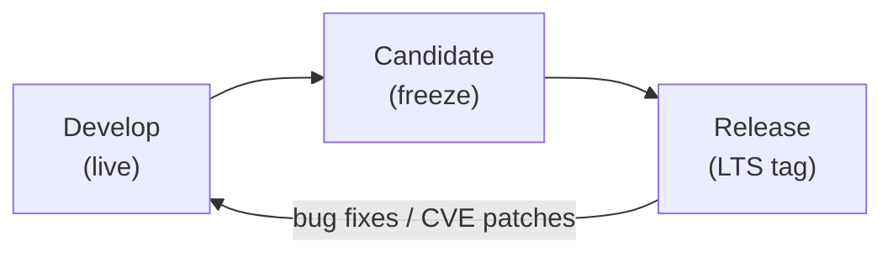
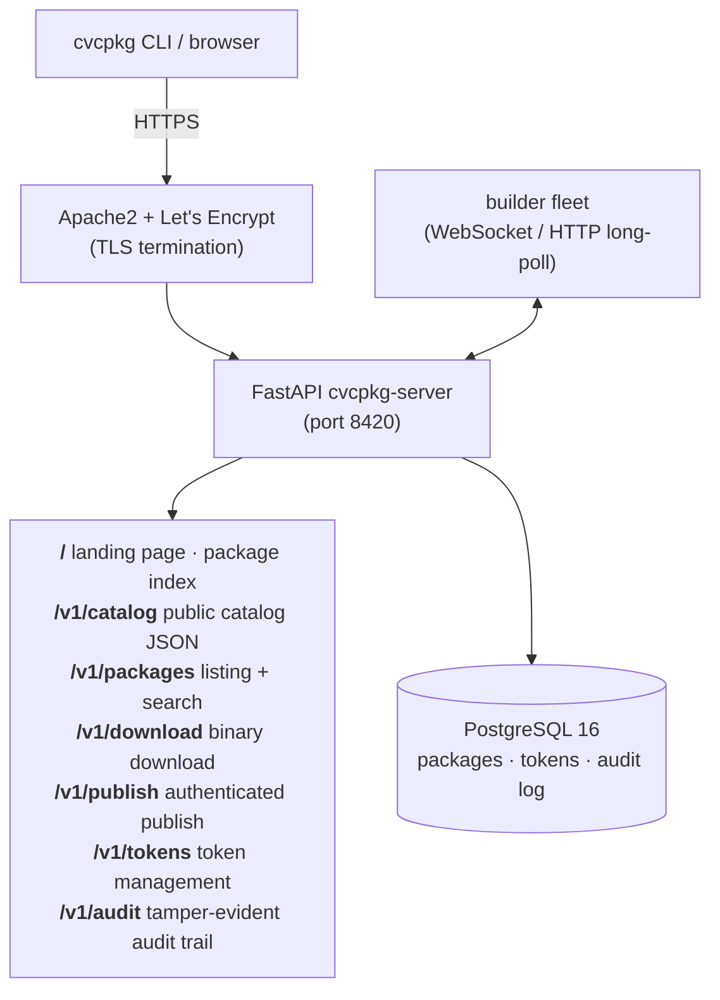
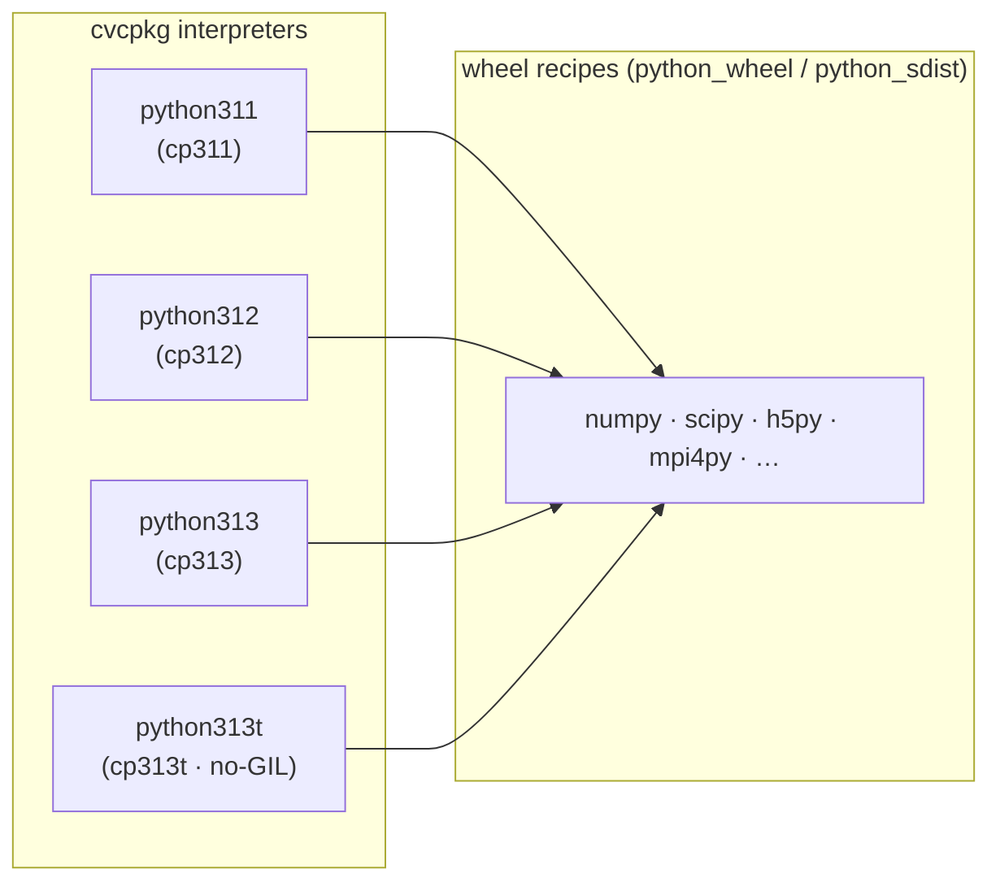
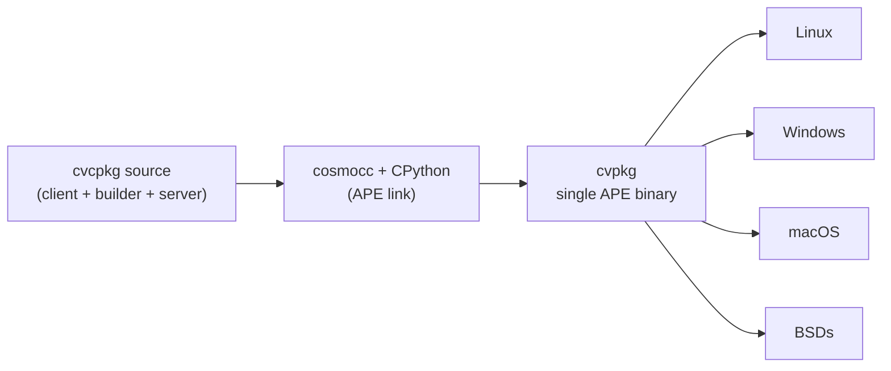

# cvcpkg Roadmap

> A cross-platform, language-agnostic binary package archive
> for the scientific computing community.

*Last updated: 2026-07-18*

---

## Project Rename — `libcvc-deps` → `cvcpkg`

The project is being renamed to **`cvcpkg`** in its entirety; the
`libcvc-deps` name is being dropped.  `cvcpkg` — the CLI, the server, the
recipe archive, and the PyPI distribution — becomes the single name for the
project going forward.

- The Python distribution is already published as **`cvcpkg`** (not
  `libcvc-deps`).
- The GitHub repository will be renamed **`transfix/libcvc-deps` →
  `<cyberpcangel-org>/cvcpkg`** *before* the first PyPI publish — the rename
  now also moves the repo into the new CyberPC Angel org (see the Ownership
  section above and Phase 25).
- Backward compatibility is retained where downstream consumers depend on
  the old name — e.g. the `libcvc-depsConfig.cmake` compatibility wrapper
  stays so existing `find_package(libcvc-deps)` calls keep working.

> **Release ordering:** the PyPI publish is the **final phase of the entire
> roadmap** (Phase 25), not an early milestone.  It happens only after the
> rename (project + repo), the trusted publisher is configured, and **every
> other roadmap phase — including the pre-release hardening phases 12–14 and
> the v2.0.0 product phases 15–19 — is closed**.  Publishing to PyPI claims a
> name and makes a community-facing commitment, so it is deliberately last.

---

## Ownership, Copyright & Branding — CyberPC Angel, LLC

**cvcpkg is owned by [CyberPC Angel, LLC](https://cyberpcangel.com).**  The
work was 100% funded by the CyberPC Angel team, and CyberPC Angel, LLC owns
the intellectual property.  All copyright and provenance branding across the
project is being set to **CyberPC Angel, LLC**.  This effort is sequenced
alongside the rename and the org move below, and lands **before** the Phase 25
PyPI publish so the first public release carries the correct ownership.

- [ ] **Copyright & provenance branding sweep → CyberPC Angel, LLC.**  Set
      the owning entity to CyberPC Angel, LLC everywhere provenance is
      asserted: `pyproject.toml` (`authors`, `homepage`/`repository`),
      `README.md`, the server landing-page footer (currently
      `cvcpkg — cross-platform binary package archive…`, no owner), the docs,
      and the GitHub repo metadata/social preview.  *(The `LICENSE` file
      already carries `Copyright (c) 2026 CyberPC Angel, LLC` — this
      generalizes that to the rest of the project.)*
  - **Do not rewrite per-recipe `maintainer` / `maintainer_email` fields.**
    Those name the **upstream package** maintainers (e.g. the zlib or boost
    packager), not cvcpkg's owner — they are legitimate third-party
    attribution and must survive the sweep untouched.
- [ ] **Source-file headers (bonus).**  Add a CyberPC Angel, LLC copyright +
      MIT notice header to every first-party source file — recommended form
      is an SPDX one-liner so it stays greppable and tooling-friendly:
      `# SPDX-License-Identifier: MIT` + `# Copyright (c) 2026 CyberPC Angel,
      LLC`.  Today **0 of 93** first-party Python files carry any
      copyright/license header, so this is a green-field sweep (a
      `scripts/apply_headers.py` + a CI check to keep new files compliant).
      Exclude vendored `third-party/` and per-recipe upstream sources.
- [ ] **ASCII-art gears logo (double bonus).**  Add an ASCII-art rendition of
      the CyberPC Angel, LLC **gears** logo to the source tree (e.g. a banner
      comment / the `cvcpkg` `--version` or no-arg splash) and to the top of
      `README.md`.  Keep it plain 7-bit ASCII so it renders in any terminal
      and in the `landing.py` guide.
- [ ] **Project logo = CyberPC Angel gears icon.**  Use the CyberPC Angel,
      LLC gears icon as the project logo: a **favicon** and `og:image` on the
      server landing page (it has **neither** today — see `_head_html`), a
      logo in the README header, and the GitHub repo social-preview image.
      Ship the asset self-hosted (no external CDN) consistent with the CSP.
- [ ] **New GitHub organization for the CyberPC Angel team; cvcpkg lives
      under it.**  Create a dedicated **CyberPC Angel** GitHub org (slug TBD,
      e.g. `cyberpcangel`) and move cvcpkg into it.  This **changes the
      Phase 25 rename target and the PyPI trusted-publisher owner** from
      `transfix` to the new org, the `_GITHUB_REPO` default
      (`transfix/libcvc-deps`, env-overridable via `CVCPKG_GITHUB_REPO`), and
      all `transfix/libcvc-deps` URL references (**~53 occurrences across ~20
      files** — CI workflows, composite actions, `landing.py`/`app.py`,
      `config.py`, schemas, docs).  Coordinate with the deferred repo rename
      so downstream `uses:` directives update in one pass.
- [x] **License stays MIT.**  MIT is the right fit and matches peer package
      managers (vcpkg, Conan, pip are all MIT).  Retained deliberately; the
      one alternative worth a conversation is Apache-2.0 (or a dual
      MIT/Apache-2.0), whose only material addition is an explicit patent
      grant — see the license note below.

### License choice — why MIT (with the honest caveat)

*Not legal advice.*  Among comparable package managers / build-dependency
tools, **MIT is the mainstream choice**: vcpkg, Conan, and pip are MIT;
Homebrew and conda are BSD; Spack and the Rust `cargo` toolchain use a
**dual MIT/Apache-2.0**.  So keeping **MIT** puts cvcpkg squarely in the norm
for this category, maximizes downstream adoption, and is trivially
understood.

The one thing MIT lacks that **Apache-2.0** adds is an **explicit patent
license + patent-retaliation clause** (plus a `NOTICE` mechanism).  For a
company-owned project that could matter if patent exposure is ever a concern;
the common way to get both the simplicity *and* the patent grant is the
**dual MIT OR Apache-2.0** license the Rust ecosystem popularized.  Net
recommendation: **MIT is appropriate and well-justified** for a tool like
this; only reach for Apache-2.0 / dual-licensing if an explicit patent grant
becomes a requirement.  (BSD-2/3-Clause is essentially MIT-equivalent for
these purposes; the 3-clause no-endorsement term offers a mild trademark
nicety but nothing MIT + a trademark policy doesn't also cover.)

---

## Vision

cvcpkg exists because existing package management systems have failed the
scientific computing community in one or more critical ways: they are bound to
a single language, locked to one operating system, overcomplicated, unreliable,
or unable to guarantee reproducible builds across platforms.

**cvcpkg is different.**  It is:

- **Language-agnostic** — packages are pre-built binaries (C, C++, Fortran,
  and eventually any compiled language).  There is no requirement to adopt a
  particular build system, runtime, or language ecosystem.
- **OS-agnostic** — first-class support for Linux, macOS, and Windows.
  Recipes declare platform-specific build logic; the archive serves every
  variant from a single namespace.
- **Simple but robust** — a single CLI (`cvcpkg`) handles building, publishing,
  installing, and verifying packages.  The server is a lightweight FastAPI
  application backed by PostgreSQL.
- **Reproducible** — each cvcpkg *release* pins a curated snapshot of recipes
  at known-good versions, giving downstream projects a stable foundation.
- **Community-extensible** — anyone can contribute recipes via pull request or
  publish packages to the archive through the authenticated API.

---

## Release Model

### Long-Term Support (LTS) Releases

Each **cvcpkg release** (e.g. v1.3.0, v2.0.0) is a curated, tested set of
recipes and the pre-built binary packages they produce.  A release is treated
as an LTS snapshot:

| Property | Description |
|---|---|
| **Recipe lockdown** | All recipes in the release are pinned to specific versions with verified SHA-256 checksums. |
| **Cross-platform matrix** | Every recipe is built and tested on Linux (x86_64), macOS (x86_64, arm64), and Windows (x64). |
| **Stability guarantee** | Packages in a release are immutable — once published, they do not change.  Broken packages are *yanked*, not updated in place. |
| **Downstream reproducibility** | Projects depending on a cvcpkg release can rebuild at any time and get identical binary artifacts. |
| **Security patching** | Critical CVEs can trigger a point release (e.g. v1.3.1) that replaces only the affected package while keeping everything else identical. |

### Live Recipes

Between releases, **updated and new recipes are available live** in the
repository and on the archive server.  This allows:

- Recipe authors to iterate on build scripts before a release freeze.
- Community contributors to submit new recipes that are not yet part of an
  official release.
- Downstream users to opt in to bleeding-edge packages by explicitly
  requesting them (e.g. `cvcpkg install boost@live`).

When the next release is being hardened, live recipes that meet quality
standards are promoted into the release manifest.

### Release Workflow



1. **Development phase** — recipes land on `main`, are built by CI, and
   published to the archive as live packages.
2. **Candidate phase** — a release branch is cut, only bug fixes are merged,
   full cross-platform CI matrix runs, community testing is solicited.
3. **Release** — the branch is tagged, all packages are signed, the release
   manifest is published.  The `prod` branch is updated and the production
   server deploys automatically.

---

## Architecture

### Current (v2.0.0)



### Deployment

- **Primary:** cvcpkg.org
- **Mirror:** pkg.tx.wtf (read-only mirror with hourly catalog sync)
- **Containerization:** Docker Compose (postgres + backend)
- **CI/CD:** GitHub Actions → `prod` branch push → self-hosted runner →
  auto-deploy script → zero-downtime restart
- **TLS:** Let's Encrypt via certbot, auto-renewal
- **Builders:** 13+ builder agents across 7 platforms:
  - Linux x86_64: 4× self-hosted (also wasm/wasi/cosmo cross-builders)
  - FreeBSD x86_64: 2× Incus VMs
  - NetBSD x86_64: 2× Incus VMs
  - OpenBSD x86_64: 2× Incus VMs
  - Windows x86_64: 2× self-hosted (+ a WSL2 windows-cross builder)
  - macOS (x86_64 + arm64): GitHub-hosted runners via workflow_dispatch

---

## Roadmap Phases

### Status Snapshot (2026-07-18)

| Phase | Title | Status |
|---|---|---|
| 1 | Foundation | ✅ Complete (v2.0.0) |
| 1.5 | Release Engineering Readiness | ✅ Complete — the *engineering* prerequisites for a wheel release (build backend, recipe bundling, wheel smoke, admin CLI, testing, CMake, docs). The actual publish is the **final phase**, not here. |
| 2 | Analytics & Telemetry | ✅ Complete — download analytics, bandwidth, platform/version distribution, and opt-in client telemetry all shipped (server + client + dashboard) |
| 3 | Admin Dashboard | ✅ Complete — `/admin` overview, packages, tokens, audit, releases, health (release *creation* workflow is the one follow-up) |
| 4 | Multi-Language & Ecosystem | ⬜ Future |
| 5 | Federation & Scaling | 🔶 Partially Done — cluster roles (primary/mirror/edge), pull-only populate, and public-vs-org namespace invariants landed (2026-07); CDN/sharding/replicas still future |
| 6 | Community & Governance | 🔶 Partially Done — org namespaces + private-visibility isolation shipped |
| 7 | Python Ecosystem (hermetic wheels, no-GIL) | 🔶 Partially Done — `python_wheel`/`python_sdist` source types, the `python:` block, the GIL-disabled test harness, and the first full matrix (`numpy` × cp311/cp312/cp313/cp313t) landed; more wheels + CUDA-math recipes + manifest freeze remain |
| 8 | Self-Hosting & Universal Bootstrap (`cvpkg`) | ⬜ Planned — `mingw-w64` toolchain recipe is the first concrete step (landed 2026-07); single-binary `cvpkg`/`cvcpkg-sc` runs a full server (seed from built-in recipes, remote builders, ad-hoc push, air-gapped) |
| 9 | Fleet & Platform Expansion (GhostBSD/DragonflyBSD, qemu) | 🔶 In Progress — DragonflyBSD platform + provisioning underway in a parallel track |
| 10 | Peer Providers & Hardware-Aware Concretization | ⬜ Planned |
| 11 | Self-Hosting Toolchains (extends Phase 8) | ⬜ Proposed |
| 12 | Federation Hardening — Selective Mirroring & Authoritative Resolution | ✅ Complete — mirror allow/deny policy, size budget with usage-based eviction, and top-down root-authoritative resolution |
| 13 | Identity & Access — OIDC / External Providers | ✅ Complete — OIDC login for the admin dashboard (code flow + PKCE, claim→role mapping); HMAC tokens remain for machines |
| 14 | Source Recipes — File-Artifact Packages | ✅ Complete — `platform: any` file artifacts consumed by downstream platform recipes, canonized by an end-to-end test |
| 15 | CLI UX & the Recipe-First Workflow | ⬜ Planned — single entry point (fold `cvcpkg-server` into `cvcpkg server`), deprecate `cvc-requirements.yaml`, `~/.cvcpkg/` defaults + auto-populated `settings.yaml` with a `--save` sticky-overrides flag, install-prefix registry (`~/.cvcpkg/local.db`) with aliases + delete/inspect/modify, per-prefix state DB (`share/cvcpkg/prefix.db`: installed-file tracking, **first-class `uninstall`**, idempotent installs, hash-verify, ops journal), recipe generation from existing projects, clean/activate commands, terminal graphics, offline source cache, recipe-set export + source pre-seeding for air-gapped self-hosting |
| 16 | Prefix Provenance & Server Seeding | ⬜ Planned — install prefixes carry catalog info + recipes in `share/cvcpkg/` so a prefix can seed a cvcpkg-server; org/private status explicit with warnings |
| 17 | Recipe Archives — Declared Artifacts & Package-Page UX | ⬜ Planned — schema-declared recipe artifacts, full recipe directories on the server, downloadable recipe archives, collapsible artifact viewer, package-list layout rework |
| 18 | Server Backups, Scheduled Jobs & Quota Governance | ⬜ Planned — recipe/package backup + restore; a general admin job manager + scheduler (none exists today); quota governance (global default → infinite, reconciliation job, recipes count against org quota) |
| 19 | Application Packaging & Desktop Delivery | ⬜ Planned — recipe entry points, desktop assets, exe/MSI + AppImage + dmg installer commands from a prefix, `cvcpkg bake` self-mounting prefix binaries (feasibility: native per-OS mechanisms + persistent state layers + cosmo APE variant, no Docker) |
| 20 | First-Party & Featured Software Recipes | ⬜ Planned — org namespaces `cypca` (eiskaltdcpp, eiskaltdcpp-py, verlihub), `cvc` (TexMol alongside libcvc/volrover), `tfx` (ezquake); SDL2/SDL3 across platforms + satellites; the wheel recipes needed to self-host cvcpkg |
| 21 | Package Visibility — Hidden Packages | ⬜ Planned — discoverability-only suppression (a third axis beside `yanked` and org `is_private`); upstream is authoritative; propagation through mirror + populate |
| 22 | Federation Topology — Nested Authority & Network Introspection | ⬜ Planned — N-tier edge→mid→root authority, cross-tier consistency warnings, same-org override, permission-gated network statistics |
| 23 | Build & Configuration-Management System | ⬜ Planned — recipes as state (Get/Test/Set, `check`/`apply`/`uninstall`), BYO non-redistributable assets, security (config-channel-is-C2), tamper-evident local forensic journal, per-machine generations |
| 24 | Live Updates, Activity Feed & Build Transparency | ⬜ Planned — client WebSocket push + new-package notifications, a public visibility-filtered activity feed (recipes/builds/yanks/unyanks/nukes), public read for public build jobs+logs (private orgs stay private) |
| 25 | **PyPI Release** | ⬜ **Final phase** — the project/repo rename, trusted-publisher config, and the gated publish. Deliberately last: `pip install cvcpkg` ships only after the roadmap is otherwise complete. |

**Road to PyPI (`pip install cvcpkg`):** the PyPI publish is the **last phase of the
roadmap** (Phase 25), not an early step.  The *engineering* readiness for it (Phase 1.5)
is done, but the release itself happens only after the remaining phases — including the
pre-release hardening phases (12–14) and the v2.0.0 product phases (15–24) — are
closed.  This is a deliberate correction: publishing to PyPI is a one-way,
name-claiming, community-facing commitment, so it comes at the very end.

### Phase 1 — Foundation

**Status: Complete (v2.0.0)**

- [x] Recipe-based build system with 99 component recipes
- [x] `cvcpkg` CLI (build, install, publish, verify, validate)
- [x] FastAPI server with PostgreSQL backend + Alembic migrations
- [x] HMAC-SHA256 token authentication with role-based access
- [x] Chained-hash tamper-evident audit trail
- [x] Ed25519 package signing
- [x] Docker production deployment (cvcpkg.org + pkg.tx.wtf mirror)
- [x] Apache2/Let's Encrypt TLS on cvcpkg.org
- [x] Landing page with package index, search, sorting, and org scoping
- [x] CI/CD deploy pipeline (prod branch → auto-deploy to both hosts)
- [x] Self-hosted GitHub runners (catx-03, star-00, star-01, lat, rebota)
- [x] 13 builder agents across Linux, FreeBSD, NetBSD, OpenBSD, Windows, macOS
- [x] Cross-platform CI build matrix (Linux, macOS, Windows, 3 BSDs)
- [x] 650+ published packages on cvcpkg.org
- [x] Organization namespaces with member management
- [x] Remote builder orchestration (submit-dag, follow-dag, monitor)
- [x] `cvcpkg install --from cvc-requirements.yaml` workflow
- [x] Activation scripts (bash, zsh, fish, PowerShell) setting CMAKE_PREFIX_PATH
- [x] CMake integration (cvcpkgConfig.cmake, libcvc-deps compat, toolchain file)
- [x] cvcpkg promoted to repo root (pyproject.toml at root)
- [x] Cosmopolitan (cosmo) cross-compilation platform support
- [x] WASM/WASI build platform support
- [x] GTK4 dependency stack (pixman → cairo → pango → gdk-pixbuf → gtk4)
- [x] Recipe validation (JSON schema, dependency graph, CI checks)
- [x] Source-fallback builds (build from source when no binary available)
- [x] Build caching (server-cache for CI and builders)
- [x] Mirror protocol (pkg.tx.wtf mirrors cvcpkg.org with sync loop)

### Phase 1.5 — Release Engineering Readiness

**Status: Complete**

The *engineering* prerequisites for a wheel release — everything that has to
work before a `pip install cvcpkg` is even buildable.  All of these are done
(including Windows CI integration tests and a full server-side security
hardening pass — private-data isolation, tenant scoping, tar-slip and
reflected-XSS fixes).

> **The actual PyPI publish is not here.**  It moved to **Phase 25 — PyPI
> Release**, the final phase of the roadmap.  The rename (project + repo),
> trusted-publisher configuration, and the gated publish all happen there,
> after every other phase is closed.  See the release-ordering note at the top
> of this document.

#### Packaging & Distribution (engineering — done)

- [x] pyproject.toml at repo root with poetry-core backend
- [x] `cvcpkg` and `cvcpkg-server` entry points
- [x] Recipes bundled into wheel via CI publish workflow
      (fixed: the publish workflow's bundle step now creates the target
      dir, fails loudly, and verifies the built wheel contains recipes)
- [x] Build + live-smoke the wheel on Linux/macOS/Windows via a release
      candidate tag (`cvcpkg-v2.0.0rc6`: 129 recipes bundled, all green)
- [x] Verify `cvcpkg --version` and `cvcpkg-server --version` from the
      installed wheel
- [x] Publish workflow (`cvcpkg-publish.yml`) wired for PyPI trusted
      publishing (OIDC), gated behind the `CVCPKG_PUBLISH_TO_PYPI` repo
      variable so a stable tag cannot publish until Phase 25 flips it on

#### Admin CLI Completeness

- [x] `cvcpkg token` — create, list, revoke, approve/deny requests
- [x] `cvcpkg builder` — list, status, run, unregister
- [x] `cvcpkg builds` — submit, submit-dag, list, cancel, pause, resume, follow-dag, monitor
- [x] `cvcpkg server` — stop, status
- [x] `cvcpkg org` — members, add-member, remove-member
- [x] `cvcpkg recipe` — push (sync recipes to server DB)
- [x] `cvcpkg server stats` — server resource + catalog statistics (DB backend, package/org/builder/job/audit counts, storage)
- [x] `cvcpkg server backup` — trigger a server-side database backup from CLI (sqlite/pg_dump/mysqldump)
- [x] `cvcpkg builder logs` — view recent build jobs / tail a job's log without the full monitor
- [x] `cvcpkg doctor` — diagnose the local toolchain (Python, CMake, Ninja, compiler, git) and server reachability

#### Testing & Quality

- [x] 927 unit tests passing
- [x] 16 integration test modules (server, browser UI, build cache, e2e lifecycle, etc.)
- [x] Integration tests for cvc-requirements.yaml install workflow
- [x] Integration tests for dummy recipe build lifecycle
- [x] CMake integration tests (configure, install, downstream find_package)
- [x] E2E live test (Docker Compose + real server + builder + compile consumer)
- [x] Recipe validation via JSON schema in CI
- [x] Source-fallback integration tests (Linux, macOS)
- [x] Windows CI integration tests (the full non-Docker integration suite
      runs on windows-latest in the CI test matrix; server/Docker-bound
      modules auto-skip via conftest, bash-only modules skip on win32)
- [x] Automated upgrade/migration test (v1.x → v2.0.0)
      (migration-chain integrity + legacy-lockfile read; live PostgreSQL migration runs in the Docker job)
- [x] Performance benchmarks for install/resolve with large catalogs (resolver regression guard on a 400-component chain)

#### CMake Integration

- [x] `cvcpkgConfig.cmake` — sets CMAKE_PREFIX_PATH + PKG_CONFIG_PATH
- [x] `libcvc-depsConfig.cmake` — backward-compat wrapper
- [x] `cvcpkg-toolchain.cmake` — for `-DCMAKE_TOOLCHAIN_FILE=` usage
- [x] Activation scripts set CMAKE_PREFIX_PATH on `source activate`
- [x] Document CMake integration in README and docs/ (docs/cmake-integration.md)
- [x] `cvcpkg install` writes cvcpkgConfig.cmake into the prefix automatically
      (also a libcvc-deps compat config + version files)

#### Documentation

- [x] README.md (quick start, install, build, publish)
- [x] docs/api-reference.md
- [x] docs/ci-cd-pipeline.md
- [x] docs/deployment-guide.md
- [x] docs/organizations.md
- [x] docs/cmake-integration.md — CMake usage guide for downstream projects
- [x] docs/recipe-authoring.md — how to create new recipes
- [x] docs/pypi-install.md — pip install guide and extras reference
- [x] CHANGELOG.md — release notes for v2.0.0

#### Gap Analysis

The following items were identified as potential gaps before the PyPI
release.  These are the gaps to close **before** the final publish step.

1. ~~**No CHANGELOG.md**~~ — ✅ Done.  `CHANGELOG.md` carries a full
   v2.0.0 entry: the rename note, the release-readiness tool changes
   (doctor, init, upgrade, admin CLI, signature enforcement), the
   recipe-bundling and NullPool fixes, and the postgresql recipes.
2. ~~**No `cvcpkg doctor` command**~~ — ✅ Done.  `cvcpkg doctor` checks
   Python, pip, CMake, Ninja, a C/C++ compiler, git, and (optionally)
   server reachability.
3. ~~**No `cvcpkg init` command**~~ — ✅ `cvcpkg init <name>` scaffolds a
   schema-valid recipe (recipe.yaml + build scripts) for cmake, meson, or
   autotools.
4. ~~**No `cvcpkg upgrade` command**~~ — ✅ `cvcpkg upgrade [components]`
   checks the catalog for newer versions of the installed components and
   re-installs just those, updating the lockfile (`--dry-run` previews).
5. ~~**No offline mode documentation**~~ — ✅ documented in
   docs/pypi-install.md (local catalog + `--local` source builds + cache).
6. **Recipe test coverage** — building and testing every recipe on all
   platforms is builder-fleet work.  `scripts/recipe_coverage.py` now
   reports declared build-matrix coverage per platform and can gate CI
   (`--require linux,macos,windows`); the actual cross-platform builds
   remain a fleet task.
7. ~~**Signature verification not enforced**~~ — ✅ `cvcpkg install
   --require-signatures` now fails on any unsigned or invalidly-signed
   package; `--verify-signatures` verifies when a signature is present.
   (Making enforcement the default remains a future policy decision.)
8. ~~**No dependency version constraints**~~ — ✅ dependencies carry
   version ranges (e.g. `^3.0`, `==1.3.0`) in the recipe/catalog, and the
   resolver enforces them — user + transitive constraints, with
   intersection and conflict rejection (see test_resolver.py).

### Phase 2 — Analytics & Telemetry

**Status: Complete (2026-07)**

Package administrators need visibility into how the archive is being used
to make informed decisions about resource allocation, deprecation, and
support priorities.

**Shipped:**

- [x] `download_events` extended with `arch`, salted `client_ip_hash`,
      `user_agent`, `cvcpkg_version`, `bytes_sent` (migration 013); the
      `/v1/download` endpoint records all of them.
- [x] Admin analytics API: `GET /v1/analytics/downloads` (totals + top
      packages), `/bandwidth` (daily byte series), `/platforms`
      (platform/arch + client-version mix), `/trends` (daily counts).
- [x] Opt-in client telemetry: `cvcpkg telemetry status|send`, the
      `CVCPKG_TELEMETRY=1` post-install ping, `telemetry_events`
      (migration 014), public `POST /v1/telemetry`, admin
      `GET /v1/analytics/telemetry`.  Anonymous by construction; the
      client sends a `cvcpkg/<version>` User-Agent so downloads attribute
      to a client version.
- [x] Displayed on the admin dashboard (Phase 3).

**Deferred:** geo-IP bucketing (needs a GeoIP data source decision) and
install success/failure telemetry.  The privacy model below is implemented
(salted IP hashes; telemetry stores nothing derived from the connection).

#### Download Analytics

- **Per-package download counts** — total, last 7/30/90 days, all time.
- **Per-version breakdown** — which versions are actively consumed vs. stale.
- **Platform distribution** — what fraction of downloads are Linux vs. macOS
  vs. Windows.  This drives build priority decisions.
- **Geographic distribution** — coarse geo-IP bucketing (continent/country)
  for CDN planning.
- **Temporal patterns** — download trends over time, spike detection.

#### Bandwidth Accounting

- **Per-package bandwidth** — total bytes served per package, per version.
- **Aggregate bandwidth** — daily/weekly/monthly totals for capacity planning.
- **Top consumers** — identify heavy-usage patterns (CI farm vs. individual
  developer downloads).

#### Client Telemetry (Opt-In)

- **Client version distribution** — track cvcpkg CLI versions in the wild to
  inform deprecation timelines.
- **Build environment fingerprints** — OS, architecture, compiler, CMake
  version — anonymized and aggregated.  Helps recipe authors understand the
  environments their packages actually run on.
- **Install success/failure rates** — per-package, per-platform.  Surfaces
  broken recipes quickly.
- **Resolution time** — how long dependency resolution takes as the catalog
  grows.

#### Implementation Plan

1. Add a `download_events` table: `(id, package_id, timestamp, client_ip_hash,
   user_agent, platform, arch, cvcpkg_version, bytes_sent)`.
2. Record download events in the `/v1/download` endpoint asynchronously
   (non-blocking to the download itself).
3. Add admin API endpoints:
   - `GET /v1/analytics/downloads` — filterable download counts
   - `GET /v1/analytics/bandwidth` — bandwidth usage summaries
   - `GET /v1/analytics/platforms` — platform distribution
   - `GET /v1/analytics/trends` — time-series data
4. Display analytics on the landing page and admin dashboard.
5. Client-side telemetry: add an opt-in `cvcpkg telemetry` command that sends
   anonymized build environment data on install.  Controlled by
   `CVCPKG_TELEMETRY=1` env var.  Off by default — never phone home without
   explicit consent.

#### Privacy

- IP addresses are salted-hashed, never stored in plain text.
- Client telemetry is strictly opt-in.
- No personal data is collected — only technical environment metadata.
- All analytics are aggregate; no individual user tracking.

### Phase 3 — Admin Dashboard

**Status: Complete (2026-07)**

A web-based administration interface at `/admin` for managing the cvcpkg
archive without CLI access.

**Shipped** — server-rendered (Bulma, no SPA), admin-token → HMAC-signed
session cookie (HttpOnly, `/admin`-scoped), every mutation audit-logged,
zero admin credentials in browser JS:

- [x] **Overview** — stat cards + downloads sparkline + top packages +
      platform/client/telemetry mixes (delivers Phase 2's "display
      analytics" item).
- [x] **Packages** — filterable variant list (yanked included); per-variant
      yank / unyank / delete.
- [x] **Tokens** — list, create (raw token shown once), revoke.
- [x] **Audit** — latest entries newest-first + one-click tamper-evident
      chain verification.
- [x] **Health** — uptime, DB backend, archive storage, counts, and a live
      builder-fleet table.
- [x] **Releases** — release-tag list with per-tag variant view.

**One follow-up:** release *creation / promotion* (freezing live recipes
into an LTS manifest) needs a freeze-process design and is tracked
separately; the release *view* is shipped.

#### Features

- **Package management** — browse, search, yank, unyank, delete packages.
  Inspect signatures, checksums, download counts.
- **Token management** — create, revoke, list API tokens.  View token
  usage history.
- **Audit trail viewer** — search and filter the tamper-evident audit log.
  Verify chain integrity from the UI.
- **Analytics dashboard** — real-time charts: download trends, platform
  distribution, bandwidth usage, top packages, geographic distribution.
- **Release management** — create and manage LTS releases.  Promote live
  recipes into release manifests.  Trigger cross-platform CI builds.
- **Health monitoring** — server uptime, database stats, disk usage,
  certificate expiry.
- **User/org management** (future) — manage publisher accounts, organization
  namespaces, permission scopes.  **Delivered by Phase 13 (Identity & Access —
  OIDC):** rather than build local account management, user registration /
  login / permissions come from an external OIDC identity provider.

#### Technical Approach

- Server-side rendered HTML with lightweight JS (htmx or Alpine.js) — no
  heavy SPA framework.  Keeps the deployment simple.
- Admin routes protected by admin-role token auth (cookie-based session after
  initial token login).
- Built into the existing FastAPI application as a sub-router — no separate
  service to deploy.

### Phase 4 — Multi-Language & Ecosystem Expansion

**Status: Future**

cvcpkg currently focuses on C/C++ libraries, but the architecture is
deliberately language-agnostic.  Future expansion:

#### Language Support

- **Fortran** — scientific computing staple, many legacy codebases.
- **Rust** — pre-built native libraries with C-compatible ABI.
- **Python C extensions** — pre-compiled wheels for scientific packages that
  are notoriously hard to build (BLAS, LAPACK, HDF5 bindings).
- **Julia artifacts** — native library packages for Julia's Pkg system.

#### Recipe Ecosystem

- **Recipe templates** — `cvcpkg init` generates a recipe from a template
  (CMake, Meson, Autotools, custom).
- **Recipe validation** — `cvcpkg lint` checks recipes for common errors,
  missing fields, insecure patterns.
- **Dependency resolution** — recipes declare build-time and runtime
  dependencies on other cvcpkg packages.  The resolver computes a dependency
  graph and builds packages in the correct order.
- **Build caching** — cache intermediate build artifacts (object files, CMake
  configs) to speed up CI builds.

#### Interoperability

- **CMake `find_package` integration** — `cvcpkg install` generates
  `cvcpkgConfig.cmake` so downstream CMake projects can
  `find_package(cvcpkg)` and then `find_package(Boost)` transparently.
  *(Partially done — config files exist, auto-install into prefix pending.)*
- **pkg-config support** — generate `.pc` files for each installed package.
  *(Partially done — toolchain sets PKG_CONFIG_PATH, recipes generate .pc files.)*
- **Spack compatibility layer** — import/export recipes from Spack specs.
- **Conan compatibility layer** — consume Conan recipes as cvcpkg recipes.
- **vcpkg manifest mode** — read `vcpkg.json` and resolve packages from the
  cvcpkg archive.
- **cpkg integration** ([getcpkg.net](https://getcpkg.net/)) — cpkg is a
  Lua + Ninja project/dependency tool for C/C++ (decentralized, script-driven
  builds; Windows + Linux).  Two-way friendliness with that community:
  1. a **`cpkg` recipe** so the tool itself installs from the cvcpkg archive
     (see Planned Recipes), and
  2. a **cvcpkg Lua helper for `cpkg.lua` scripts** — e.g.
     `cvcpkg.dependency("boost")` inside `add_dependency()` resolves a
     pinned, prebuilt binary from cvcpkg.org into the project prefix instead
     of re-building from source.  cpkg keeps its build scripting; cvcpkg
     supplies the full-fledged binary package manager underneath (catalog,
     signing, reproducible LTS pins, cross-platform archive).

#### Build-Prefix Hygiene (build vs runtime placement)

When building for a target that needs cross-compilation, the build-time
**host tools** (cmake, ninja, bazel/bazelisk, cross-toolchains) are a
byproduct — they must not pollute the deliverable install prefix that a
downstream project (e.g. a C# consumer) ingests.

- **Separate build prefix (done).** `cvcpkg build --build-prefix` installs the
  whole build-dependency closure into its own prefix (default `<prefix>.build`,
  a sibling of the deliverable `--prefix`); the deliverable gets only the
  runtime closure.  Passing the same path as `--prefix` disables the separation
  (legacy behaviour).  This fixes the bazel/bazelisk leak into `bin/`.
- **Placement by dependency edge (done).** `depends.build`/`depends.host_tools`
  closure → build prefix; `depends.runtime` closure → install prefix.  Neither
  `platform: any` nor "source-ness" affects placement, so an `any` runtime dep
  still ships.  Source packages stage to `<build-prefix>/src/<name>` purely by
  being build deps.  `CVC_BUILD_PREFIX` is exposed to build scripts alongside
  `CVC_DEPS_PREFIX`.  NOTE: this makes the build/runtime split load-bearing —
  mis-filed deps are now real bugs.
- **Manifest-flagged (done).** Host-tool bundles carry `bundle.host_tool: true`
  in their `manifest.yaml` (derived from a recipe's `cross_toolchain`
  declaration).  The deliverable prefix records the separation in
  `share/libcvc-deps/host-tools.yaml` (`present`, `prefix`, `tools`,
  `stripped`).
- **Strip on install (done).** On install we strip the recorded build prefix
  **unless `--keep-build-prefix` is passed** — the install command reads the
  record to know a build prefix exists and where.  `cvcpkg build` strips by
  default at the end of a build; `cvcpkg install` honours the record on
  finalize; `--keep-build-prefix` retains it (reuse a toolchain, or ship the
  staged sources).  `--host-tools-prefix`/`--keep-host-tools` remain as
  deprecated aliases.
- **Future.** Thread the same host-tools separation through
  `cvcpkg install`'s from-source fallback (`build_from_source_fallback`), so
  host tools built *during* an install are also recorded and stripped; and a
  server/requirements-level default policy for the strip.

### Phase 5 — Federation & Scaling

**Status: Partially Done** — the cluster-role model (primary / mirror /
edge-satellite), pull-only public-catalog populate, and the
public-vs-organization namespace invariants landed in 2026-07.  CDN
offload, federated multi-registry query, sharded storage, and read
replicas remain future work.

As the archive grows, a single server won't suffice.  Plan for horizontal
scaling and federation:

- **CDN integration** — serve package archives from CloudFlare R2, AWS S3,
  or similar.  The server becomes a metadata/API layer; binaries are served
  from edge locations.
- **Cluster roles & catalog authority** — three deployment roles, distinguished
  by how each treats the **public namespace** (`org_slug == ""`):
  - **Primary** (e.g. `cvcpkg.org`) — the canonical source of truth for public
    packages; accepts public publishes.
  - **Mirror** (e.g. `pkg.tx.wtf`, `--mirror-mode`) — a read-only replica of a
    primary; rejects *all* publishes.
  - **Edge / Satellite** (`CVCPKG_POPULATE_UPSTREAM` set) — a read-write cluster
    that **populates** its public catalog *from* an upstream primary while
    hosting its **own private org packages locally**. This is the enterprise /
    air-gapped deployment shape (e.g. the dev cluster, a licensed-host builder).

  Invariants (implemented 2026-07):
  - **Upstream is canonical for the public namespace.** An edge cluster only
    *imports* public packages — populate is pull-only, there is no push to
    upstream — and it **hard-rejects local publishes into the public namespace**
    (HTTP 409). Public packages can therefore never diverge from upstream. Local
    publishes must target an organization (`--org`).
  - **Org packages are a separate namespace.** The package unique key includes
    `org_slug`, so `shell/foo==1.0` and public `foo==1.0` coexist. Org packages
    are local-authoritative: private-capable, never populated from or pushed to
    upstream. The populate diff is namespace-scoped to the public catalog, so a
    private package can never shadow a public upstream one.
  - Private org packages (`is_private`) are visible only to org members; the
    chunked-upload path is org-aware so large private packages are supported.

  Still open: populate imports *missing* public variants only — syncing upstream
  *updates* (a re-published public variant, same key, new content) and
  multi-upstream fan-in are future work; the invariants above keep the public
  catalog safe in the meantime.
- **Mirror protocol** — institutions can run local read-only mirrors
  (`--mirror-mode`) that sync from a primary. Useful for pure read-only
  air-gapped caches; the read-write variant is the *edge* role above.

  **Upstream is authoritative.** A client resolving against a mirror or edge
  must get the same answer it would have got from upstream. Populate was
  originally add-only, so a bundle yanked or nuked upstream carried on being
  served by every downstream indefinitely — the mirror silently disagreed with
  the registry it claimed to mirror, and a bundle retired for being broken (or
  for a CVE) stayed installable. Each populate cycle now reconciles:

  - upstream **yanked** it → yank locally (reversible; an upstream unyank
    propagates back on the next cycle)
  - upstream **nuked** it (absent from the catalog *and* carrying a tombstone)
    → yank locally and write a local tombstone, so downloads answer `410 Gone`
    exactly as upstream does
  - upstream **dropped it with no tombstone** → ambiguous: yank only, and log
    loudly. A truncated catalog or a transient upstream fault is
    indistinguishable from a deletion, and yank is recoverable.

  Two deliberate limits:

  - **Provenance-scoped.** Only rows carrying that upstream's
    `origin_upstream` are eligible. An edge hosts its own packages beside the
    mirrored ones, and "upstream doesn't have it" is not evidence that a
    locally published package should disappear.
  - **A mirrored nuke does not delete bytes.** It stops serving the bundle
    immediately and leaves the archive to the ordinary yank-retention GC.
    Deleting on sight would let one upstream mistake — or one compromised
    upstream — destroy data across every mirror simultaneously, and an
    air-gapped edge may hold the last copy in existence.

  Authority chains transitively: in `A <- B <- C`, a yank on `A` reaches `C` by
  travelling each hop, since `C` never talks to `A`. For that to work the
  catalog has to be able to *disclose* a yank — `/v1/catalog?include_yanked=1`
  — because the default filtered view makes "upstream retired it" and "upstream
  lost it" indistinguishable, and only the first is a verdict worth recording.

  **A mirror may dissent.** An operator can `unyank` a bundle their upstream
  still considers retired — they need it to unblock a build, or they know
  something upstream does not. That decision has to survive: `upstream_yanked`
  is tracked separately from the local `yanked` flag, so reconciliation can
  tell "we have not enforced this yet" from "we enforced it and were
  overridden", and stops re-yanking in the latter case. With one flag there was
  nowhere to record the difference and every sync silently reverted the
  operator.

  The divergence is then **disclosed, not hidden**: the catalog reports
  `upstream_yanked` on such a bundle, and clients resolve with upstream winning
  by default — a bundle withdrawn for a CVE must not come back just because one
  mirror still serves it. `--trust-mirror` (or `CVCPKG_TRUST_MIRROR=1`) opts
  into the mirror operator's ruling instead, and `--no-trust-mirror` restores
  upstream authority when that variable is already set in the environment.

  Authority is a property of the **chain**, not of one hop. A mirror's dissent
  is enforced locally but never propagated as though upstream had reconsidered:
  each server classifies an upstream bundle as retired when *either* `yanked` or
  `upstream_yanked` is set, so the origin's ruling reaches the bottom of a
  nested chain even when a middle mirror is serving the bundle anyway. Reading
  only `yanked` let a dissenting middle hop launder the origin's decision into a
  clean unyank for everything below it — with the disclosure flag cleared, so
  `--trust-mirror` had nothing left to opt into.

  Reconciliation is scoped by recorded provenance (`origin_upstream`), which
  means it only ever covers rows that carry it. Servers that mirrored anything
  before that column existed are backfilled from the `populate:<upstream>`
  provenance already in `published_by` (migration 022); without it,
  reconciliation is a silent no-op over a mirror's entire pre-existing
  catalogue. A stamp that no longer matches the configured upstream — after a
  scheme, host or port change — is reported rather than quietly ignored.
- **Federated registries** — multiple independent cvcpkg servers can
  cross-reference packages.  A client can query multiple registries
  with fallback.
- **Storage backends & named volumes** — let artifacts live on many
  backends at once, with recipes choosing where.

  *Already built (harden, don't rebuild):* a pluggable `StorageBackend`
  protocol (`cvcpkg/backends/`) with **9 backends** — `s3` (S3/MinIO/Garage
  via boto, honoring `CVCPKG_S3_ENDPOINT_URL`), `gcs`, `azure`, `sftp`,
  `rsync`, `rclone`, `https`, `file`, `gh-release` — dispatched **by URI
  scheme** (`cvcpkg.storage.get_backend`), with per-scheme options
  (`backends:` in config) and third-party registration via the
  `cvcpkg.storage_backends` entry point. **Reads are already multi-backend:**
  a catalog can mix `s3://…`, `https://…`, `gh-release://…` freely and each
  package downloads through its own backend. The **write** side is the gap —
  the server stores every archive under a single `storage_uri`.

  *To build — server-defined named volumes:*
  - The **cvcpkg-server config declares named volumes**, each a
    `{name, backend URI/scheme, options, tier, org scope}`. Example:
    `garage-hot` → `s3://cvcpkg@garage`, `gh-cold` → `gh-release://…`.
  - **Volumes are advertised to clients/recipes** via the API and are
    **valid only in the context of that server's domain** — a volume name is
    resolved against the server it was fetched from; the same name on another
    domain is unrelated. (Downloads still use the fully-resolved URI recorded
    in package metadata, so a moved/renamed volume never breaks existing
    installs.)
  - **Recipes (and `publish`) select a target volume by name**; the server
    writes the artifact to that volume's backend and records the resolved URI
    in the package row. Falls back to a server default volume when unset.
  - **SLA / provider tiers** — volumes carry tier metadata (hot/cold,
    durability, region, provider). Different providers can expose different
    volumes; users pick per-recipe. Opens an SLA/billing hook (a provider can
    price or gate a premium `--volume`).
  - **Hardening tasks:** wire the server publish path to write through any
    backend (not just `file://`), add publish/download round-trip tests per
    backend, validate/authorize volume selection, and migrate the server
    `storage_uri` off `file://` onto Garage (S3) — proven on the dev cluster
    first (a small Garage there), then prod (HA Garage, see the fleet-storage
    plan in vm-provisioning `docs/FLEET-STORAGE.md`).
- **Read replicas** — PostgreSQL streaming replication for read-heavy
  workloads.

### Phase 6 — Community & Governance

**Status: Partially Done**

- [x] **Organization namespaces** — `@org/package` scoping for institutional
  publishers, with member management CLI and API.
- [ ] **Package ownership model** — maintainers, co-maintainers, transfer
  process.
- **Review workflow** — community recipe PRs go through automated CI +
  manual review before being merged.
- **Quality tiers** — packages rated by test coverage, platform coverage,
  maintainer responsiveness.
- **Advisory database** — track CVEs affecting published packages, automatic
  yank + advisory notification for affected versions.
- **Documentation hosting** — render recipe README.md on the package page.

---

### Phase 7 — Python Ecosystem Integration (Hermetic Python + Native Prefixes)

**Status: Partially Done** — the `python_wheel`/`python_sdist` source types, the
`python:` block, the per-interpreter test harness (incl. the GIL-disabled
assertion), and the first full matrix (`numpy` × cp311/cp312/cp313/cp313t) have
landed.  Remaining: more wheel packages (scipy/h5py/mpi4py), the CUDA-math
prerequisite recipes, and the release-manifest freeze.

cvcpkg already ships CPython interpreters as recipes (`python311`/`312`/`313`) that install
`libpython`, the interpreter, and the stdlib into a prefix under `CVC_INSTALL_DIR`. Phase 7
closes the loop: **cvcpkg installs upstream Python wheels *into that same prefix*** so a
downstream project gets one activatable prefix carrying both the native C/C++ libraries
(`find_package`-able) *and* a complete, pinned Python environment (`import`-able) — with minimum
system dependencies. This extends cvcpkg's "any compiled language" vision to the Python packages
layered on top of those libraries, and gives the CVC science stack (volrover, MolSurf, TexMol,
F2Dock) a single reproducible **Python + native** environment.

**Two new `source.type` values (additive, schema_version 1):**

- **`python_wheel`** — stage a pinned, sha256-verified prebuilt wheel (numpy, torch, sionna,
  warp-lang, physicsnemo) via `pip install --no-deps --no-index --prefix $CVC_INSTALL_DIR` into the
  prefix interpreter's own `lib/pythonX.Y/site-packages`. The wheel analogue of the `prebuilt`
  C-source type; never re-hosted (fetched from PyPI/`download.pytorch.org` at build time).
- **`python_sdist`** — build a C-extension wheel from a pinned sdist with **build-isolation off**
  so the extension links the prefix's **cvcpkg** C libraries (h5py→cvcpkg `hdf5`, an FFTW/CUDA-
  linking extension→cvcpkg `fftw3`/`cufft`, mpi4py→cvcpkg MPI) via `depends.build` on the cvcpkg C
  recipes + `HDF5_DIR`/`CMAKE_PREFIX_PATH` env. This is the hermeticity payoff: no `apt install
  libhdf5-dev`; the extension binds cvcpkg's copy.

Recipes add a top-level **`python:`** block (`interpreter`, `abi`, `manylinux_min`,
`build_isolation`, pinned `build_requires`); a "resolve like pip from requirements.txt" mode is
**rejected** for release artifacts — every wheel/sdist is pinned by filename + sha256, transitive
Python deps are themselves cvcpkg Python recipes resolved by the existing `depends` graph.

**Hermeticity goals:** every wheel/sdist sha256-pinned and frozen in the LTS release manifest
alongside the C recipes; offline/air-gapped install via a local mirror (`--no-index`); the only
system requirement is a C toolchain + the manylinux glibc floor. Composes with Phase 1.5
(`pip install cvcpkg`): the tool is pip-installable; the tool then installs other wheels into a
target prefix. Known tension: the `torch` wheel bundles its own CUDA and will not share cvcpkg's —
ship it self-contained as `python_wheel`; reserve cvcpkg CUDA-math recipes for C++ consumers and
`python_sdist` extensions we build.

**Planned CUDA-math recipes (prerequisite for the C++/sdist side).** Prebuilt-staging recipes for
the NVIDIA redistributable math libs (download `.tar.xz`, sha256-verify, generate a relocatable
`Config.cmake`): a `cuda-cudart` base + `cufft`, `cublas`, `cusparse`, `cusolver`. Dep order
`cudart → cublas/cusparse → cusolver`; Linux-first, Windows-optional (NVIDIA ships no macOS/wasm).
Highest cross-value is `cufft` (F2Dock's FFT-correlation docking; `libcufftw` is a near drop-in for
the existing `fftw3` recipe), then `cublas`/`cusolver`/`cusparse` for volrover/MolSurf dense &
sparse solves.

#### Per-Interpreter Wheel Matrix (incl. Free-Threaded / No-GIL)

cvcpkg ships **five** CPython interpreters as recipes — `python311`,
`python312`, `python313`, and `python313t` (built with `--disable-gil`),
plus the `python3` meta-recipe.  The wheel work above is not a single
recipe per package: it is a **matrix** of wheel recipes, one per shipped
interpreter ABI, so any prefix interpreter gets a complete, pinned wheel
set built for *exactly* its ABI tag:



- [x] **`python_wheel` / `python_sdist` source types** — additive to
      `schema_version: 1`, plus the top-level `python:` block
      (`interpreter`, `abi`, `manylinux_min`, `build_isolation`,
      `build_requires`).  cvcpkg fetches and sha256-verifies the artifact
      itself instead of trusting each build script to do it, so an unpinned
      wheel is a hard error and the install runs offline (`--no-index`).
- [x] **Wheel recipes for every shipped interpreter** — each wheel package
      gets variants for cp311 / cp312 / cp313 / cp313t, resolved through the
      normal `depends` graph against the matching `python31x` recipe.
      Shipped: `numpy-cp311/cp312/cp313/cp313t`, 5 platforms pinned each.
- [x] **Free-threaded (no-GIL) wheel channel** — the `python313t` (cp313t)
      column is the flagship: every cp313t wheel is built against the
      free-threaded interpreter **and its test suite is executed with the
      GIL disabled on the builder fleet** as part of the recipe `test:`
      step.  cvcpkg can therefore deliver packages that **provably work
      without the GIL** — not "should work", but *demonstrated on every
      platform we publish for*, which general-purpose indexes cannot claim.
- [x] **Per-interpreter test harness** — `_common/python-wheel.{sh,ps1}`
      installs into and runs the check under the exact target interpreter.
      For a free-threaded ABI it asserts `Py_GIL_DISABLED` *and* that
      `sys._is_gil_enabled()` is false before running the snippet — CPython
      silently re-enables the GIL for extensions not marked
      free-threading-safe, so without that assertion the no-GIL claim would
      be unproven (`PYTHON_GIL=0`, `-X gil=0`).
- [ ] **Wheel matrix beyond numpy** — scipy, h5py (`python_sdist` against
      cvcpkg `hdf5`), mpi4py; plus the CUDA-math prerequisite recipes.
- [ ] **Release-manifest freeze** — the LTS manifest pins the full
      interpreter × wheel matrix (filenames + sha256) alongside the C
      recipes, so a release describes one reproducible Python stack per
      interpreter.

> **Interpreter coverage moves upstream.**  numpy **2.5.x dropped both
> `cp311` and `cp313t`** (its free-threaded column is now `cp314t`).  The
> matrix is pinned to **numpy 2.4.6**, the newest release still carrying all
> four ABIs cvcpkg ships.  Advancing the pin needs either a numpy covering
> every shipped interpreter or a `python314t` recipe first — the same
> tension will recur for every wheel, so the matrix tracks *our*
> interpreters, not upstream's latest.

See [docs/python-wheels.md](docs/python-wheels.md).

---

### Phase 8 — Self-Hosting & Universal Bootstrap (`cvpkg`)

**Status: Planned** — see also Phase 11, which develops the
platform-toolchain-recipe thread (the `mingw-w64` cross-toolchain recipe
landed 2026-07 as the first step).

Close the loop on distribution: cvcpkg should be installable *by* cvcpkg,
and bootstrappable on a bare machine with **zero prerequisites** — no
Python, no compiler, no package manager.

#### cvcpkg self-install recipe

- [ ] **A `cvcpkg` recipe** that installs the cvcpkg wheel into a prefix
      using cvcpkg's own Python packages: `depends` on a shipped
      interpreter (`python313` by default) plus `python_wheel` recipes for
      the runtime deps (click, httpx, PyYAML, cryptography, …).
      `cvcpkg install cvcpkg` then produces a self-contained, activatable
      prefix whose `bin/cvcpkg` runs on the prefix interpreter — fully
      hermetic, no system Python involved.
- [ ] Dogfoods the Phase 7 machinery end-to-end (interpreter recipe +
      wheel matrix + entry-point shims) and becomes the recommended
      install path for build machines.
- [ ] **A `cvcpkg-sc` recipe — a fully self-contained cvcpkg (for
      completeness).**  Where the generic `cvcpkg` recipe above installs
      the hermetic Python setup as an *activatable prefix* (a directory
      tree: interpreter + wheels + `bin/cvcpkg` shim), `cvcpkg-sc` packages
      that same full, hermetic cvcpkg — the complete tool including server
      and builder, not a trimmed cut — into a **single self-contained
      deliverable**.  It builds on the generic recipe (`depends: [cvcpkg]`)
      and then seals the resulting prefix with the Phase 19 **`cvcpkg
      bake`** machinery, so the output is one self-mounting binary that
      launches into `cvcpkg` with its hermetic prefix mounted.

  The three self-hosting artifacts are deliberately distinct:

  | recipe | output | feature set | mechanism |
  |---|---|---|---|
  | `cvcpkg` | activatable prefix (directory tree) | full | hermetic Python prefix (Phase 7) |
  | **`cvcpkg-sc`** | **single self-contained binary** | **full (server + builder + all)** | **Phase 19 `cvcpkg bake` of the hermetic prefix** |
  | `cvpkg` | single Actually Portable Executable | install / verify / activate / doctor **+ run a full server + builder** | `cosmocc` + CPython APE (below) |

  `cvcpkg-sc` and `cvpkg` are *not* the same artifact: `cvpkg` is a
  cosmo APE (one file, every platform), whereas `cvcpkg-sc` is the
  **whole** cvcpkg baked from its native hermetic prefix (CPython
  interpreter + wheels), platform-native rather than one-file-everywhere.
  `cvcpkg-sc` ships the same self-mounting-binary UX per platform as any
  other bake (Linux squashfuse/overlay, macOS dmg+shadow, Windows
  ISO+scratch).  **Both must be able to run a fully-fledged
  `cvcpkg server` (see the single-binary-server subsection below);** for
  the cosmo APE that means bundling the server deps (FastAPI, uvicorn,
  SQLAlchemy, an aiosqlite DB) into the APE — heavier than the original
  "bootstrap only" cut, but the deliberate goal is a single file that is
  client, builder, *and* server.

**Dependency survey (2026-07-16).** Auditing cvcpkg's own non-optional
runtime closure against PyPI turned up two constraints that shape this work:

| dependency | shape | note |
|---|---|---|
| click, httpx, httpcore, h11, certifi, idna, anyio, sniffio, typing_extensions | pure Python (`py3-none-any`) | one `platform: any` recipe each — no matrix |
| sqlalchemy | pure Python **and** cp-tagged speedups | either column works |
| **cryptography** | **`cp311-abi3`** (26/45 wheels) | stable ABI — one wheel serves cp311+ |
| **PyYAML**, **greenlet** | cp-tagged, **no cp313t**, no abi3 | free-threaded column does not exist upstream |

1. **abi3 collapses the matrix.**  A stable-ABI wheel is version-independent,
   so `cryptography` is *one* recipe, not four.  The `python:` block accepts
   `abi: abi3` for exactly this case.
2. **cvcpkg cannot yet self-install onto `python313t`.**  PyYAML and greenlet
   publish no free-threaded wheels, and the 3.13 free-threaded build does not
   implement the stable ABI, so `cryptography`'s abi3 wheel does not cover it
   either.  The self-install recipe therefore targets **`python313`** (as
   this phase already specifies); a `python313t` self-install needs those
   dependencies built from sdist via `python_sdist` — which is the concrete
   next step, not a blocker on the default path.

   There is an irony worth stating plainly: Phase 7 lets cvcpkg *prove* numpy
   works with the GIL disabled, while cvcpkg itself cannot yet run GIL-disabled
   from wheels.  That gap is upstream's, and it is exactly the gap the
   `python_sdist` type exists to close.

#### `cvpkg` — an Actually Portable Executable bootstrap

- [ ] **APE build toolchain** — use `cosmocc` (already a cvcpkg recipe and
      cross-platform target) with CPython to compile a Python application
      into a single **Actually Portable Executable** (αcτµαlly pδrταblε
      εxεcµταblε) that runs unmodified on Linux, macOS, Windows, and the
      BSDs.
- [ ] **`cvpkg` recipe** — cvcpkg compiled as a completely self-contained
      APE (client + builder + **server**, via the single `cvcpkg server`
      entry point from Phase 15).  One binary, every supported platform,
      no installed Python required.  Bundling the server deps
      (FastAPI/uvicorn/SQLAlchemy/aiosqlite) makes the APE larger than a
      bootstrap-only cut, but the goal is one file that can be client,
      builder, *and* server.
- [ ] **Zero-dependency bootstrap** — publish the APE on cvcpkg.org so a
      bare machine can go from nothing to a working build environment:

      ```
      curl -LO https://cvcpkg.org/cvpkg && chmod +x cvpkg
      ./cvpkg install --prefix ./deps boost hdf5 fftw3
      ```

- [ ] **Fleet smoke test** — CI builds the APE via the cosmocc recipe
      infrastructure and executes it on every builder platform in the
      fleet (linux, windows, macos, freebsd, netbsd, openbsd) each release.



#### Single-binary server — every workflow from one file

The payoff of the single entry point (Phase 15) plus a full-featured
self-contained binary: **`cvpkg` / `cvcpkg-sc` can run a fully-fledged
cvcpkg-server**, so one file is client, builder, *and* server.  The
built-in recipes are the seed, and every population path is supported:

- [ ] **Seed a base server from the built-in recipes.**  `cvpkg server
      run` on a bare machine comes up with the **bundled recipe set already
      loaded** as the starting catalog — a working server with zero
      external input (no network, no separate recipe push).  Composes with
      Phase 16 prefix-seeding and Phase 15's recipe export.
- [ ] **Register remote builders to populate it.**  Builders (themselves
      `cvpkg`/`cvcpkg-sc` binaries) register against the single-binary
      server, claim jobs, build, and publish — the existing builder-fleet
      workflow, now hostable from one file.
- [ ] **Ad-hoc push from another `cvpkg`.**  A second `cvpkg` process that
      builds packages locally (e.g. on a developer laptop or an isolated
      build box) can **push the finished builds** to the server — no
      standing builder registration required.
- [ ] **Air-gapped operation end to end.**  With recipes built in and the
      **source cache pre-seeded** (Phase 15's `recipe export` +
      `source fetch`), a single `cvpkg` binary on an isolated host runs the
      server, builds from the warmed cache, and serves the results to
      air-gapped clients — no internet at any step.  This is the flagship
      airgap story: carry one binary + a source cache in, stand up a full
      archive.
- [ ] **Same server, three shapes.**  `cvcpkg server run` behaves
      identically whether launched from a `pip install`ed `cvcpkg`, the
      native `cvcpkg-sc` bake, or the `cvpkg` APE — one code path, one
      entry point, selected only by which binary you happen to hold.

### Phase 9 — Fleet & Platform Expansion

**Status: In Progress** — DragonflyBSD platform + provisioning underway in a
parallel track (matching the Status Snapshot above).

- [ ] **GhostBSD builders** — GhostBSD is FreeBSD-based (binary-compatible
      userland, `pkg` packages), so a builder validates the desktop-BSD
      story cheaply.  Decide whether GhostBSD consumes the existing
      `freebsd` platform packages (compat mode) or warrants a distinct
      `ghostbsd` platform tag; provision as an Incus VM on the star
      cluster alongside the existing BSD fleet (see the vm-provisioning
      repo, `docs/CVCPKG-BUILDERS.md`, for capacity notes and the
      provisioning plan).
- [ ] **DragonflyBSD builders** — a genuinely new platform (`dragonflybsd`
      tag): its own kernel, HAMMER2 filesystem, DPorts/`pkg` packages.
      Requires porting the `_common` build helpers and platform detection,
      then an Incus VM pair like the other BSDs.
- [ ] **qemu recipe stack** (see Planned Recipes below) — beyond its value
      as a package, qemu unlocks **emulated builders** for platforms and
      architectures we lack hardware for (arm64/riscv64 Linux, exotic
      BSDs), and reproducible VM images for builder provisioning.
- [ ] **Emulated-arch pilot** — once qemu recipes land, trial a
      qemu-system-aarch64 Linux builder VM to extend the fleet beyond
      x86_64 without new hardware.

---

### Phase 10 — Peer Providers & Hardware-Aware Concretization

**Status: Planned**

Some libraries have **multiple interchangeable implementations behind one ABI** — BLAS/LAPACK
(OpenBLAS, Intel MKL, BLIS, Apple Accelerate, Arm PL), FFT (FFTW3, MKL's FFTW3 wrapper), an
SSL/TLS ABI (OpenSSL, …), an OpenMP runtime, and so on. Today a recipe must hard-depend on one
concrete provider (`openblas`), which bakes a portability/performance choice into every
downstream package. Phase 10 makes providers **swappable peers**: downstream packages depend on
the *capability* (the ABI contract), and cvcpkg **concretizes** it to the best provider available
for the target platform, architecture, and **CPU hardware profile**.

This is the established pattern from Spack (*virtual dependencies + providers + `archspec`
microarchitecture concretization*), Conda (*mutex metapackages* like `blas * mkl` + virtual
packages `__avx2` / `__cuda`), Gentoo (*virtuals*), and Debian (*Provides* + *alternatives*) —
adapted to cvcpkg's pinned, cross-platform, reproducible model.

#### Concepts

1. **Virtual capability** — a named ABI contract defined once in `capabilities/<name>.yaml`: the
   headers, soname(s), the CMake target consumers link (e.g. `BLAS::BLAS`), an ABI/interface
   version, the ranked list of candidate providers, and a **mutex** rule (exactly one provider of
   a virtual may be active in a prefix — two BLAS libraries colliding on the same soname is an
   error, not a merge).
2. **`provides:` (peers)** — a recipe declares which virtuals it satisfies. `openblas` →
   `provides: [blas, lapack, cblas]`; `mkl` → `provides: [blas, lapack, cblas, fftw3]`. Recipes
   providing the same virtual are **peers**: ABI-compatible and swappable. Peers must honour the
   capability's ABI contract (same target, same headers/soname), which `cvcpkg validate` checks.
3. **Eligibility gating** — each provider entry carries `platforms:` (arch/OS availability — MKL
   is `linux-x86_64` / `windows-x64` only) and `requires_isa:` (CPU instruction sets it needs to
   *run/perform* — an AVX-512 MKL variant requires `avx512f`; a baseline build requires `sse4_2`).
   Providers whose platform or ISA requirements the target can't meet are pruned **before**
   selection.
4. **Meta-package shim** — downstream depends on the **virtual**, not a provider:
   `depends: { runtime: [blas, lapack] }`. Resolution replaces the virtual with the concretized
   peer. A thin `blas` meta-recipe (depends only on the virtual) is shipped for users who just want
   "the sane default for my machine."
5. **Hardware-aware concretization** — the solver: (a) filters providers to those whose
   `platforms` include the target and whose `requires_isa ⊆` the target **hardware profile**;
   (b) ranks the survivors by the capability's `default_priority`, overridable per-user
   (`providers: { blas: mkl }` in config, or `--provider blas=mkl`); (c) enforces the mutex and
   reports conflicts. A **HardwareProfile** descriptor — `{arch, isa: [avx2, avx512f, fma, neon…],
   gpu: {vendor, arch}}` — is **probed from the local target by default** (cpuid / `/proc/cpuinfo`
   / `sysctl`), or **supplied explicitly** to concretize a runtime pack for *other* hardware
   (cross-target builds; mirrors Conda `__`-virtuals / archspec).
6. **Provenance & reproducibility** — the concretized choice (which peer, and *why*: platform +
   satisfied ISA + priority) is recorded in the lockfile / release manifest **per target profile**.
   Re-resolving on the same profile is deterministic; a *different* profile may legitimately
   resolve a different peer. An LTS release therefore pins provider resolution per profile, not a
   single global provider.

#### recipe.yaml / schema additions (additive, backward-compatible)

```yaml
# capabilities/blas.yaml — the virtual ABI contract (new recipe kind)
kind: capability
capability:
  name: blas
  abi_version: "3"                 # netlib BLAS interface
  cmake_target: BLAS::BLAS         # what consumers link; every provider must export it
  mutex: true                      # exactly one provider per prefix
providers:                         # ranked; first eligible wins unless overridden
  - { name: mkl,        platforms: [linux-x86_64, windows-x64], requires_isa: [avx2], priority: 30 }
  - { name: blis,       platforms: [linux-x86_64, windows-x64], requires_isa: [avx2], priority: 20 }
  - { name: armpl,      platforms: [linux-aarch64],             requires_isa: [neon], priority: 20 }
  - { name: accelerate, platforms: [macos-arm64, macos-x86_64],                       priority: 25 }
  - { name: openblas,   platforms: ["*"],                       requires_isa: [],     priority: 10 }  # portable default
default: openblas
```

```yaml
# recipes/openblas/recipe.yaml — a peer provider
recipe: { name: openblas, ... }
provides: [ { virtual: blas, abi_version: "3" }, { virtual: lapack, abi_version: "3.1" }, cblas ]
requires_isa: []            # runs anywhere; a per-arch build matrix handles kernels internally

# recipes/mkl/recipe.yaml — a peer provider (x86-64 only)
recipe: { name: mkl, ... }        # prebuilt-staging; ships MKLConfig.cmake
provides: [ { virtual: blas, abi_version: "3" }, { virtual: lapack, abi_version: "3.1" }, cblas,
            { virtual: fftw3, abi_version: "3" } ]     # MKL also satisfies the FFTW3 ABI
requires_isa: [avx2]

# downstream — depend on the capability, not a provider
# recipes/numpy/recipe.yaml  (a Phase-7 python_sdist)
depends: { build: [ { virtual: blas }, { virtual: lapack } ],
           runtime: [ { virtual: blas }, { virtual: lapack } ] }
```

#### CLI

```
cvcpkg install --provider blas=mkl numpy scipy     # force a peer
cvcpkg providers blas                              # list eligible/selected peers for this host
cvcpkg profile                                     # show detected HardwareProfile (arch + ISA + gpu)
cvcpkg install --hardware-profile lonestar6.yaml … # concretize for a *different* target
```

#### Worked example — BLAS on three targets

With `numpy`, `scipy`, and `F2Dock` all declaring `depends: [blas, lapack]`:

- **Lonestar6 (x86-64, AVX-512):** eligible = {mkl, blis, openblas} → **mkl** (highest priority,
  ISA satisfied). numpy/scipy/F2Dock link MKL; F2Dock also gets MKL's FFTW3 ABI for free.
- **Apple M-series (macos-arm64):** eligible = {accelerate, openblas} → **accelerate**.
- **Linux aarch64 server:** eligible = {armpl, openblas} → **armpl** if present, else **openblas**.
- **Older x86-64 without AVX2:** mkl/blis pruned by `requires_isa` → **openblas** (the portable
  default always survives).

#### Composition with the rest of the roadmap

- **Phase 7 (Python).** A numpy/scipy `python_sdist` that `depends: [blas]` builds against whichever
  peer is concretized — "MKL numpy vs OpenBLAS numpy" becomes a **provider choice, not two
  recipes**, and the whole hermetic Python+native prefix shares the one selected BLAS.
- **Provider families.** The same mechanism generalizes the ad-hoc `CVC_BLAS_PROVIDER` /
  `CVC_FFT_PROVIDER` switches discussed for the Intel-MKL work into a first-class,
  hardware-aware selector — and extends to any single-ABI/many-implementations library (FFT, SSL,
  OpenMP runtime, malloc, …).
- **Releases.** An LTS release records the resolved provider per `HardwareProfile`, keeping
  cross-platform reproducibility while letting each target get its best-available implementation.

---

### Phase 11 — Self-Hosting Toolchains + `cvpkg` (Zero-System-Dependency Deploys)

**Status: Proposed** — extends Phase 8 (Self-Hosting & Universal Bootstrap)
with the platform-toolchain-recipe angle; the `mingw-w64` recipe (landed
2026-07) is the first concrete step.

The end-state of cvcpkg's "minimum system dependencies" goal is to deploy onto a **bare
base-system userland** — no system compiler, no system SDK, nothing but the OS libc and
shell — with cvcpkg supplying the whole toolchain *and* dependency graph. Two threads:

**1. Platform-toolchain recipes.** Recipes for the compilers/SDKs themselves, so a build
host needs only cvcpkg + a base system. Prioritize the **redistributable, self-hostable**
links first (they unblock most recipes), and treat non-redistributable SDKs as
builder-provisioning requirements (recorded in vm-provisioning), *not* recipes:

| Target | Redistributable → recipe | Not redistributable → provisioning dep |
|---|---|---|
| **Cross C/C++** | `llvm`/`clang` (exists), `binutils`, `lld`, `libc++` | — |
| **Linux** | pinned glibc/musl sysroot floor (manylinux-style), `make`/`cmake`/`ninja` (exist) | — |
| **Windows** | **mingw-w64 + clang** as the portable toolchain | **MSVC + Windows SDK** (can't be re-hosted; e.g. `openssh-win` stays MSVC-native — see vm-provisioning) |
| **macOS** | clang | **Apple macOS SDK** (reference the Xcode/CLT SDK, don't re-host) |
| **BSD** | pin `gmake`/autotools (partly done) | base compiler ships with the OS |

Recommendation: start with clang/LLVM + binutils + lld + mingw-w64 + the build tools —
these are freely self-hostable and cover the bulk of the catalog. MSVC, the Windows SDK,
and the macOS SDK are licensing-encumbered and stay host prerequisites; that's an accepted
boundary of "zero system deps," not a failure of it.

**2. `cvpkg` — cvcpkg building itself.** Once the toolchain recipes exist, add a recipe that
builds **cvcpkg itself** into a self-contained, zero-system-dependency artifact — the
`cvpkg` bootstrap distribution (cf. Phase 1.5's `pip install cvcpkg`, but with no Python
system requirement). **Once the `cvpkg` build + recipe are working, release the `cvpkg`
artifact as a versioned GitHub release asset** so a fresh machine can fetch a single
self-contained `cvpkg` (`curl … | sh`) and bootstrap the rest of the catalog with zero
prior dependencies.

#### Compiler, toolchain & assembler recipe expansion (pre-2.0.0)

Concrete recipe work queued for the v2.0.0 (pre-PyPI) window, building on the
`llvm`, `llvm20`, `mingw-w64`, `nasm`, and `rust` recipes already in the tree:

- [ ] **`clang` recipe** — layered on the existing `llvm` recipe (the compiler
      front end is not yet packaged, only the LLVM libraries/tools are).
- [ ] **`clang20` recipe** — same shape, depending on the legacy `llvm20`
      recipe, for consumers pinned to the LLVM 20 line.
- [ ] **GCC-family feasibility** — evaluate `gcc` and `gfortran` recipes
      (three-stage bootstrap, target libraries, per-platform viability; ties
      into Phase 4's Fortran language support).
- [ ] **Other toolchain feasibility** — survey the remaining compiler
      toolchains against the redistributable-vs-provisioning boundary above:
      **Intel oneAPI** C/C++ (`icx`) and Fortran (`ifx`) — licensing decides
      prebuilt-staging recipe vs provisioning dep; **VS2022/MSVC** — stays a
      builder-provisioning dependency (not redistributable, per the table
      above); **Rust** — grow the existing `rust` recipe into a full toolchain
      story with first-class Rust *package* (cargo/crates) support (ties into
      Phase 4's Rust language support).
- [ ] **Assemblers beyond x86** — `nasm` covers x86; add recipes for
      assemblers targeting the other common CPUs — per-target GNU `as` via
      cross-`binutils` (aarch64, riscv64, …) and standalone retargetable
      assemblers (e.g. `vasm`) — so bare-metal and cross-arch builds can be
      served from the catalog.

---

### Phase 12 — Federation Hardening (Selective Mirroring & Authoritative Resolution)

**Status: Complete** — mirror allow/deny policy, mirror size budget with
usage-based eviction, and top-down root-authoritative resolution all shipped.

Phase 5 stood up the cluster-role model (primary / mirror / edge-satellite) and
the public-vs-org namespace invariants.  Phase 12 hardens the edge/satellite
story for real deployments, where an operator follows an upstream root but does
**not** want to mirror everything, and where clients must get a consistent
answer regardless of which server they hit.

#### Selective mirroring (allow / deny lists)

- A server that follows an upstream (edge/satellite, `CVCPKG_POPULATE_UPSTREAM`)
  can configure a **whitelist or blacklist** of packages it mirrors from
  upstream.  Primary use case: **very large packages** an operator would rather
  not cache (e.g. `qt6`, `vtk`, CUDA libs) while still mirroring the rest.
- Lists match by package name (and optionally platform/arch/variant), evaluated
  during the populate/sync loop so excluded packages are simply never pulled.
- Managed via the admin API, the `/admin` dashboard, and a `cvcpkg server
  mirror-policy` CLI.  Org-local packages are unaffected (they are locally
  authoritative, never mirrored).

#### Bounded mirror + usage-based eviction

- Admins set a **maximum mirror size** (bytes) for the upstream-mirrored cache.
- When the mirror exceeds its budget, cvcpkg **evicts upstream-origin packages
  by usage** (least-recently / least-frequently downloaded first, informed by
  the Phase 2 download analytics).  A re-request re-populates on demand.
- Org-local and pinned/release packages are never evicted — only the pull-only
  public cache is subject to the budget.

#### Top-down authoritative resolution

- When a client resolves packages it queries **from the root down**: the root
  server is **authoritative** for the public namespace (default `cvcpkg.org`,
  but the root can be any configured server).  A satellite defers to its
  upstream root for public packages and answers locally only for its own org
  packages.
- This guarantees the public namespace is **consistent no matter which
  satellite a client talks to** — a satellite can never present a divergent or
  stale public package as authoritative — while still serving private org
  packages locally and offline.
- Composes with the Phase 5 invariant that edge clusters hard-reject public
  publishes: the root is the single source of truth, satellites are caches.

### Phase 13 — Identity & Access (OIDC / External Providers)

**Status: Complete (2026-07)**

**Shipped** — see [docs/oidc-identity.md](docs/oidc-identity.md):

- [x] **OIDC login** for the `/admin` dashboard: standard authorization-code
      flow for a confidential client, with **state** (CSRF), **nonce**, and
      **PKCE S256**.  The PKCE verifier rides in a signed, HttpOnly, 10-minute
      transaction cookie — never in `state`.
- [x] **Authorization from claims** — `CVCPKG_OIDC_ADMIN_GROUPS` /
      `PUBLISHER_GROUPS` / `ADMIN_EMAILS` map IdP claims onto cvcpkg roles
      (configurable groups claim).  A user who authenticates but matches no
      mapping is **refused**, never silently downgraded.
- [x] **Tokens remain for machines** — the admin token form always stays
      available for CI and break-glass access; OIDC is additive and only
      offered when the provider is fully configured (otherwise `/admin/oidc/*`
      is 404 and nothing changes).
- [x] Logins are audit-logged with the user's email/username as the actor.
- [x] 28 tests: config gating, claim→role precedence, PKCE S256, signed-txn
      tamper/expiry, and the full flow against a stubbed IdP (state mismatch,
      missing txn, IdP error, and unentitled-user refusal all covered).

Deliberately **no JWT/JWKS dependency**: tokens are obtained by direct
server-to-server TLS exchange with the token endpoint, so per OIDC Core
§3.1.3.7 TLS server validation stands in for id_token signature checking;
claims come from the userinfo endpoint.  Local id_token signature
verification, OIDC-authenticated publishing, and IdP-group→org-membership
sync are documented follow-ups.

Delivers the **User/org management** capability flagged as future in Phase 3 —
but by **delegating identity to an external OIDC provider** instead of building
account management, password handling, and permission UX from scratch.

- **OIDC authentication** — sign in with an external identity provider (Google,
  GitHub, GitLab, or any generic/enterprise OIDC IdP).  The web UX (landing
  page + `/admin`) gains real **user registration, login, and sessions**
  without cvcpkg storing passwords.
- **Authorization from claims** — map OIDC identities and group/claim data onto
  cvcpkg **roles, organization membership, and permission scopes**, so access
  control is driven by the IdP the institution already runs.
- **Tokens remain for machines.** HMAC-SHA256 API tokens stay the mechanism for
  CI, builders, and scripted publishes (they are the right tool there); OIDC is
  for **human users and the browser UX**.  This revisits — and scopes — the
  "HMAC-SHA256 tokens are simpler than OAuth" design principle: simple tokens
  for machines, delegated OIDC for people.
- Aligns with Phase 6 (org namespaces + governance) and Phase 3 (the admin
  dashboard's cookie session becomes an OIDC session).

### Phase 14 — Source Recipes (File-Artifact Packages)

**Status: Complete** — source recipes announce as `platform: any` / `noarch`
file artifacts, downstream recipes consume the staged tree, and an end-to-end
integration test canonizes the workflow.

Some deliverables are **just source files** — a header-only tree, a vendored
source drop, a patch set, a data blob — with no compilation.  cvcpkg should
publish and consume these directly, reusing existing infrastructure rather than
inventing a new recipe type.

- **No new `source` recipe type.**  A source recipe is an ordinary recipe that
  **announces it is a file artifact**: `platform: any`, `arch: any` (source is
  valid everywhere), a files-only package, and no toolchain — leaning on the
  existing `platform: any` build class (already handled in the builder's
  build-order and matrix logic) and the existing `source.type`/`prebuilt`
  staging.  The only processing is **patches and optional packaging scripts**;
  the output archive *is* the source tree.
- **Published once, valid everywhere.**  Because the artifact is `any/any`, it
  is built once and served to every platform — no per-platform fan-out.
- **Downstream recipes consume sources to produce binaries.**  A platform/arch
  recipe declares a build dependency on a source recipe; the builder stages the
  source artifact (instead of re-fetching upstream) and compiles per-platform.
  This gives a clean split: one authoritative, checksummed source package feeding
  many binary variants — reproducible and mirror-friendly.
- **End-to-end integration tests canonize the workflow.**  A test publishes a
  source recipe (`any/any`), publishes a downstream recipe that consumes it and
  builds a real binary on at least one platform, installs both, and verifies the
  binary — locking in the source→binary contract so it cannot regress.

---

### Phase 15 — CLI UX & the Recipe-First Workflow

**Status: Planned — required before the v2.0.0 PyPI release**

The developer-facing polish pass: make recipes (not requirements files) the
one way to describe a build, give cvcpkg a stable per-user home under
`~/.cvcpkg/`, make install prefixes first-class managed objects, and make
the terminal experience worthy of the web front end.

#### Recipe-first: deprecate the `cvc-requirements.yaml` build style

- [ ] **Flag `cvc-requirements.yaml` for deprecation** and lean only on
      recipes.  `cvcpkg install --from cvc-requirements.yaml` keeps working
      through v2.0.0 but emits a deprecation warning and a pointer to the
      migration path; the docs and quick-starts stop leading with it.
- [ ] **Downstream projects maintain recipes in their own source.**  The
      supported model: a project carries its recipes and the related
      scripts/media as part of its source tree, exactly like this repo's
      `recipes/` directory (composes with Phase 17's declared artifacts).
- [ ] **Developer loop for downstream users** — an easy workflow to do a
      local build of a project, debug it, and generate + add recipe patches
      (`cvcpkg`-assisted patch generation rather than hand-maintained diffs).
- [ ] **Recipe generation from existing projects** — `cvcpkg` commands that
      scaffold a working recipe from an existing autotools, CMake, qmake,
      cpkg, Conan, or similar project (extends `cvcpkg init`'s current
      cmake/meson/autotools templates with build-system detection/import).

#### Single entry point — fold `cvcpkg-server` into `cvcpkg server`

Today there are **two** console entry points: `cvcpkg` (the client) and a
**separate** `cvcpkg-server` (`cvcpkg.server.cli:server_cli`, whose `run`
command is the actual server, alongside its own `token`/`audit` groups).
The client already has a `cvcpkg server` group, but it is
**management-only** (`stop`, `status`, `stats`, `backup` — commands that
talk *to* a running server).  Everything should live behind the single
`cvcpkg` binary.

- [ ] **Fold the server into `cvcpkg server run`** — move the
      `cvcpkg-server` group's subcommands (`run`, plus its server-local
      `token`/`audit` management) under the existing client `cvcpkg server`
      group, and **drop the separate `cvcpkg-server` console script** (keep
      a deprecation shim for one release).  One binary, one entry point;
      `cvcpkg server run --port … --storage …` starts the server.  This is
      also the prerequisite for the single self-contained binary running a
      server (Phase 8) — a bake/APE with one entry point can't ship two
      console scripts.

#### `~/.cvcpkg/` — settings, search paths, and default prefixes

- [ ] **Recipe discovery** — by default, look for a `recipes/` directory in
      the current working directory, then in a list of paths from an
      environment variable (e.g. `CVCPKG_RECIPES_PATH`), then in hardcoded
      defaults like `~/.cvcpkg/recipes`.  (Today: bundled wheel recipes →
      repo walk-up → CWD fallback; this makes the CWD-first overlay story
      explicit and user-extensible.)
- [ ] **User settings in `~/.cvcpkg/settings.yaml`** — user settings override
      built-in defaults *and* environment variables.  (Today config lives in
      `~/.config/cvcpkg/config.yaml`; consolidate the user-facing home under
      `~/.cvcpkg/` as part of this phase.)
- [ ] **Auto-populate `settings.yaml` with defaults on first client run.**
      When cvcpkg runs as a client and no `~/.cvcpkg/settings.yaml` exists,
      write one seeded with the **effective defaults** (fully commented, so
      it doubles as self-documentation of every knob).  Today `config.py`
      is **load-only** — it reads the config file but never creates it and
      has no write path at all — so this is net-new.
- [ ] **`--save` to persist overrides (sticky settings).**  A flag on all
      relevant commands that writes the values overridden *this invocation*
      — whether they came from a CLI argument or an environment variable —
      back into `~/.cvcpkg/settings.yaml`, so future commands don't have to
      repeat the same `--server`/`--prefix`/`--cache-dir`/… or `CVCPKG_*`
      exports.  Precedence stays: explicit CLI arg > env var > saved
      settings > built-in default; `--save` just promotes the top of that
      stack into the file.  Pairs with a `cvcpkg config get/set/unset/edit`
      surface for direct editing.
- [ ] **Default build prefix `~/.cvcpkg/build`** — builds no longer require
      an explicit `--prefix` to have a sane, stable home.
- [ ] **Default install prefix `~/.cvcpkg/install`** — likewise for
      installs; `--prefix` remains the override.
- [ ] **`cvcpkg clean` for build trees** — make it easy to clean the whole
      build directory or the build directories of specific packages only.
      (Today's `clean` only sweeps orphaned temp work dirs.)
- [ ] **First-class prefix activation** — a command that makes it easy to
      activate an install prefix so the user can run the apps and runtime
      libs installed there.  Today install writes venv-style
      `bin/activate*` scripts; add a `cvcpkg activate <prefix>` front door
      (spawn a subshell or print eval-able environment) so users don't need
      to know the script paths per shell.
- [ ] **Headers land in `<install prefix>/inc`** — make sure library recipes
      correctly put headers in the prefix's `inc` directory, and that
      libraries are *never* classified as build tools: headers and libs are
      deliverables and must survive the build-prefix strip (see Phase 4's
      Build-Prefix Hygiene — mis-filing a library as a host tool is a bug).

#### Install prefix management (`~/.cvcpkg/local.db`)

cvcpkg currently has **no machine-level record of the prefixes it has
installed**: every command takes `--prefix <path>` (default `./deps`) and
all state lives inside each prefix tree
(`share/libcvc-deps/lockfile.yaml` + per-bundle manifests).  The gap has
real consequences — `cvcpkg gc` documents pruning archives "no longer
referenced by any installed prefix" but cannot enumerate prefixes, so it
treats the referenced set as empty; and an install-conflict error message
already points users at a `cvcpkg uninstall` that does not exist yet.
Phase 15 gives prefixes a first-class management story:

- [ ] **Track install prefixes in a local database** — when a user installs
      an install prefix with a bunch of packages, keep track of it in an
      sqlite database file (by default **`~/.cvcpkg/local.db`**) that maps
      install prefix names to install prefix locations.  The per-prefix
      lockfile remains canonical *inside* the prefix; `local.db` is the
      machine-level index over them.  (This would be the client's first
      sqlite use — client state today is YAML + a file cache.  Not to be
      confused with `registries.yaml`, which maps *federated package
      registries*.)
- [ ] **Alias shorthand** — a command-line option to set an install
      prefix's alias shorthand.  (Today the closest thing to a prefix name
      is the activation prompt tag, which defaults to the directory
      basename.)
- [ ] **Delete an install prefix** — a command to delete an install prefix:
      deregister it from `local.db` and remove the tree.
- [ ] **Inspect an install prefix** — a command to inspect an install
      prefix: show installed packages, settings, metadata, etc.  (The
      lockfile header — platform/arch/config/link, catalog revision — the
      per-bundle entries, and the host-tools record are the natural data
      sources.)
- [ ] **Modify install prefix settings** — commands to modify an install
      prefix's settings.
- [ ] **Path or alias everywhere** — when referring to install prefixes,
      allow using their path as well as their alias in every prefix-taking
      command (install, list, verify, sync, upgrade, world, build,
      pack/build-all/pack-all, cpkg deps, …) — **including when activating
      an install prefix in the shell**: the `cvcpkg activate` front door
      above resolves aliases through `local.db`.
- [ ] **Stale-entry tolerance** — prefix trees can be moved, copied, or
      deleted out-of-band (activation scripts are self-contained, though
      they bake in the absolute prefix path), so the database must detect,
      repair — e.g. re-register and regenerate the path-baked activation
      scripts after a move — or prune stale entries rather than break.
- [ ] **Registry-powered `gc`** — with prefixes enumerable, `cvcpkg gc`
      computes the real referenced-hash set from each registered prefix's
      lockfile instead of pruning against an empty set.

#### Prefix state database — file tracking, uninstall, idempotent installs

Four primitives that are **first-class functionality, not nice-to-haves**
(directive 2026-07-18): today extraction is a **blind merge** into the
prefix tree with no record of which package wrote which file, there is no
`cvcpkg uninstall` (an install-conflict error message already tells users
to run one that does not exist), recipes have no teardown slot, and
re-install always re-extracts.  The data backbone is a **per-prefix SQLite
database at `share/cvcpkg/prefix.db`**, next to the prefix's existing
metadata (today `share/libcvc-deps/lockfile.yaml` + per-bundle
`manifest.yaml`) — the machine-level `~/.cvcpkg/local.db` indexes
prefixes; `prefix.db` is each prefix's own ground truth and **travels with
the prefix**.

- [ ] **Installed-file tracking.**  At extract time, record every
      materialized path with its sha256, mode, and owning package into
      `prefix.db` (the recipe's `package.files` are *globs*, not a file
      list — the DB holds what actually landed).  Enables `cvcpkg owns
      <file>`, real file-conflict detection, and hash-level verification.
- [ ] **First-class `cvcpkg uninstall <pkg> --prefix/-alias`.**  Remove
      exactly the files the package owns, prune emptied directories,
      update lockfile + DB atomically (SQLite transaction), and handle
      dependents deliberately: refuse by default when other installed
      packages depend on the target, `--cascade` to remove the dependent
      closure (the resolver already knows the runtime graph).  Runs the
      recipe's teardown hook when one is declared (the state contract in
      the configuration-management phase below).
- [ ] **Idempotent installs.**  Installing a variant already recorded in
      `prefix.db` that passes verification is a **no-op** (today it
      re-downloads and re-extracts over the tree); `--force` overrides;
      partial damage re-extracts only what fails verification.
- [ ] **`cvcpkg verify` with teeth.**  Verify currently cross-checks
      metadata only — no file is ever hashed, despite the docstring
      claiming corruption detection.  With the file table it becomes a
      real integrity check: hash installed files against recorded digests,
      report modified/missing/unowned files (drift detection for the
      config-management phase).
- [ ] **Upgrades stop leaving corpses.**  `upgrade` currently
      extract-merges the new version over the old; with file tracking it
      becomes install-new + remove-files-no-longer-present — no orphaned
      files from renamed/dropped paths.
- [ ] **Append-only operations journal.**  A journal table in `prefix.db`
      records every install / uninstall / upgrade / verify / state-apply
      with timestamp, acting user, package set, and pre/post digests —
      the local forensic substrate (see the configuration-management
      phase for chaining and server-anchoring).

#### Terminal experience

- [ ] **Nice terminal graphics when the terminal supports it** — progress
      bars for package downloads and installs, colorized status/summaries,
      spinners for resolution — using the **same color palette as the web
      front end** (the Bulma-dark landing/package pages: link blue
      `#3273dc`, success green `#48c774`, warning yellow `#ffdd57`, danger
      red `#ff3838`, on the `#0a0a0a`/`#1a1a2e` dark ground).  Degrade
      gracefully: plain output on dumb terminals/CI pipes, honor
      `NO_COLOR`.

#### Source-complete & offline builds

- [ ] **End-to-end from-source builds for downstream projects** — make sure
      a downstream project's recipe build builds *everything* correctly
      from sources when the packages aren't available on a cvcpkg-server
      (the Phase 1 source-fallback path, canonized by an end-to-end
      downstream-project test so it cannot regress).
- [ ] **Pre-download for air-gapped machines** — an option to pre-download
      the recipe sources/archives *referred to* by recipes (as opposed to
      the scripts/docs/media packaged *with* the recipe, which Phase 17
      covers) and look them up in the cache **by hash** at build time, so a
      machine with no internet access can build from a warmed cache.
- [ ] **Cache directory flag + default** — add a CLI flag for the recipe
      source download cache directory where it makes sense, with the
      default moving to `~/.cvcpkg/cache` (today `~/.cache/cvcpkg`),
      consistent with the `~/.cvcpkg/` consolidation above.

#### Recipe-set export & source pre-seeding (air-gapped self-hosting)

The payoff scenario: pre-download a recipe set **and** its source cache
online, carry them to an air-gapped host, and build there with a single
self-contained `cvpkg` / `cvcpkg-sc` binary (Phase 8 / Phase 19–20) — no
network, no server.  Also the extraction path for a self-contained binary
that has recipes baked in but where the user wants them on disk.

- [ ] **`cvcpkg recipe export <packages…>` — recipe-set archive with
      dependency closure.**  Generate and return an archive (tarball / zip /
      others) of the recipes for the requested packages.  **By default it
      pulls in the full recipe dependency closure** (build + host_tools +
      runtime deps, transitively, plus `_common`); `--no-deps` exports only
      the named recipes.  Include each recipe's declared artifacts
      (Phase 17: scripts, patches, media) so the result extracts to a
      **well-formed recipes directory** usable directly by
      `cvcpkg build/install`.  This is distinct from what exists today:
      `/v1/recipes/bundle` returns **all** recipes with no selection or
      closure, and `cvcpkg download` fetches **binary bundles**, not
      recipe sources.
- [ ] **Newest-recipe resolution, remote-preferred but local-revision-
      aware.**  Lean on remote servers for the newest recipes (top-down per
      Phase 22 authority), but a **newer local `cvc_revision`** wins when
      present — export the newest available version per recipe from either
      source, and report where each came from.  Composes with the Phase 22
      cross-tier consistency warnings.
- [ ] **Server API for the selective bundle** — extend the recipe API with
      a package-set + closure parameter (e.g. `POST /v1/recipes/export`
      taking a package list and a `deps` flag), returning the archive.
      Honors org/private visibility and the hidden-package rules
      (Phases 21) — a hidden recipe still exports when explicitly requested
      or pulled in as a dependency.  The client falls back to composing the
      closure itself from `/v1/recipes/{name}` when the server predates the
      endpoint.
- [ ] **`cvcpkg source fetch <packages…>` — pre-download the source
      cache.**  Download all upstream source archives *referred to* by the
      exported recipe set (the `source.url` / `source.artifacts` tarballs,
      verified by their recipe `sha256`) into a directory, so the
      air-gapped host builds entirely from the warmed cache (extends the
      "Pre-download for air-gapped machines" item above from "current
      recipes" to "an explicit recipe-set closure").  `--cache-dir`
      controls the destination (default `~/.cvcpkg/cache`).
- [ ] **Compressed or extracted source cache.**  The pre-downloaded source
      cache can be kept **either** as the fetched compressed archives
      **or** already extracted into source directories — a flag selects.
      Extracted trees are the substrate for later **patch generation and
      recipe-patch iteration** (Phase 15's developer loop), so the two
      forms are first-class, not an afterthought.
- [ ] **One-shot seed + a manifest** — a convenience that runs
      `recipe export` + `source fetch` together and writes a small manifest
      (recipe set, versions, source hashes, provenance) so the air-gapped
      side can verify completeness before building, and so the bundle
      itself is reproducible and auditable (ties into Phase 16 provenance
      and Phase 23's forensic journal).

---

### Phase 16 — Prefix Provenance & Server Seeding

**Status: Planned — required before the v2.0.0 PyPI release**

An install prefix should be able to tell its own story: what was installed,
from which recipes, under which organization — completely enough that the
prefix itself can bootstrap a new cvcpkg-server.

- [ ] **Catalog info saved into the prefix** — a flag for the `cvcpkg
      install` step such that, when installing a prefix, it saves catalog
      info in a **`share/cvcpkg/`** directory so the *entire install prefix*
      can be used to **seed a cvcpkg-server and catalog**.  (Aligns with the
      rename: today's per-prefix records — `manifest.yaml`,
      `host-tools.yaml` — live under `share/libcvc-deps/`; the seeding
      records land under `share/cvcpkg/`.)
- [ ] **Recipes installed for provenance** — the installed packages' recipes
      are installed into that same directory, both for provenance (the
      prefix records exactly how its contents were built) and so that a
      cvcpkg-server seeded from the prefix can **deliver the recipes to end
      users** (composes with Phase 17's complete recipe archives).
- [ ] **Organization info & private status are explicit** — when adding the
      catalog info to the install, organization info **including private
      status** is recorded explicitly, and cvcpkg **warns** when a prefix
      seed would carry private-org content — so seeding a server from a
      prefix can never silently republish private packages (extends the
      Phase 5/12 public-vs-org namespace invariants to prefix-seeded
      servers).

---

### Phase 17 — Recipe Archives: Declared Artifacts & Package-Page UX

**Status: Planned — required before the v2.0.0 PyPI release**

A recipe is more than a `recipe.yaml`: it is the yaml plus its build/test
scripts, patches, docs, and media.  Phase 17 makes that whole unit explicit
in the schema, complete on the server, and downloadable + browsable on the
package page.

#### Declared artifacts (schema)

- [ ] **All related artifacts declared in the schema** — a recipe declares
      every artifact that belongs to it (build/test scripts, patches, helper
      files, docs, images, media), so it is unambiguous what a well-formed
      recipe directory — and therefore a recipe archive — must contain.
      (Today scripts are only *implied* by `build.matrix[].script`,
      `test.script`, and `patches:`; nothing declares auxiliary files.)

#### Complete recipes on the server

- [ ] **The server stores the full recipe directory** — not only recipe
      yamls but **every script and artifact** that goes along with the
      recipe, stored in the recipe's directory server-side.  (`cvcpkg
      recipe push` already uploads the recipe directory's files; the
      declared-artifact schema makes completeness checkable and enforced.)
- [ ] **Downloadable recipe archives** — the package page shows a link to
      download an archive (zip or tarball) of the recipe including all of
      its scripts and artifacts, such that an end user who downloads and
      extracts these recipe archives into a directory has a **well-formed
      recipe directory** usable with the normal cvcpkg commands to build,
      install, and publish packages.

#### Recipe storage accounting & publish governance

**Current state (audited 2026-07-18).**  When a recipe is pushed to
*announce* a package before it is built, the server **does** store the
full recipe directory — `recipe.yaml` plus all scripts, patches, and any
media present — as one `tar.gz` under
`state_dir/recipe_bundles/[org]/<name>.tar.gz`.  But three things are
missing, and they matter for private-org fairness and abuse resistance:

- [ ] **Recipe bundles must count against the organization's storage
      quota.**  Today recipe uploads count against **nothing** — the
      per-org `storage_used_bytes` quota (default 10 GiB) and the global
      cap are **package-only**; `upload_recipe` never calls
      `check_storage_limit`.  A private org can therefore stage unlimited
      recipe bytes for free.  Count org-scoped recipe bundles against the
      org quota; **global/base recipes (an admin concern — see below) stay
      exempt.**
- [ ] **Gate global/base recipe publishing to admins.**  The premise that
      a global recipe is "published by an admin" is **not currently
      enforced** — `upload_recipe` requires only a `publisher` token, and
      the admin/org-member check is **skipped entirely when `org_slug` is
      empty**, so any publisher can push *or silently overwrite* a global
      base recipe.  Require admin for the public namespace (matching
      `DELETE /v1/recipes/{name}` and the register-placeholder endpoint,
      which already do), so the exemption above is safe and the public
      recipe set is admin-curated.
- [ ] **A recipe-upload size cap.**  `upload_recipe` reads the entire body
      into memory with **no `MAX_UPLOAD_BYTES` check** (unlike the
      chunked, capped package-upload path) and there is no body-size
      middleware — a recipe bundle can be arbitrarily large.  Add a cap and
      stream to disk.
- [ ] **Route recipe bundles through the pluggable storage backend.**
      Recipe bundles are written directly to the server's local filesystem
      and **bypass** the `StorageBackend` layer that package archives use,
      so they cannot live on `s3://`/`gcs://`/etc. and are not covered by
      the Phase 18 backups' backend targets.  Route them through the same
      backend abstraction.

> These compose with the **quota-reconciliation job** and the
> **default-infinite global quota** in Phase 18 — recipe accounting is
> only trustworthy once a job reconciles the materialized counters.

#### Package-page recipe section

- [ ] **Show the declared artifacts alongside the recipe** — in the recipe
      section, list the recipe and its declared artifacts (likely scripts)
      together.
- [ ] **Click-to-expand, initially folded** — the recipe and each artifact
      are clickable and expand to show their contents; everything starts
      folded up so the user has to click to reveal each one, saving screen
      real estate.
- [ ] **Inline media display** — if declared artifacts are images or other
      media, display them inline in the recipe section the same way a
      script or recipe yaml is shown.

#### Package-page layout

- [ ] **Package list under the description** — move the package (variant)
      list up to sit under the package description instead of at the very
      bottom of the page.
- [ ] **Collapse revision rows** — for each platform/arch row, collapse the
      rows that show the same package at different revisions: show only the
      newest revision, and let the user click to expand the rest of the
      visible (unyanked) packages.

---

### Phase 18 — Server Backups, Scheduled Jobs & Quota Governance

**Status: Planned — required before the v2.0.0 PyPI release**

Three related operator concerns: restorable backups, a way for admins to
*manage and schedule* server jobs (which the scheduled backup needs and
which does not exist today), and honest storage quotas.

#### Backups & restore

`cvcpkg server backup` today is a database dump.  Before 2.0.0 the server
needs **first-class, restorable** backups of the things that actually matter:
the recipes and the packages.

- [ ] **First-class recipe backups** — back up *all* recipes, with flags
      controlling inclusion of public and private-org recipes (a backup of
      private-org content is explicit, never accidental).
- [ ] **Selective package backups** — back up some or all packages with
      flags selecting by **size, date, type, etc.**, so an operator can take
      a full archive backup or a bounded "recipes + recent/small packages"
      one.
- [ ] **Restore command** — `cvcpkg server restore` restores a recipe backup
      or a full recipe + package backup onto a server (the other half of
      Phase 16's seed-from-prefix story: a server can be rebuilt from either
      a backup or a seeded prefix).
- [ ] **Scheduled backups, admin-managed** — a dedicated scheduled-backup
      job manageable by admins (admin API, the `/admin` dashboard, and CLI)
      that handles regular backups to **various backend types** — reusing
      the Phase 5 storage-backend layer (`s3`, `gcs`, `azure`, `sftp`,
      `rsync`, `rclone`, `file`, `gh-release`) for offsite destinations.

#### General admin job manager & scheduler

**Current state (audited 2026-07-18): there is no general job scheduler.**
All periodic server work — mirror sync, populate sync, mirror health,
log/yank retention GC, build dispatch — is a set of **hardcoded
fixed-interval `asyncio` loops** in the app lifespan, tunable only by env
vars and **not addressable, pausable, or rescheduleable** at runtime.  The
only *manageable* jobs are **build jobs** (submit/list/cancel/pause/resume,
per-org scoped); there is no cron/`ScheduledJob`/job-queue abstraction, and
the `/admin` dashboard's job surface is **view-only** (the Health tab shows
counts and a builder table with no controls).  The scheduled backup above
has nowhere to live.  This phase builds the missing substrate:

- [ ] **A scheduled-task abstraction** — a jobs-with-schedule table + a
      scheduler that runs registered jobs at admin-configured times/
      intervals (backups, quota reconciliation, retention GC, populate/
      mirror sync all become *registered jobs* instead of hardcoded loops).
- [ ] **An admin job manager** — API + `/admin` dashboard + CLI to **list,
      pause, resume, reschedule, trigger-now, and cancel** scheduled jobs
      and view their run history/last-status, extending management beyond
      build jobs to all server-internal work.  Every job action is
      audit-logged (composes with Phase 23's forensic journal).
- [ ] **Surface existing jobs** — bring the current hardcoded loops under
      the manager as read-at-minimum (next-run, last-run, interval) so
      operators can see and adjust them without redeploying.

#### Quota governance

**Current state (audited 2026-07-18): quotas exist but are incomplete.**
There is a **per-org** quota (`storage_used_bytes` vs `storage_limit_bytes`,
default 10 GiB) and a **global** cap
(`CVCPKG_GLOBAL_CACHE_STORAGE_LIMIT_BYTES`) — but the global default is
**100 GiB, not infinite**, the org counter is a materialized value that can
**drift** (mutated incrementally on publish/delete/yank with no
reconciliation), and neither counts recipe bundles (see Phase 17).

- [ ] **Default the global quota to infinite.**  Keep the knob, but change
      the default from 100 GiB to **unlimited (0 = infinite)** so a
      self-hosted server does not silently reject publishes at 100 GiB;
      operators opt *in* to a cap.
- [ ] **Quota-reconciliation job** — a scheduled job (using the manager
      above) that recomputes each org's `storage_used_bytes` from the true
      `SUM(size_bytes)` — including recipe bundles once Phase 17 counts them
      — so the materialized counter cannot drift from reality.
- [ ] **Quota admin UI** — surface and edit the global and per-org limits
      (and current usage) in the `/admin` dashboard; today they are only
      reachable via the JSON API (`PATCH /v1/admin/settings`,
      `PATCH /v1/orgs/{slug}`).

---

### Phase 19 — Application Packaging & Desktop Delivery

**Status: Planned — required before the v2.0.0 PyPI release**

cvcpkg prefixes already carry applications, not just libraries.  Phase 19
lets recipes describe the application surface (entry points, icons, docs,
media) and turns a finished install prefix into a native installer per
platform.

#### Recipes describe applications

- [ ] **CLI entry points in recipes** — applications that have CLI entry
      points specify them in their recipes (the AppImage/installer work
      below consumes them).
- [ ] **Desktop assets in recipes** — recipes can specify desktop icons,
      help documentation, images, video, and any other media as part of the
      recipe, installed with the package (declared via Phase 17's artifact
      schema).
- [ ] **Desktop integration** — optionally edit the user's desktop to add a
      desktop icon / start-menu launcher / program-files entry, etc., for an
      installed application in the prefix (opt-in at install time; cleanly
      reversible).

#### Installers from an install prefix

- [ ] **Windows** — a command to easily make an **exe or MSI installer**
      from an install prefix, using info from the manifest, README, and
      other cvcpkg metadata in the prefix (Phase 16's provenance records
      supply the metadata).
- [ ] **Linux** — a command to easily make an **AppImage** containing the
      contents of an install prefix, using an entry point specified in the
      application's recipe.
- [ ] **macOS** — a command to easily make a **dmg installer** from an
      install prefix.

#### `cvcpkg bake` — self-mounting prefix binaries (feasibility)

**`cvcpkg bake <prefix>`** packages an install prefix as a **single binary
deliverable with a defined entry point**: executing the bake launches the
user into that entry point (an application entry point from the recipe, or
a shell by default) with the **entire install prefix mounted and
available** — as a **user-mutable volume that unmounts when the main shell
(or entry point) exits**.

**Feasibility verdict (researched 2026-07-18): no Docker required — on any
platform.**  On Linux everything needed is a plain unprivileged process
using kernel features (user + mount namespaces, FUSE-in-userns since 4.18,
unprivileged overlayfs since 5.11); Apptainer and NVIDIA enroot ship
exactly this UX today with no daemon and no setuid.  On macOS and Windows,
Docker is a Linux VM and could not even host a prefix of native binaries —
the native mechanisms below are the only real options.  A container engine
adds machinery without adding capability.

Per-platform mechanism ladder (best first, detected at runtime):

- **Linux** — launcher stub (static musl, embedded squashfuse/libfuse3 +
  zstd) with the prefix appended as a squashfs image (the AppImage
  type-2 runtime layout).  `unshare(CLONE_NEWUSER|CLONE_NEWNS)` →
  squashfuse mounts the image as `lowerdir` → kernel **overlayfs upper
  layer** for mutability → exec the entry point with the prefix
  activated.  Teardown is a **kernel invariant**: when the last process
  in the mount namespace exits — even on SIGKILL — the kernel destroys
  the namespace and every mount in it; no cleanup code runs at all.
  Fallback rungs: fuse-overlayfs (kernels 4.18–5.10), plain FUSE mount
  with `-o auto_unmount` (no userns), proot, and finally makeself-style
  extract-and-run (no kernel features at all — the nix-portable-style
  capability ladder).
- **macOS** — launcher + appended read-only dmg;
  `hdiutil attach -nobrowse -mountpoint … -shadow <file>` gives a
  **natively copy-on-write, user-mutable volume** with no kext, no admin,
  no macFUSE (rejected: kext/Reduced-Security friction on Apple Silicon).
  Bonus finding: `hdiutil attach` has a documented **`-section`** option
  (0-based 512-byte sectors) which, combined with
  `-imagekey diskimage-class=CRawDiskImage`, may attach the dmg payload
  **in place at its byte offset inside the bake binary** with no carve
  step — validate per macOS release in CI, and keep carve-to-cache as
  the fallback (commit needs the standalone base image anyway).  Mounts
  outlive the process, so the launcher needs a watchdog `hdiutil detach`
  plus a stale-attachment sweep on start.
- **Windows** — **read-only ISO mount + scratch directory** (validated:
  standard users can `Mount-DiskImage` ISOs with no admin since
  Windows 8; always read-only; `-StorageType ISO` lifts the `.iso`
  extension requirement).  The payload must be a real local file, so the
  bake carves its ISO out to a content-addressed cache once and reuses
  it (clear the sparse attribute before mounting — sparse ISOs fail with
  `0xc03a0005`; never mount from a UNC path).  Layering without ProjFS
  is **additive shadowing**, not a true union: PATH-order layering
  (scratch dirs precede mount dirs), env-var redirection of writable app
  state into scratch, shell-shim copy-up on first write, and NTFS
  junctions (no-admin) to graft scratch subtrees — deletions of baked
  files are recorded as tombstones in the bake state, not the
  filesystem.  SFX-extract remains the fallback (hardened environments
  can block ISO mounting via policy); ProjFS / WinFsp stay opt-in power
  modes where pre-enabled.  A 4 GB PE ceiling applies to the bake
  binary on Windows — Windows will not load executables ≥ 4 GB
  (llamafile hit exactly this), so oversized payloads must ship as
  sidecar volumes.

**Persistent bake filesystem — yes, on all three platforms.**  Model every
bake as an **immutable content-addressed base** plus a **named mutable
state layer**, with the same verbs everywhere: `bake status`, `bake
reset` (drop the layer), `bake commit` (fold the layer into a *new*
immutable base with a new digest), `bake states` (multiple named layers
over one shared base — per-project scratch spaces):

- *Linux* — reuse a persistent overlayfs `upperdir`/`workdir` across runs
  (same-filesystem pair, one overlay mount at a time per pair; mount with
  `userxattr` and `index/metacopy/redirect_dir` off so the upper stays
  portable plain-files-plus-whiteouts and survives base updates as
  path-based merging).  Commit = mksquashfs of the merged view.
- *macOS* — reuse the shadow file (documented behavior: re-attach with
  the same `-shadow` and prior writes reappear).  The shadow is
  block-level CoW **tied to the exact base image** — key it by base
  digest and invalidate on base update; it grows monotonically until
  merged.  Commit = `hdiutil convert -shadow` → new base dmg (the native
  flow).
- *Windows* — the scratch dir is a plain NTFS directory: persistence is
  free.  Commit = rebuild the ISO from mount + scratch + tombstones.

**One payload format for all platforms?  No.**  ISO9660 was evaluated and
rejected as the universal payload: Windows CDFS ignores Rock Ridge (POSIX
modes and symlinks are lost, Joliet caps name components at 64 chars) and
on Linux kernel iso9660 is a block filesystem (`FS_REQUIRES_DEV`, no
`FS_USERNS_MOUNT`) that cannot be mounted in an unprivileged userns — the
FUSE ISO implementations are unmaintained (fuseiso: last upstream release
2007).  Baking therefore uses the native payload per OS — squashfs
(Linux), dmg (macOS), ISO (Windows) — or one zip payload in
extraction mode.

**Cosmo bake — a single APE deliverable for every platform: feasible,
with sharp edges.**  One cosmocc-built fat APE (x86_64+aarch64) runs the
same file on Linux, macOS, Windows 8+, and the three BSDs; llamafile
proves multi-GB payload-carrying APEs in the wild (and its zipalign
trick — uncompressed page-aligned zip members mmap'd straight from the
executable — avoids extraction for big blobs).  Cosmo libc provides
fork/exec on all six OSes (including Windows) for driving host tools
(`hdiutil`, PowerShell `Mount-DiskImage`, fusermount) and real
`mount()`/raw-syscall access on Linux/BSD/XNU for the namespace path.
The pragmatic ladder: default = carve/extract the payload to a
content-addressed cache and exec the entry point (the APE loader itself
already does exactly this dd-to-`$TMPDIR` dance); upgrade rungs = Linux
squashfuse/userns+overlay, macOS hdiutil, Windows ISO mount.  Build with
**bundled ape loaders** (on Apple Silicon a loader is compiled from
embedded source on first run — requires Xcode CLT — and downloaded bakes
face the standard Gatekeeper quarantine dance; never rely on first-run
`dd` self-assimilation, which mutates the deliverable).

**In-binary persistent data store (cosmo bake) — options, worst to
best:**

1. **Live self-modifying zip (redbean precedent).**  redbean's
   `StoreAsset()` appends a new member + rewritten central directory +
   EOCD to its *own executable* under an fcntl write-lock.  Proof it
   works — but it is officially proof-of-concept: Linux/XNU/FreeBSD
   only, **impossible on Windows while running** (the OS write-locks a
   running exe), append-only growth until offline compaction, and not
   crash-atomic as implemented.
2. **Reserved uncompressed zip member as a raw block region + SQLite
   custom VFS** pwriting into the bake's own byte range (EOCD never
   moves, so the zip stays valid; the member's CRC goes stale by
   design — cf. SQLite's official `appendvfs`).  No known prior art
   does SQLite-into-own-binary; same self-write platform limits as (1).
3. **EOCD-last append journal** — checksummed records appended after the
   payload, then a fresh central directory + EOCD (fsync payload
   *before* the EOCD append makes the trailing EOCD the atomic commit
   point; a torn tail is detected and truncated at next start).  The
   most robust *self-write* design; still subject to the Windows lock
   and 4 GB ceiling.
4. **Sidecar store + explicit `bake commit` (recommended default).**
   The bake file stays an immutable, hash-stable artifact; mutable state
   lives in the content-addressed cache (or beside the binary when
   writable) as plain files or SQLite.  An explicit `bake commit`
   rewrites the binary offline — zip-append or full rewrite + atomic
   rename; on Windows the rename-to-`.old` dance (rclone-style) or
   apply-on-next-run.  TiddlyWiki's single-file self-rewrite is the UX
   precedent: live writes go to a store, "saving the file" is a
   deliberate act.  This is the only option that survives Windows exe
   locking, ro/noexec media, AV heuristics against self-writing
   executables, concurrent instances, and macOS signing.

Feasibility work items:

- [ ] **Prototype the Linux bake** (userns + squashfuse + overlayfs;
      prove the mount-namespace auto-teardown, persistent upperdir reuse,
      and the fallback ladder).
- [ ] **Prototype the macOS bake** (embedded dmg + `-shadow`
      copy-on-write; try in-place `-section` attach vs carve-to-cache;
      watchdog detach + stale sweep; shadow keyed by base digest).
- [ ] **Prototype the Windows bake** (carve ISO → no-admin read-only
      mount + persistent scratch dir + PATH/junction layering +
      tombstones; SFX-extract fallback; janitor for crashed sessions).
- [ ] **Prototype the cosmo bake** (fat APE stub + per-OS ladder;
      bundled loaders; fleet smoke test like Phase 8's cvpkg).
- [ ] **Design the persistent-state model** (`bake status` / `reset` /
      `commit` / `states`; sidecar store as the default, EOCD-last
      append journal as the opt-in in-binary mode).
- [ ] **Entry points** — the baked entry point comes from the
      application recipe's CLI entry point (see "Recipes describe
      applications" above); default entry point is the user's shell with
      the prefix activated.
- [ ] **`squashfs-tools` recipe** — net-new; needed to build bake
      payloads from prefixes on the fleet (payload compression:
      xz/zlib/lz4/bzip2 recipes already build for the cosmo platform;
      zstd would need a `build-cosmo.sh`).

Prior art to steal from: **Apptainer** (`apptainer shell image.sif` —
the exact UX, rootless since 1.1.0, `--writable-tmpfs`/`--overlay`),
**AppImage type2-runtime** (static stub + appended-squashfs layout,
`--appimage-extract-and-run` fallback), **enroot** (minimal
namespaces-only philosophy), **nix-portable** (runtime capability
ladder), **makeself** (universal floor), **llamafile** (multi-GB APE
payloads, zipalign), **redbean** (self-modifying zip, embedded SQLite),
**TiddlyWiki** (single-file commit UX).  Composes with: the AppImage
item above (same payload tech), Phase 8's `cvpkg` APE (the portable
stub — a cosmo bake is `cvpkg` + payload), Phase 15's activation
semantics (the bake shell is `cvcpkg activate` applied to a mounted
root) and prefix registry, Phase 16's provenance (catalog + recipes
travel *inside* the bake — and its private-org warning applies to baking
one), and Phase 15's air-gap story (a bake is its logical endpoint: one
file, no network, no unpack).

#### Code signing — official CyberPC Angel, LLC binaries

Every installer and bake above should eventually ship **signed as CyberPC
Angel, LLC**, so our builds are verifiably official.  Researched
2026-07-18 — the landscape moved recently, and two common assumptions
need correcting up front:

> **You don't buy a "Microsoft license" or an "Apple license" for this.**
> Windows Authenticode certificates come from commercial CAs (DigiCert,
> Sectigo, SSL.com, GlobalSign…), not Microsoft — though Microsoft *now
> sells a signing service* (below) that is the best fit for us.  Apple's
> is a **$99/yr Developer Program membership** plus a Developer ID
> certificate, not a per-product license.
>
> **EV certificates no longer buy SmartScreen reputation.**  Microsoft
> removed the EV fast-track in 2024 and its docs now say paying an EV
> premium "solely to avoid SmartScreen warnings is no longer justified" —
> OV and EV are treated identically, and reputation accrues organically
> from clean-install volume for both.  Ignore any vendor page still
> claiming "instant SmartScreen bypass"; do not buy EV.

- [ ] **Windows — Azure Artifact Signing (~$120/yr), signed from Linux
      CI.**  Microsoft's signing service (GA Jan 2026, $9.99/mo Basic,
      5,000 signatures/mo): a US LLC qualifies, the old 3-year org-age
      rule is gone, no USB token or HSM to manage.  Certs are 72-hour
      short-lived, so **RFC 3161 timestamping is mandatory**, and
      **`jsign`** is the only client that reaches it from Linux — which
      suits the builder fleet.  Fallback path: SSL.com OV + eSigner
      (~$309/yr).  Context on why cloud signing: since June 2023 all
      code-signing keys must live in FIPS-140-2-L2 hardware (the
      downloadable `.pfx` is dead), and since March 2026 certs max out at
      ~15 months — cloud signing sidesteps the token-reship treadmill.
- [ ] **macOS — Apple Developer Program (org) + notarization.**
      Enrollment needs a **D-U-N-S number** (free, ~week) and the real
      legal entity; then a **Developer ID Application** cert (plus
      Developer ID *Installer* for `.pkg`).  Pipeline: `codesign
      --options runtime --timestamp` → `notarytool` submit (`altool` is
      dead) → `stapler staple`.  **Notarization is effectively mandatory
      now** — macOS 15 removed the Control-click bypass, leaving
      unnotarized apps behind an admin-password wall.  Signing/stapling
      needs a macOS runner (the fleet's mac builders); `rcodesign` is a
      viable Linux-native secondary, not the primary.  For dmg:
      sign+notarize+**staple the app first**, then build/sign/notarize/
      staple the dmg.  Universal binaries: `lipo` first, sign the fat
      binary.
- [ ] **Linux — GPG + checksums; cosign for provenance.**  No OS trust
      authority exists to pay; ship detached GPG signatures + SHA256SUMS
      on release artifacts, sign apt/rpm repos if we publish them, and
      add **sigstore/cosign** attestations in CI for supply-chain
      provenance (valuable to automated consumers, invisible to desktop
      users; AppImage's own signature field is effectively decorative).
      Composes with cvcpkg's existing Ed25519 package signing.
- [ ] **Order of operations** — Windows first (worst unsigned UX, cheapest
      fix, reputation takes weeks to accrue so start early), macOS second
      (longer enrollment lead time), Linux continuous/cheap.  Realistic
      floor: **~$220/yr** in program fees plus macOS CI capacity.
- [ ] **Pitfalls to design in from day one** — timestamp *everything* (an
      untimestamped signature dies with its cert, retroactively, on every
      user's disk); expect a SmartScreen **reputation reset on any cert
      change** (renew early, overlap, keep one consistent signing
      identity); make notarization CI steps retryable (no SLA).

---

### Phase 20 — First-Party & Featured Software Recipes

**Status: Planned — required before the PyPI release**

cvcpkg is not only infrastructure: it is how the organization ships its own
software.  This phase populates three organization namespaces with
first-party and flagship packages, and lands the wheel recipes cvcpkg needs
to install *itself*.

| org | scope |
|---|---|
| **`cypca`** | CyberPC Angel, LLC software — `eiskaltdcpp`, `eiskaltdcpp-py`, `verlihub`.  Not part of cvcpkg proper, but organization software we want featured on the archive.  (These repos move under the CyberPC Angel GitHub org alongside cvcpkg — see the Ownership section.) |
| **`cvc`** | the CVC scientific stack — `libcvc`, `volrover`, and now `TexMol` |
| **`tfx`** | personal builds — the `ezquake` client.  The org page links to the maintainer's GitHub profile. |

#### Self-hosting Python wheel recipes

- [ ] **Every wheel recipe needed to self-host cvcpkg.**  Completes the
      Phase 8 `cvcpkg` self-install recipe, whose dependency survey is
      already recorded there.  Required runtime closure: `PyYAML`, `click`,
      `sqlalchemy`, `cryptography`, `httpx`, `greenlet`, plus the transitive
      pure-Python set (`httpcore`, `h11`, `certifi`, `idna`, `anyio`,
      `sniffio`, `typing_extensions`).  Server/DB extras add `fastapi`,
      `uvicorn`, `pydantic`, `python-multipart`, `alembic`, `asyncpg`,
      `aiosqlite`, `aiomysql`; `tqdm` for the progress extra.
      Per the Phase 8 survey: `cryptography` is **one** `abi3` recipe rather
      than a per-interpreter matrix, and `PyYAML`/`greenlet` publish no
      free-threaded wheels — so the `python313t` self-install stays blocked
      on building those two from sdist via `python_sdist`.

#### `cypca` — CyberPC Angel software

- [ ] **`eiskaltdcpp`** (Direct Connect / ADC client, C++20, CMake, GPL-3.0).
      Required deps already in the catalog: `bzip2`, `zlib`, `openssl`,
      `gettext`, `iconv`.  Default-on options pull `pcre2`, `libidn2`
      (**not** libidn), `lua`, `miniupnpc`, `aspell`, and `protobuf`.  The
      Qt6 frontend is **on by default** (`USE_QT6`), GTK3 off; separate
      `-qt`, `-gtk`, `-daemon`, and `-cli` targets exist, so the recipe
      should decide which frontends to ship as variants.
      *Packaging landmines:* `LOCAL_ASPELL_DATA=ON` performs a
      `file(DOWNLOAD …)` from SourceForge **at configure time** and must be
      disabled for sandboxed/air-gapped builders (see Phase 15's offline
      story); `BUILD_TESTS` fetches Catch2 from the network; and the root
      `CMakeLists.txt` uses `CMAKE_SOURCE_DIR`, which breaks
      `add_subdirectory`/FetchContent consumption.
- [ ] **`eiskaltdcpp-py`** (Python bindings, GPL-3.0-or-later).  Build
      backend is **`scikit-build-core`** with **SWIG ≥4.0** (not Poetry, not
      pybind11/Cython) — a `python_sdist` recipe in Phase 7 terms, since it
      compiles an extension against the `eiskaltdcpp` core.
      Python ≥3.10 (cp310–cp313).  Its **runtime dependency is just
      `click>=8.0`**; the heavier stack is opt-in extras — `api`
      (`fastapi`, `uvicorn[standard]`, `python-jose[cryptography]`,
      `bcrypt`, `pydantic`) and test extras (`pytest`, `pytest-asyncio`,
      `pytest-timeout`, `httpx`).  Wheel recipes for those extras are the
      concrete "wheel packages required for eiskaltdcpp-py" work item;
      `click`, `httpx`, `pydantic`, and `cryptography` are already needed
      for cvcpkg self-hosting above, so the marginal set is small
      (`fastapi`, `uvicorn`, `python-jose`, `bcrypt`, pytest family).
      *Critical ABI constraint:* the `LUA_SCRIPT` and `WITH_DHT` options
      change the core's vtable/struct layout, and a mismatch **corrupts
      memory at runtime rather than failing to link**.  The recipe must pin
      and propagate those flags from the `eiskaltdcpp` recipe explicitly —
      a natural fit for a declared inter-recipe option contract.
- [ ] **`verlihub`** (NMDC hub server, CMake).  Deps: `openssl`, `zlib`,
      `pcre` (**PCRE1**, unlike eiskaltdcpp's PCRE2), `icu`, `libmaxminddb`
      (not legacy GeoIP), a MySQL/MariaDB client, libcrypt, `gettext`.
      `icu` and `libmaxminddb` are **not yet in the catalog** — new recipes.
      Optional: `protobuf`, `lua`, Perl/Python plugins; the TLS-proxy
      feature requires a **Go toolchain** and should stay off by default.
      Upstream classifiers are **Linux-only** — do not promise macOS or
      Windows variants.
      *Decision needed:* the fork is **16 commits ahead but 24 behind**
      upstream Verlihub; pin only after deciding whether to rebase.

#### `cvc` — the scientific stack

- [ ] **`TexMol`** — finish adding it alongside `libcvc` and `volrover`
      (Qt6 modernization fork, CMake, GPL-2.0).  It already ships a
      **`cvc-requirements.yaml` that is effectively a cvcpkg manifest**
      (`zlib`, `boost`, `cgal`, `fftw3`, `gsl`, `hdf5`, `tiff`,
      `imagemagick`, `qt6`, `vtk`, `pthreads4w`) — a ready-made starting
      point, and a good first consumer of Phase 15's recipe-from-project
      generation.  Additional direct deps: `glew`, OpenGL, plus optional
      CGAL/LAPACK/NFFT/PETSc features.  Its core dependency is **`libcvc`**
      itself, so the two recipes land together.
      *Watch:* several vendored trees (`glew`, `libCG`, `levmar`,
      `contourtree`) can duplicate-symbol against catalog copies.

#### `tfx` — personal builds

- [ ] **`ezquake`** (QuakeWorld client, C, CMake, GPL-2.0).  Deps:
      `zlib`, `pcre2`, `expat`, `libcurl`, `libpng`, `libjpeg-turbo`,
      `libsndfile`, **SDL2**, OpenGL, plus `minizip` and `jansson` (new
      recipes); optional `freetype`, `speex`/`speexdsp`.  Builds for
      Windows, Linux, macOS, and BSD, with mingw cross presets.  Note it
      vendors `src/qwprot` as a **submodule** — the recipe must fetch it
      recursively or vendor it.
      *Source: **upstream `QW-Group/ezquake-source`** — decided.*  The
      maintainer's earlier changes were merged upstream, and the
      `transfix/ezquake-source` fork carries no remaining divergence
      (0 ahead / 153 behind), so the recipe tracks upstream directly.
- [ ] **Org page links to the maintainer's GitHub profile** — extends the
      organization page with an optional profile/website link field.

#### SDL — broad platform and architecture coverage

A deliberate catalog win: SDL unlocks games and multimedia software across
the fleet.

- [ ] **`sdl3`** (current line, 3.4.x) and **`sdl2`** (2.32.x — still
      receiving fixes, and what `ezquake` and much existing software
      require).  Ship both; default to SDL3.  Never package odd-minor
      (3.3.x) prereleases.
- [ ] **Maximize platform/arch coverage** — Linux, Windows, macOS, the BSDs,
      Haiku, Emscripten/WASM, and QNX are all upstream-supported and map
      onto existing or planned cvcpkg platforms.  Console targets (Switch,
      PS4/PS5, Xbox) are **NDA-gated and explicitly out of scope** for a
      public archive.  Upstream ships mingw and QNX CMake toolchain files
      that compose with Phase 11's cross-toolchain work.
- [ ] **Exploit `SDL_DEPS_SHARED` (default ON).**  SDL `dlopen`s its
      backends (wayland, x11, pulseaudio, pipewire, alsa, …), so they are
      **build-time header dependencies only** and the shipped binary carries
      almost no hard link-time deps — ideal for portable packages, and it
      degrades gracefully when a backend is absent at runtime.  Setting it
      `OFF` explodes the dependency closure; keep it on.
- [ ] **Companion libraries as separate recipes** — `SDL_image`,
      `SDL_mixer`, `SDL_ttf`, `SDL_net`.  These version **independently of
      SDL core and of each other** (e.g. SDL_image 3.4.x vs SDL_mixer 3.2.x
      are unrelated numbers), and each drags its own codec tree
      (png/jpeg/tiff/webp/avif; ogg/vorbis/opus/flac/mpg123; freetype/
      harfbuzz) — so budget one item each, not a single "satellites" line.

#### Quake engines & tooling

SDL's first real payoff: a family of GPL-2.0 engines and tools that share
the SDL/codec dependency stack already being built above.  These are
upstream open-source projects, so they land in the **public namespace**
(unlike `ezquake`, which stays in `tfx` as a personal build); moving any of
them under an org later is a one-line change.

> **Policy: build from source, do not repackage upstream binaries.**
> Every engine here publishes prebuilt binaries, and it would be tempting
> to stage them as `prebuilt` recipes.  Don't — build each from source
> against cvcpkg's own dependency closure.  This is the whole point of the
> archive (reproducibility, a known dependency graph, cross-platform
> coverage the upstreams don't offer, and CVE-patchable deps), and it is
> what makes the binaries *ours* to sign (see **Code signing** in
> Phase 19).  It also avoids inheriting upstream's vendored-static habits:
> QuakeSpasm ships statically-linked libjpeg/zlib/png/ogg/vorbis/opus/mad,
> and FTE's `make makelibs` downloads and builds its own copies of the same
> libraries — both of which defeat a shared, auditable dependency graph.
> `prebuilt` staging stays reserved for genuinely non-redistributable or
> non-buildable artifacts (vendor SDKs, NVIDIA redistributables).

- [ ] **`fteqw`** — the FTE QuakeWorld engine (GPL-2.0).  Supports **both
      SDL2 and SDL3**; on Linux the default build uses the native
      X11/Wayland path with `DYNAMIC_SDL`, i.e. **SDL is `dlopen`'d rather
      than linked** — the same portability property SDL itself has.
      Optional deps (CMake warns and continues): `zlib`, `bzip2`,
      `libjpeg-turbo`, `libpng`, `freetype` + `fontconfig`, vorbisfile,
      `gnutls`, OpenGL, draco.  Vulkan is **headers-only** (loader
      `dlopen`'d) and OpenAL is runtime-loaded.  **Note: libcurl is *not* a
      dependency** — FTE ships its own HTTP stack; don't add it.
      *Landmines:* (1) **`make makelibs` downloads source tarballs over the
      network at build time** (ijg.org, zlib.net, xiph.org, SourceForge,
      GitHub, libsdl.org…) — a hermetic recipe must **skip `makelibs`
      entirely** and build against cvcpkg deps.  (2) Two build systems:
      Make is the tested/blessed path but must run from `engine/`, while
      `CMakeLists.txt` sits at the repo root.  (3) Renderer variants
      (`gl-rel`, `vk-rel`, `d3d-rel`, `mingl-rel`) are build *flavors* that
      produce the same binary name — shipping GL and Vulkan side by side
      needs separate build dirs or renaming.  (4) The `ffmpeg` plugin is
      pinned to **ffmpeg 4.x** and will not build against modern ffmpeg.
      *Source caveat:* `github.com/fte-team/fteqw` self-describes as a
      **mirror** (origin was SourceForge SVN; a Forgejo instance may be the
      live upstream — the site served binaries newer than the mirror), so
      **pin a commit SHA** rather than tracking a branch.
- [ ] **`fteqcc`** — the FTE QuakeC compiler, built from the **same repo**
      (`engine/qclib/`, targets `qcc-rel`/`qccgui-rel`); there is no
      separate upstream repo.  The CLI is essentially freestanding C
      (optional zlib).  Worth its own recipe beyond QuakeC: **`fteqcc`
      doubles as a pak/pk3 creator and extractor** (`-l`/`-x`/`-0`/`-9`),
      making it a genuinely useful standalone archive tool.
      `fteqccgui` is a separate matter — on non-Windows it needs **Qt5
      Widgets + QScintilla**, and the Make path *regenerates* Scintilla
      lexers via `python LexGen.py` (build-time code generation), so treat
      the GUI as an optional variant, not the default.
- [ ] **Other FTE tools as separate recipes** — `fteqw-sv` (dedicated
      server; **no GL/SDL deps, the cleanest recipe of the set**),
      `fteqw-cl` (client-only), `iqmtool` (model converter: smd/gltf/glb/
      iqe/md5/fbx/obj → IQM/VVM/MDL), `imgtool` (texture/WAD/cubemap
      conversion + compression), `qtv` (QuakeTV relay — **ships its own
      LICENSE file**, verify separately), `ftemaster`, `httpserver`,
      `qcvm`, and `q3asm2` (QVM assembler; Make-only, absent from the CMake
      targets).
- [ ] **`qss-m`** — **QSS-M (QuakeSpasm Spiked Multiplayer)**, the client
      the maintainer asked for (`github.com/timbergeron/QSS-M`,
      `qssm.quakeone.com`, GPL-2.0).  Lineage: Quake 1.09 → FitzQuake →
      QuakeSpasm → QuakeSpasm-Spiked → QSS-M; it is the **most actively
      maintained** of that line.  Makefile build (`build-linux.sh` →
      `QSS-M-l64`; macOS universal `.app`; MSYS2 on Windows).  Unlike
      FTEQW, **libcurl and GnuTLS are genuine dependencies here**, along
      with SDL2, `libmad`, `opus`/`opusfile`, `vorbis`, `zlib`.  Note the
      required `-Wl,--allow-multiple-definition` link flag on modern GCC.
- [ ] **`quakespasm-spiked` (QSS)** and **`quakespasm`** — optional
      companions to QSS-M.  QSS (`Shpoike/Quakespasm`, GPL-2.0) is Spike's
      fork and the bridge to the FTE codebase, but is less active.  Plain
      QuakeSpasm's canonical home is **SourceForge** with
      `github.com/sezero/quakespasm` as the official mirror — avoid the
      archived `ericwa/Quakespasm`.  *Gotcha:* upstream QuakeSpasm defaults
      to **SDL-1.2** unless `USE_SDL2=1`; QSS and QSS-M default to SDL2.
      **Set the SDL major explicitly in every recipe.**  Upstream ships
      statically-linked binaries, so expect friction building fully-shared.
- [ ] **`darkplaces`** — LadyHavoc's engine (GPL-2.0), the base for several
      standalone games.  Track **`DarkPlacesEngine/darkplaces`** on GitHub
      (its README states the Git repo officially replaces the old SVN).
      *Note:* `hemebond.gitlab.io/darkplaces-www` is a **rebuild of the
      classic project website**, not a fork — useful as documentation, not
      as a source to track.  Makefile build (`make sdl-release`); a VS2019
      solution exists but upstream does not recommend it.
      Deps are **narrower than folklore suggests**: client needs
      `libjpeg-turbo` + **SDL2 ≥ 2.0.18** (≥ 2.24.0 on Windows), with
      `libcurl`, `libpng`, `freetype`, vorbisfile optional; the
      **dedicated server needs only libjpeg + zlib and no SDL at all** —
      so ship two targets from one source.  Audio goes through SDL2, so
      there is no direct ALSA/OSS dependency, and `libd0_blind_id` /
      `libtheora` are *not* deps (those are Xonotic-side concerns).
- [ ] **Companion engines (optional)** — `vkquake` (Vulkan, the most active
      of the family) and `ironwail` (performance-focused QuakeSpasm fork);
      both GPL-2.0.

#### Quake servers, proxies & server mods

All GPL-licensed and self-contained — a clean, high-value cluster.

- [ ] **`mvdsv`** — the standard QuakeWorld server (GPL-2.0, CMake,
      **no external dependencies**).  Pin **`QW-Group/mvdsv`**:
      `deurk/mvdsv` is a rename-redirect to it, not a separate fork.
- [ ] **`qwfwd`** — the maintained QuakeWorld server **proxy**
      (`QW-Group/qwfwd`, GPL-2.0, CMake, no declared deps).
- [ ] **`fteqw-sv`** — FTE's dedicated server (see above); covers both
      NetQuake and QuakeWorld protocols, and is the dependency target for
      `crmod7` below.
- [ ] **`ktx`** — the competitive QuakeWorld mod (`QW-Group/ktx`,
      GPL-2.0).  **Recipe-shape warning: KTX is a native C shared library
      (`qwprogs.so` / `.dll`), *not* compiled QuakeC** — it builds with
      CMake + gcc/clang and **does not use fteqcc**.  Runtime dependency on
      `mvdsv`.  An alternate **QVM** target exists (`build_cmake.sh
      linux-amd64 qvm`) whose toolchain upstream does not document —
      default the recipe to the native `.so` and treat QVM as an optional
      variant.
- [ ] **`crmod7`** — the CRx / CRMod line (**`quakeone/CRMod7`**,
      GPL-3.0).  Note both `quakeone/CRx` and `quakeone/crmod-plus` are
      **rename-redirects to `CRMod7`** — pin the real name.  This is the
      **opposite recipe shape from KTX**: it is QuakeC compiled with
      **`fteqcc`** into `progs.dat` (+ optional `csprogs.dat`), which makes
      it the first real consumer of the `fteqcc` recipe above.  It is a
      **NetQuake** mod and **requires FTE extensions — it must run on
      `qss-m` or `fteqw-sv`**, a hard dependency edge.  Actively developed
      but has **no tagged releases**, so pin a commit.
      *Legacy note:* `jp-grossman/crmod` (the original ClanRing CRMod++ —
      "CR" = **ClanRing**) ships a GPL-3.0 `LICENSE.txt` today, but its
      historical distribution readme carried a bare "Copyright 2000, Idle
      Communications, Inc." with no grant.  It is also MSVC/qccx
      toolchain-bound and stale since 2021 — **package CRMod7, not the
      legacy tree**, and don't treat the older provenance as settled.
- [ ] **`fortressone`** — ⚠️ **licensing blocker, engine-only for now.**
      FortressOne is a standalone QuakeWorld Team Fortress distribution
      that **ships FTE**; the engine side is fine (upstream FTE is
      GPL-2.0).  But `FortressOne/server-qwprogs` (the TF mod),
      `FortressOne/fteqw-code`, the installers, and `oztf` all carry
      **no LICENSE file at all** (API reports `null`), and the mod
      descends from TF 2.9, whose original licensing was never
      free-software.  Only `qwtf-discord-bot` (MIT) is cleanly licensed.
      Package the engine; **do not assert a license for the mod** — that
      needs an upstream conversation before it can ship.
- [ ] ~~**Attackers Go Red** (attackersgored.com)~~ — **not packageable.**
      It is a real Quake 1 / QuakeWorld CustomTF "O vs D" mod with a
      long-running community, but the site publishes **no source and no
      license** (it is a WordPress/phpBB community presence, with files
      routed via email).  The packageable substrate is the engine plus a
      generic CustomTF progs, not AGR itself.
- [ ] ~~**nQuake**~~ — **not a compile target.**  nQuake is a
      downloader/installer that assembles shareware Quake + ezQuake +
      textures + configs + bots.  Packaging it would mean reimplementing
      its distfile assembly *and* inherit the shareware problem below.
      Package `ezquake` + assets directly instead.

#### Game content — a redistribution tier model

Engines are GPL-2.0 and carry **no legal friction**.  Game *content* is a
different problem, and the naïve version of "package public Quake map
collections" is not safely executable.  Researched 2026-07-18; **not legal
advice**, and the Tier B conditions below are worth a short consult before
hosting bytes.

> **The critical architectural point.**  A `source.url` + `sha256` recipe
> does **not** by itself avoid redistribution.  cvcpkg is a *binary*
> archive: the normal flow is recipe → build → **publish the built artifact**.
> For source code the build transforms input into output; **for game data
> there is no transformation** — the "build" is repackaging, so the
> published artifact contains the original copyrighted bytes verbatim and
> the archive is redistributing them.  Protection only exists when the
> archive hosts **only the recipe** and the *client* fetches the payload at
> install time.

- [ ] **`redistributable: false` recipe flag (highest-value item here).**
      A per-recipe flag that **hard-blocks binary publication** and forces
      the install-time-fetch path.  Without it, a maintainer running the
      normal publish pipeline silently turns a lawful recipe into an
      infringing archive artifact.  Direct precedents: **Flathub's
      `extra-data`** source type (uri + checksum + size, fetched from the
      publisher at install; Flathub *requires* it for non-redistributable
      sources) and **Debian's `game-data-packager`**, which ships no data
      and assembles packages on the user's machine.

**Tier A — safe to host outright.**  `librequake` (BSD-3-Clause art +
GPL-2.0 QuakeC; actively maintained, still beta — note it has **no root
LICENSE file**, so automated detection reports `NOASSERTION` and the
licences must be asserted by hand), `spirit-quake-maps-gpl` (GPL-2.0
`.map` sources), and every engine above.  **Start here** — this is the
part of the plan with no legal friction.

**Tier B — host only as the byte-identical original archive.**  Arcane
Dimensions, Copper, Alkaline, and Underdark Overbright each carry an
**explicit** electronic-redistribution grant in their readme — but all are
conditioned on *unaltered*, *no charge to the recipient*, and *readme
included*.  That condition is a trap for a package manager: recompressing
into our own format, installing a file subset, or stripping docs
**breaches the very licence being relied on**.  Copper goes further and
explicitly forbids repackaging its `progs.dat`/assets alongside maps, which
rules out convenience bundles.  Given how tight this is, Tier B is a good
candidate for the fetch-at-install path *even though* hosting is arguably
permitted.

**Tier C — fetch-at-install or user-supplied only; never host.**
Retail `pak0.pak`/`pak1.pak` and the mission packs must come from the
user's own Steam/GOG/CD install — detect, verify by sha256, never fetch,
never host (the `game-data-packager` model).  The 2021 Nightdive
re-release content (`QuakeEX.kpf`, Dimension of the Machine) is under the
ZeniMax EULA — user-supplied only.
**Shareware `pak0.pak` belongs here too, and is weaker than its
reputation** — see the note below.

**Tier D — avoid entirely.**  **Dwell** is not merely unlicensed: its own
readme credits assets *"ripped"* from Serious Sam (Croteam), plus Raven,
Digital Extremes, and Lobotomy content — affirmatively contaminated, and
its compiled Copper-derived `progs.dat` raises a separate GPL-2.0
source-availability question.  **Quake Epsilon** aggregates dozens of packs
with individually unverified terms plus a repackaged shareware `pak0`; the
maintainer's "these builds are legal" is a self-assertion, not a grant.
Also avoid assuming that Internet Archive or Quaketastic hosting implies
permission — it does not.

> **On the shareware episode.**  It is commonly believed to be freely
> redistributable; the actual *Limited Use Software License Agreement* is
> narrower.  §6 grants the right to distribute **"the Software as a
> whole"** free of charge — extracting `pak0.pak` and shipping it
> standalone is not "as a whole".  §3 prohibits reproducing or preparing
> derivative works, and §4 separately prohibits use of the contained
> "art work, images… sound effects, music".  Debian classifies
> `quake-shareware` as **non-free** and declines to host it.  Carmack's GPL
> release note said he would *see about* relicensing the shareware episode
> for redistribution — there is no evidence it ever happened.  Compounding
> this, **`ftp.idsoftware.com` is dead** (DNS resolves; ports closed), so
> even a fetch-at-install recipe would point at a third-party mirror that
> holds no redistribution right of its own.  Recommendation: treat the
> shareware data as Tier C at best, and make **LibreQuake** the default
> out-of-the-box content so an engine install is playable with no
> proprietary data at all.

- [ ] **Provenance + takedown hygiene** — record per-package provenance
      (Quaddicted exposes stable content-addressed `by-sha256/` IDs and
      asks only for attribution), publish a DMCA/takedown contact, and act
      on requests promptly.
- [ ] **Naming and trademark care** — "Quake" is a registered id Software
      trademark, and enforcement in this space is **trademark-forward**
      (the QDoom project drew a cease-and-desist over trademark/logo use,
      then was invited to ship officially).  Package *names* and branding
      deserve as much care as package contents.

> *Correction carried into the plan:* "Slipgate Cyberdemon" does not exist
> as a pack — most likely a garbling of **Slipgate Sightseer**
> (slipseer.com), which is a community *site*, not a release.

---

### Phase 21 — Package Visibility: Hidden Packages

**Status: Planned — required before the PyPI release**

A package should be able to be **suppressed from discovery without being
suppressed from use**: it does not appear in searches or listings unless
explicitly asked for, but it remains fully present in dependency
resolution and downloadable/usable in builds.  This is for system and glue
packages that are necessary but visually ugly in an index.

**Hidden is a third, orthogonal axis.**  Today there are two, and neither
fits:

| axis | scope | controls |
|---|---|---|
| `yanked` | per bundle variant | **resolvability** — the catalog *omits* yanked bundles entirely |
| org `is_private` | per organization | **access** — who may see/download at all |
| **`hidden`** (new) | per package/variant | **discoverability only** — everything still works |

> **Do not copy `yanked` wholesale.**  `get_catalog_dict()` *omits* yanked
> bundles from the catalog (and hard-writes `yanked: false` on what it
> emits), which is precisely the behavior hidden packages must **not**
> have.  Hidden filters listing and search surfaces while leaving the
> catalog/resolution feed untouched.

- [ ] **Schema + migration** — a `hidden` boolean on the package row
      (migration **020**; `019` is the current head).  Must work for
      public packages (`org_slug == ""`), org-scoped packages, and private
      orgs alike.  Note public packages have **no** existing per-package
      flag carrier other than `yanked`, so this is genuinely new ground.
- [ ] **Suppress on every listing/search surface**, with an explicit
      opt-in mirroring `--include-yanked`: `/v1/packages`, `/v1/search`
      **and its facets** (a separate code path — otherwise facet counts
      leak exactly what the listing hides), `/v1/packages/{name}`,
      `/v1/feed.xml`, tag counts, and the package-count fields in
      `/healthz`, `/metrics`, and admin stats.
- [ ] **Keep resolution and download fully working** — `/v1/catalog` must
      still carry hidden bundles (unlike yanked).  The resolver is pure and
      needs no change; but `catalog_entries()` silently drops fields it does
      not know, so `CatalogEntry` must learn to carry the flag if the client
      is to report or filter on it.
- [ ] **CLI** — `--include-hidden` / `--hidden-only` on `cvcpkg search`,
      mirroring the existing yanked flags.  (There is no `cvcpkg list`
      command; listing *is* `search` with an empty query — Phase 15's
      prefix/UX work may add one, and it must honor this too.)
- [ ] **Write path + roles** — hide/unhide endpoints modeled on the yank
      endpoints: publisher-or-admin with the same ownership/org-membership
      check, audit-logged.
- [ ] **Centralize the visibility predicate.**  The org ACL is currently
      duplicated in four places (`get_bundles`, `get_search_facets`,
      `get_catalog_dict`, and the download path's `_archive_is_visible`).
      Adding a third axis to four independent copies invites drift — fold
      them into one helper as part of this work.

#### Upstream is the authority on hidden-ness

- [ ] **Propagation.**  Mirror-mode gets this for free — it copies the
      upstream catalog document wholesale, so a new field rides along
      verbatim.  **Populate/edge does not**: it re-publishes through an
      explicit field allowlist that would silently drop `hidden`, *and* it
      is **insert-only** — the diff skips any variant already present
      locally, so a flag flipped upstream would never reach an
      already-populated edge.  Both need fixing: add `hidden` to the
      allowlist, and give populate a **metadata-refresh path** so flag
      changes propagate to existing rows.
- [ ] **Authority direction** — the most-upstream server is authoritative.
      A downstream server may *additionally* hide something upstream shows
      (local suppression is fine), but must not un-hide what upstream hid.
- [ ] **Org-scoped hidden packages** — populate skips org packages
      entirely on both sides today, so hidden org packages cannot ride the
      populate path as-is.  Decide explicitly whether they propagate at all
      or stay local-authoritative (this composes with the Phase 5 invariant
      that org namespaces are locally authoritative).

---

### Phase 22 — Federation Topology: Nested Authority & Network Introspection

**Status: Planned — required before the PyPI release**

Phase 12 shipped top-down root-authoritative resolution for the **two-tier**
case.  This phase generalizes it to arbitrary nesting (edge → mid → root),
makes disagreement between tiers *visible* instead of silent, and adds
permission-gated network introspection.

**What already exists** (so this extends rather than invents):

- `merge_root_authoritative(root, local)` takes **exactly two** catalogs and
  merges by namespace — public bundles from root, org bundles from local.
  It does **not** compare a package between tiers, **not** warn on
  mismatch, and **not** record which tier a bundle came from.
- `federation.py` already models cross-server refs *with provenance*
  (`ResolvedNode.server` / `.base_url`) and walks a transitive closure using
  `registries.yaml` as the trust allowlist — but it has **zero production
  callers**.  It is a tested-but-unwired library, and the natural substrate
  for this phase.
- `refs.py`'s `cvc://host/org/name` parsing *is* in production (`/v1/deps`).
- The mirror registry is a **flat list** — no parent, tier, or depth.  A
  mirror is hard-blocked (403) from registering mirrors beneath it, while a
  populate-edge is not — so edge → mid → root is reachable by
  configuration today but is nowhere modeled, validated, or reported.
- `CVCPKG_ROOT_URL` is **client-only**; the server never reads or reports
  it.  `/healthz` reports `mirror_mode`, `populate_upstream`, and
  `populate_stats` — **publicly, with no auth**.

Work items:

- [ ] **N-tier authority chain** — generalize resolution beyond two
      catalogs so a client walks root → mid → edge with **higher servers
      authoritative**, resolving top-down.
- [ ] **Same-org override** — higher servers serving the same organizations
      override lower ones and are never shadowed.  Today the merge hands
      *all* org bundles to the local server unconditionally; that two-tier
      simplification has to go.
- [ ] **Cross-tier consistency checks + warnings** — when an edge or mirror
      serves a different package (version / sha256 / size) than a higher
      tier for the same key, warn the user.  This requires **provenance on
      resolved entries**: `CatalogEntry` has no server field today, though
      `ResolvedNode` does — another reason to wire `federation.py` in.
- [ ] **Prefer higher, fall back only on unavailability** — keep the
      existing offline fallback (root unreachable → local, with a notice)
      but make the preference explicit and warn whenever a lower tier is
      used because a higher one was unreachable.
- [ ] **Model the topology server-side** — parent/upstream identity, tier
      or depth, and *which organizations a server serves*, none of which
      are represented today; then report them (e.g. on `/healthz` or a new
      endpoint).  Decide deliberately whether a mirror may nest beneath a
      mirror, which is currently a hard 403.
- [ ] **Wire `federation.py` into the real resolution path** — it is fully
      tested and completely unused; this phase is what it was built for.
- [ ] **Network statistics commands (permission-gated)** — client commands
      to enumerate the servers on a network: edge / mid-tier / root roles,
      domains, and the cluster nodes serving a domain.  Nothing like this
      exists — `cvcpkg server stats` is single-server and admin-gated.  Gate
      on the existing `reader`/`publisher`/`admin` roles plus org
      membership.
      *Disclosure note:* `/healthz` and `/metrics` are currently **fully
      public** and already leak `mirror_mode` and `populate_upstream`, so
      topology disclosure needs a deliberate policy decision rather than an
      accidental one.

---

### Phase 23 — cvcpkg as a Build & Configuration-Management System

**Status: Planned — required before the PyPI release**

cvcpkg is not only for publishing packages.  With a recipe set it should
work as a **general build system and configuration-management tool**:
installing a recipe applies state and runs its dependency recipes;
uninstalling tears it down; a machine's configuration is a **dependency
graph of recipes**.  The pitch is "SaltStack, but cleaner — because it is
integrated into a holistic, cross-platform, content-addressed package
manager instead of bolted onto one."  This phase formalizes that pattern,
plus **BYO (bring-your-own)** recipes for assets we cannot legally
redistribute, and it depends on the per-prefix state database and the
first-class `uninstall` from Phase 15.

This is grounded in a survey of the field (researched 2026-07-18); the
sourced findings shape every decision below, and the honest failure modes
are stated, not glossed.

#### Positioning — and the honest limits

There are exactly two architectures that unify packaging and configuration,
and they made **opposite** bets:

- **Camp A — functional/immutable (Nix/NixOS, Guix).**  The whole system
  is a pure function of its inputs; config files and services are *build
  outputs*; install paths are content-addressed; rollback is a symlink
  swap; removal is reference-counted GC.  This gets atomicity, generations,
  and real rollback — paid for with a purity model and a learning curve
  that would violate cvcpkg's "a graduate student understands it in an
  afternoon" design principle.
- **Camp B — resource model over a mutable OS (PowerShell DSC, winget
  `configure`, Portage).**  Declared resources with idempotency checks
  applied to a mutable host.  **Microsoft's `winget configure` is literally
  this pitch already shipped** — a package manager that grew a DSC-powered
  config engine.  cvcpkg's mutable install prefixes + arbitrary
  `build.sh`/`build.ps1` sit structurally in **camp B**, so camp B's
  failure modes are the ones cvcpkg will actually hit.

We adopt **camp B, with the best camp-A ideas grafted on where the prefix
boundary makes them cheap** (per-prefix generations; the content-addressed
cache already re-materializes any prior state offline).  The roadmap states
the limits up front rather than discovering them in production:

> **Four walls every camp-B tool hits, stated honestly.**
> 1. **Arbitrary scripts are not idempotent.**  Being "in a package
>    manager" does not fix this; even `dpkg`/`rpm` maintainer scripts are
>    *required* to be idempotent and are a notorious breakage source.
> 2. **Teardown is authoritative inside the prefix, best-effort outside.**
>    Files cvcpkg tracks, it can remove; state it reaches out to mutate
>    (services, registry, `/etc`, the desktop) it can only revert with a
>    hand-written, drift-prone inverse — exactly as Salt/Chef/Ansible do.
>    Even NixOS does **not** revert side effects (a DB migration survives a
>    rollback), and is *deprecating* its own unstructured activation
>    scripts for being "unsandboxed, un-rolled-back, order-dependent."
> 3. **Apply is on-demand and non-atomic**, not a continuous enforcement
>    daemon.  cvcpkg will be Ansible-shaped (corrects drift when you run
>    it), not Puppet-shaped (self-heals every 30 min).  A half-failed apply
>    leaves a half-configured host — `winget configure` documents exactly
>    this.  We do **not** market it as enforcement.
> 4. **A single topological pass need not converge** (Salt's classic
>    two-run problem) and cross-referencing state recipes surfaces
>    dependency cycles as hard errors.

#### The state contract (Get / Test / Set)

The load-bearing lesson from every tool that survived: **idempotency is a
per-resource contract, never a free property of the engine.**  DSC states
it best as a wire-level `Get`/`Test`/`Set` triple — the engine runs `Test`
first and calls `Set` only when non-compliant.

- [ ] **Typed `state:` resources** in the recipe — `file`, `symlink`,
      `template`, `env`, `service`, `registry-key` (Windows), `user` — each
      with built-in Get/Test/Set, so the common 90% is declarative,
      verifiable, and **auto-reversible** (capture the prior value before
      `Set`, store it in `prefix.db`, replay on uninstall — the MDM
      removal-semantics model).
- [ ] **A labeled imperative escape hatch** — a recipe-supplied
      `script:` + **`teardown:`** slot for anything the built-ins do not
      cover.  Recipes with a `script:` effect but no `teardown:` are
      **labeled non-revertible in status output** (NixOS-style honesty
      about the imperative 10%); apply scripts are contractually required
      to be idempotent and are re-checked via content-hash (`run_onchange`
      semantics).
- [ ] **Three modes, no daemon** — `cvcpkg check` (audit/report-only, per
      the DSC "Audit" mode that survived two Microsoft generations),
      `cvcpkg apply` (apply + monitor), autocorrect left to an *external*
      loop (cron/CI).  **Explicitly no resident agent and no pull server**
      — DSC's LCM and pull server are being retired; ship an honest CLI
      with machine-readable exit codes and let a scheduler own the loop.
- [ ] **On Windows, delegate rather than reimplement** — DSC v3 resources
      are now an open executable-plus-JSON-manifest protocol; a `state:`
      entry can invoke them instead of cvcpkg re-growing the entire
      Registry/Service resource zoo.
- [ ] **Never enforce fields you did not declare** — drift correction
      touches only resources in the applied generation's manifest (the
      Kubernetes field-ownership / ostree `/etc`-merge lesson); user
      modifications outside the declared set are sacred.

#### BYO — bring-your-own, non-redistributable assets

The cleanest prior art is **Gentoo**, because it splits into *separate
axes* what every other tool conflates.  A recipe should be able to point at
an asset the archive cannot host (a licensed installer, retail game data, a
client's proprietary blob) and have the *user* supply it:

- [ ] **`source.type: byo`** (and/or a `restrict: [fetch, mirror]` axis
      split): declares the artifact **cannot be rehosted** *and* **cannot
      be auto-fetched** — the two are distinct permissions, as Gentoo's
      `RESTRICT="mirror"` vs `RESTRICT="fetch"` proves.
- [ ] **A `pkg_nofetch`-style instructions phase** — when the asset is
      missing, print machine-authored acquisition instructions *at the
      moment it is needed*, not buried in a wiki.
- [ ] **Verification invariant to provenance** — a mandatory, pre-published
      `sha256` (+ `size` as a cheap second signal) checked identically
      whether the file was hand-dropped or fetched; there is **no "skip
      because the user supplied it."**  Steal `game-data-packager`'s trick
      of **checksumming the extracted assets, not the container**, so a CD,
      a GOG installer, and a Steam depot (three bitstreams → one asset set)
      all verify.
- [ ] **A search path** — `~/.cvcpkg/distfiles`, a `CVCPKG_DISTFILES` env
      var, plus explicit `--asset path=…`.  This maps directly onto the
      existing airgap / licensed-client-host / patch-recipe workflow.
- [ ] **License-acceptance gating** — a `license.eula: true` axis requiring
      explicit opt-in (Gentoo `ACCEPT_LICENSE` / `@EULA`), so a EULA'd
      asset never installs silently.  Composes with the Phase 20
      `redistributable: false` flag (which hard-blocks *publishing* the
      built artifact).

#### Security — the config channel is a C2 channel

Once install applies state, recipes execute arbitrary scripts, often as
root.  The defining incident is **SaltStack CVE-2020-11651/-11652** (2020):
two auth-bypass bugs turned exposed salt-masters into fleet-wide remote
root within ~72 hours — LineageOS, Ghost, and a **DigiCert CT-log signing
key** among the fallout.  The structural lesson is permanent: **a config
master is a pre-authorized root-execution channel to every node; its auth
boundary is a fleet-wide C2 boundary.**  Supply-chain history adds the
rest (event-stream's maintainer-trust transfer, Codecov's key-in-a-public-
artifact, the xz backdoor where *the built tarball ≠ the audited repo*,
Birsan's dependency confusion).

- [ ] **Signing ≠ safety, and static Ed25519 ≠ survivable compromise.**
      cvcpkg has the *identity* half.  It lacks (a) **TUF-style rotation /
      thresholds / expiry** so a stolen key is not game-over — note PyPI
      *abandoned* forcing developer key management in favor of OIDC Trusted
      Publishers because key custody "did not survive contact with real
      maintainers" — and (b) a **client-verifiable transparency log**: the
      existing chained-hash audit log is **server-side**, so a compromised
      server can push unlogged state.  Sigstore's Rekor is the shape to
      match (client checks an inclusion proof before apply).
- [ ] **Mandatory hash pinning in apply-mode** — reject unpinned
      fetch-at-install; TOFU is not enough (the Codecov/xz shape).
- [ ] **Namespace-scoped resolution, never "highest version wins across
      trust domains"** — private/org names must never be shadowed by public
      ones (the dependency-confusion antidote; composes with Phase 22).
- [ ] **Sandbox everything up to apply; treat apply as privileged.**  Fetch
      / build / template-render can be hermetic (no net, restricted FS —
      the Nix/Bazel ceiling); a root `apply`/`teardown` **cannot** be
      sandboxed by definition.  Confine it with OS-level MAC
      (seccomp/AppArmor) around a *declared surface manifest* ("this recipe
      may touch `/etc`, install unit X, open port N"), and make fleet-wide
      state changes a **two-person-reviewed, transparency-logged** operation
      (the GitOps model: signed, approved manifest in a repo).
- [ ] **Secrets are references, never embedded** — resolved at apply-time
      from an external store (SOPS/age or Vault), never baked into a
      recipe, lockfile, cache, or the audit log; no plaintext temp files
      during apply (the Ansible-Vault CVE shape).
- [ ] **Integrity-protect local state** — the lockfile and `prefix.db` /
      `local.db` decide what uninstall reverts and what reconcile
      re-applies; unprotected, a local attacker retargets teardown or hides
      an install.  Sign/HMAC the local state; detect out-of-band edits.

#### Longevity — will a recipe fleet still be healthy in five years?

The instructive finding: **three of the four major CM ecosystems were
damaged by *ownership events*, not technical failure** — Salt (Broadcom
gutted maintenance; repo killed on a week's notice), Chef (binaries went
proprietary → the Cinc community rebuild), Puppet (Perforce moved to
private repos + a node-count EULA → the OpenVox fork).  The recipes
survived; the **engine and distribution channel** rotted.

- cvcpkg **owns its engine**, which removes vendor-rot risk but transfers
  the whole burden to cvcpkg's own compatibility discipline.
- [ ] **A written recipe-schema versioning + dated-deprecation policy**
      (Ansible's ~6-month deprecation floor is the best-in-class model;
      Salt's cliff-edge is the anti-model).  This is a survival trait, not
      bureaucracy — and old lockfiles must stay installable from the
      content-addressed store (the property that let Cinc/OpenVox exist).
- [ ] **Shrink the shell surface over time** — grow typed resources for the
      common cases (each with generated verify/teardown), keep shell as the
      *labeled* escape hatch.  Arbitrary shell is non-idempotent,
      statically unverifiable, and irreversible; every CM tool made this
      same shell→typed migration.
- [ ] **CI the idempotency contract** — run `apply` twice on a clean image
      (second run must be a no-op) **and** once on a *dirty* aged snapshot
      (the "worked in staging, diverged in prod" failure class is
      structural for mutate-in-place CM; Knight Capital is the extreme
      form).  cvcpkg recipes are already CI-built, so the marginal cost is
      low — a genuine edge over Ansible-without-Molecule.

> **Market note.**  The industry moved from mutate-in-place CM toward
> immutable images + orchestration — but CM persists exactly where cvcpkg's
> users live: **HPC, scientific computing, bare-metal, air-gapped,
> licensed, and lab/workstation fleets** — long-lived, heterogeneous
> machines that cannot be treated as cattle.  The winning pattern in that
> niche is *hybrid*: a known base plus a **narrow, verifiable delta**.  So
> cvcpkg's CM mode should be "install content-addressed artifacts + a small
> declared config delta," not "run arbitrary mutation scripts" — the closer
> the delta is to package semantics (files with owners and hashes), the
> more the fleet behaves immutably even while technically mutated in place.

#### Forensics — a genuinely superior paper trail

When a production system breaks or is breached, most CM tools provide a
poor record: Salt's job cache defaults to **24-hour** retention, PuppetDB's
reports to **14 days** — against a **2024–2025 median attacker dwell time
of 11–14 days**.  `ansible-playbook` records *nothing* centrally.  And
**none** of the mainstream CM tools makes its record tamper-evident (their
history sits in ordinary mutable databases).  `rpm -Va` trusts a local
mutable DB an attacker with root simply edits.  cvcpkg already owns the two
hardest prerequisites — a signing infrastructure and a server-side chained
log — so a genuinely better story is within reach.  This is a real
differentiator; lean into it.

- [ ] **Local append-only transaction journal (the keystone)** — one
      hash-chained JSONL per machine: every install / uninstall / apply /
      revert / reconcile appends `{seq, wall+monotonic time, uid/euid +
      SUDO_USER + SSH_CONNECTION (the "by whom, from where" local CM logs
      never capture), recipe name/version/hash, artifact sha256s, per-file
      pre/post hashes, exit status, prev-record-hash}` (the CloudTrail
      digest-chain pattern, machine-scoped).  `fsync` on append, never
      rewrite, **retain by default forever** — explicitly contrasted with
      Salt's 24 h against a 14-day dwell time.
- [ ] **Cross-anchor the local chain to the server audit log (and vice
      versa)** — on each server contact the client submits its chain head;
      the server appends it to its chained log and returns *its* head, which
      the client records next.  Rewriting a machine's history then requires
      rewriting the server's log, which every other client's checkpoint
      makes detectable — the Certificate-Transparency / Rekor witness
      pattern, built from parts cvcpkg already has.  For air-gapped/BYO
      hosts: export signed checkpoints with each patch-recipe transfer, and
      optionally FSS-style forward-secure sealing of journal segments.
- [ ] **Per-package installed-file manifests, signed** — the Phase 15
      file-tracking table, but with the manifest **embedded in the
      Ed25519-signed package** and verified against *that* rather than a
      local mutable DB (structurally immune to the `/var/lib/rpm` tamper
      problem).  Enables uninstall, ownership queries, drift detection, and
      **NSRL-style known-good filtering at file granularity** ("these 40,000
      hashes are files we shipped; these 3 are not").
- [ ] **Generation snapshots that recover content, not just hashes** —
      every CM transaction is an immutable generation (resolved state set +
      recipe graph); **store the pre-mutation content of every overwritten
      file in the existing content-addressed cache** (they are just blobs).
      This out-does Nix (recoverable before-state, not merely a logged hash)
      *and* covers the mutable system state Nix/ostree refuse to manage.
      Gives `cvcpkg diff --gen 41 --gen 47` and makes revert "re-apply the
      previous generation."
- [ ] **`local.db` is a rebuildable index, not the source of truth** —
      derived from journal + manifests, reconstructible via `cvcpkg
      rebuild-index`; store the journal chain head in it so index/journal
      divergence is itself a detection signal.
- [ ] **DFIR-friendly output** — document the journal format and expose it
      as an **osquery table** and a plaso/Timesketch-ingestible timeline, so
      investigators meet cvcpkg inside the tooling they already use.
      *Honest limit stated in the docs:* none of this constrains a root
      attacker *going forward* — only forwarding/anchoring frequency bounds
      the rewriteable window — but the **pre-compromise record is provably
      intact and post-compromise divergence is detectable**, which no
      mainstream CM tool offers.

#### Worked recipe examples (licensing explicit in every recipe)

Illustrative sketches — schema is indicative, not final — showing the
initialize-proprietary-software-then-legally-modify pattern the user asked
for.  **Every recipe declares its license and redistributability
explicitly.**

- [ ] **`quake-data-retail` — a BYO recipe** (user supplies their own
      purchased game data; cvcpkg never fetches or hosts it):

      ```yaml
      recipe: { name: quake-data-retail, upstream_version: "1.0", cvc_revision: 1 }
      license: "id Software EULA (proprietary)"     # NOT ours to license
      redistributable: false                        # hard-blocks publishing the artifact
      source:
        type: byo                                   # user-supplied
        restrict: [fetch, mirror]                   # cannot auto-fetch, cannot rehost
        asset: { file: "pak0.pak", sha256: "<retail pak0 digest>", size: 18689235 }
      license_gate: { eula: true }                  # must be explicitly accepted
      nofetch: |                                    # printed when the asset is missing
        Copy pak0.pak and pak1.pak from your purchased Quake (Steam/GOG/CD)
        into ~/.cvcpkg/distfiles/ , or pass --asset pak0.pak=/path/to/pak0.pak
      package: { files: ["id1/*.pak"] }
      ```

- [ ] **`arcane-dimensions` — an explicitly-licensed, fetch-at-install
      recipe** (the map pack grants electronic redistribution but only
      *unaltered*, so cvcpkg fetches the byte-identical original and does
      not repackage it):

      ```yaml
      recipe: { name: arcane-dimensions, upstream_version: "1.8", cvc_revision: 1 }
      license: "AD readme grant: electronic distribution, unaltered, no charge, readme included"
      redistributable: false            # host the recipe, not the bytes (Tier B)
      source:
        type: byo
        restrict: [mirror]              # may auto-fetch, may NOT rehost
        asset: { url: "https://www.simonoc.com/files/ad/ad_v1_8_final.zip",
                 sha256: "<ad zip digest>" }
      package: { files: ["**"] }        # installed byte-identical, readme included
      ```

- [ ] **`lab-quake-server` — a state/config recipe that composes the
      above** and legally layers a first-party config on top (initialize
      proprietary/licensed data, then add *our* GPL/CC-licensed
      modifications):

      ```yaml
      recipe: { name: lab-quake-server, upstream_version: "1.0", cvc_revision: 1 }
      license: "MIT (CyberPC Angel, LLC) — our config only; deps carry their own"
      depends:
        runtime: [ fteqw-sv, ktx, quake-data-retail ]   # engine + mod + BYO data
      state:
        - service: { name: "quakeworld", exec: "${CVC_PREFIX}/bin/fteqw-sv +exec server.cfg" }
        - template: { src: "server.cfg.j2", dest: "${CVC_PREFIX}/id1/server.cfg" }   # OUR config
        - file: { path: "/etc/systemd/system/qw.service", mode: "0644", from: "qw.service" }
      teardown: |                        # explicit inverse for the out-of-prefix unit
        systemctl disable --now qw.service 2>/dev/null || true
        rm -f /etc/systemd/system/qw.service
      ```
      Installing `lab-quake-server` triggers its dependency recipes (engine,
      mod, and the BYO data whose EULA the operator accepted), then applies
      the typed `state:` resources (auto-reverted on uninstall) and the one
      labeled-imperative systemd unit (reverted by its `teardown:`).

#### Delivery

- [ ] **Integration tests exemplifying the pattern** — alongside the
      existing `tests/integration/test_source_recipe_workflow.py`,
      `test_platform_any.py`, and `TestLocalBuildMode`
      (`test_source_fallback.py`): a fully-local (no-server)
      build→install→**apply**→verify→**uninstall**→verify-clean lifecycle;
      an idempotency test (apply twice → second run is a no-op; apply on a
      dirty snapshot); a BYO test (missing asset prints instructions and
      fails; supplied asset with correct hash succeeds; wrong hash is
      rejected); and a teardown test (uninstall reverts both typed state and
      the labeled-imperative `teardown:`).
- [ ] **README section** — a "cvcpkg as a build & configuration system"
      section (fits after "Build modes"): the recipes-as-state model, the
      Get/Test/Set contract, `check`/`apply`/`uninstall`, BYO assets, and —
      stated plainly — the four honest limits above, so the docs never
      over-promise reconciliation, atomicity, or script reversibility.

---

### Phase 24 — Live Updates, Activity Feed & Build Transparency

**Status: Planned — required before the PyPI release**

Give users a **real-time view of the archive**: WebSocket push for new
packages and notifications, a **live activity feed** of site events (new
recipes, published builds, yanks / unyanks / nukes), and public visibility
into how public packages are built — while keeping private organizations'
builders and build logs strictly private.  Especially useful when a flood
of packages is expected and users want to watch them land.

**Current state (audited 2026-07-18).**  The SPA is **poll-based**
(`setInterval` refreshes builders every 30s, jobs every 15s) with no client
real-time.  The **only** WebSocket is builder-facing
(`/v1/builders/{id}/ws`); the **only** client-facing stream is the
per-build-log SSE (`/v1/builds/{id}/log/stream`), and it is
publisher/admin-gated.  The **audit log already records the full event
vocabulary** wanted here (`publish, yank, unyank, delete, nuke,
recipe_upload, build_*`) — but `GET /v1/audit` is **admin-only**, and
yank/unyank/nuke currently emit **no** event at all (only an audit row;
today only `package.published` and the build/builder lifecycle fan out via
the outbound webhook bus).

#### Live updates & notifications

- [ ] **A client-facing real-time channel** — a browser/CLI-facing
      WebSocket (or SSE) carrying catalog events, net-new: the existing
      builder WebSocket and the `emit_webhook_event` outbound bus are
      server↔infra only and carry no client subscribers.  Reuse that
      plumbing rather than inventing a parallel one.
- [ ] **New-package push + notifications** — push `package.published`
      (already emitted to webhooks) to subscribed clients as an in-page
      notification; a live counter/toast when new packages land.
- [ ] **User subscriptions** — "notify me on a new version of X / new
      packages in org Y."  No user-facing subscribe/notify primitive exists
      today (the only subscription is the admin-managed, org-scoped
      server-to-server webhook); this is the per-user layer on top.

#### Live activity feed

- [ ] **Emit events for the whole lifecycle** — yank, unyank, nuke, and
      recipe upload currently write only an audit row and fan out nothing.
      Emit them (as webhook/bus events) so they can reach the feed.
- [ ] **A public, filtered activity feed** — a live projection of the audit
      stream (new recipes, published builds, yanks/unyanks/nukes) that the
      SPA renders as a scrolling feed.  It must be a **visibility-filtered
      public projection**, not the admin-only `GET /v1/audit`: exclude
      private-org and hidden-package (Phase 21) events for unauthorized
      viewers, exactly as `/v1/feed.xml` already excludes yanked/private
      packages.  Extends that RSS feed (latest *published packages* only)
      to the full event stream.

#### Build transparency — public sausage-making, private stays private

The org-privacy dimension is **already enforced** for builders (public and
no-org builders are visible to everyone via `optional_reader_auth`;
private-org builders 404 for non-members — implemented and covered by
`test_builder_public_access.py`).  The gap is on the **build-job and
build-log side**, which are publisher/admin-only with **no public read
path even for public builds**:

- [ ] **Make public build jobs and logs publicly readable** — add
      `optional_reader_auth`-style public read to `GET /v1/builds`,
      `/v1/builds/{id}`, `/v1/builds/{id}/log`, and the log SSE stream for
      **public / no-org builds**, mirroring what `/v1/builders` already
      does.  Let anyone watch how the public packages are built (logs and
      all) — "see how the sausage is made."
- [ ] **Keep private builders and logs strictly private** — preserve the
      existing `_assert_build_visible` / `_assert_dag_visible` org checks so
      **only authorized org members (or admins) can read a private org's
      build logs, jobs, or builder details**; unauthorized callers get 404,
      never a leak.  (Privacy is org-derived via `OrganizationRow.is_private`
      today; no per-object visibility flag is needed unless a finer grain is
      wanted later.)
- [ ] **Close the test gap** — there is a public/private access test for
      *builders* but **none for build jobs or logs**; add the parallel
      suite asserting anonymous/reader can read public build logs and are
      404'd on private-org ones, and that members/admins can.

---

### Phase 25 — PyPI Release (Final Phase)

**Status: Blocked on all prior phases — deliberately last**

The **actual** `pip install cvcpkg` release.  This is the terminal phase of the
roadmap: it happens only after every other phase (including the Phase 12–14
hardening and the Phase 15–19 v2.0.0 product work) is closed.  Publishing to
PyPI claims the `cvcpkg` name and is a one-way, community-facing commitment,
so it is sequenced last on purpose.

The engineering readiness for it landed long ago in Phase 1.5; what remains are
the release *actions*, in order:

- [ ] **Rename the project to `cvcpkg`, dropping `libcvc-deps`** (see the
      Project Rename section at the top of this document).
- [ ] **Create the CyberPC Angel GitHub org and move the repo into it**,
      renaming in the same pass: `transfix/libcvc-deps` →
      `<cyberpcangel-org>/cvcpkg` (deferred to here so downstream `uses:`
      references can be updated simultaneously without breaking CI).  See the
      Ownership, Copyright & Branding section for the full org move.
- [ ] **Configure the PyPI trusted publisher** for the renamed repo:
      owner `<cyberpcangel-org>` (the new org, **not** `transfix`), repo
      `cvcpkg`, workflow `cvcpkg-publish.yml`, environment `pypi`.  (An
      earlier stable publish failed with `invalid-publisher` because no
      matching trusted publisher exists yet.)
- [ ] **Flip `CVCPKG_PUBLISH_TO_PYPI` to `true` and push a stable tag** to
      trigger the gated publish workflow.
- [ ] **Publish to PyPI** — `pip install cvcpkg` goes live.

These steps require GitHub-org-admin and PyPI-account actions (repo rename,
trusted-publisher setup, the publish flag); they are intentionally operator
actions, not something CI does on its own.

---

## Package Recipes

### Current Recipes (v2.0.0) — 99 recipes at release; 133 live in `recipes/` as of 2026-07

| Category | Recipes |
|---|---|
| **Core** | abseil, boost, log4cplus, pthreads4w, re2, readline |
| **Math** | clapack, fftw3, gsl, levmar, mpfr, nfft3, openblas |
| **Imaging** | imagemagick, lerc, libjpeg-turbo, libpng, libwebp, tiff |
| **Data** | hdf5, protobuf, yaml |
| **Compression** | bzip2, lz4, xz, zlib, zstd |
| **Network** | c-ares, curl, grpc, libpq, miniupnpc, openssl |
| **Geometry** | cgal, vcglib |
| **Visualization** | vtk |
| **GUI / Graphics** | cairo, fontconfig, freetype, fribidi, gdk-pixbuf, graphene, gtk4, harfbuzz, libepoxy, pango, pixman, qt6, qtmultimedia, qtshadertools, skia, slint, wayland, wayland-protocols, xkbcommon |
| **Audio** | ffmpeg, gstreamer, libpulse, libsndfile, pipewire |
| **Build tools** | autoconf, automake, bazel, bison, cmake, cosmocc, emsdk, flex, libtool, m4, meson, nasm, ninja, swig |
| **Python** | python3, python311, python312, python313, python313t (free-threaded / no-GIL) |
| **Databases** | mariadb-connector-c, sqlite |
| **Runtime / Interop** | libffi, libunistring, iconv, idn2, pcre2, wamr, wasi-sdk, wasmedge, wasmer, wasmtime |
| **Security** | ca-bundle |
| **Text** | aspell, gettext, glib, lua |
| **Misc** | f2c, gmp, libiimod |

### Planned Recipes

| Category | Recipes | Why |
|---|---|---|
| **Emulation / Virtualization** | qemu, dtc (device-tree compiler), libslirp, capstone | qemu itself as a package, plus emulated builders (Phase 9). Most of qemu's dependency stack already exists as recipes: glib, pixman, zlib, curl, libffi, meson/ninja. |
| **Python wheels (Phase 7)** | numpy, scipy, h5py, mpi4py, … × {cp311, cp312, cp313, cp313t} | per-interpreter wheel matrix; the cp313t column ships provably no-GIL-safe packages. |
| **Bootstrap (Phase 8)** | cvcpkg (self-install prefix), cvcpkg-sc (full cvcpkg baked to one self-contained binary), cvpkg (trimmed cosmo APE) | cvcpkg installable by cvcpkg; single-binary zero-dependency bootstrap. Three distinct artifacts — hermetic prefix, full self-contained binary, trimmed portable APE. |
| **C/C++ tooling** | cpkg ([getcpkg.net](https://getcpkg.net/)) | ship the Lua+Ninja project tool as a recipe, plus a cvcpkg Lua resolver helper so `cpkg.lua` scripts pull prebuilt cvcpkg binaries (see Phase 4 Interoperability). |
| **Compilers (Phase 11)** | clang (→ existing `llvm`), clang20 (→ legacy `llvm20`); feasibility: gcc, gfortran, Intel oneAPI icx/ifx, rust toolchain + cargo package support | package the compiler front ends on the LLVM recipes already in the tree; survey the rest against the redistributable-vs-provisioning boundary (VS2022/MSVC stays provisioning-only). |
| **Assemblers (Phase 11)** | cross-binutils GNU `as` (aarch64, riscv64, …), vasm | assemblers for common CPUs beyond x86 (`nasm` already covers x86). |
| **Shells** | bash, zsh (then fish, dash, …) | popular interactive shells for prefix environments — `powershell` is the only shell recipe in the tree today, and the dependencies are already recipes (readline for bash's `--with-installed-readline`, ncurses, pcre2 for zsh's pcre module). |
| **Editors** | vim, emacs — terminal builds plus GTK and KDE/Qt GUI variants | no editor recipes exist yet.  The GUI variants need a new `gtk3` recipe (vim's and emacs's GTK front ends build against GTK3; the tree's `gtk4` satisfies neither) and `gnutls` for emacs (optional: `libgccjit` for native-comp, `tree-sitter`); the display stack is Wayland-first (emacs pgtk).  The KDE/Qt variants ride the KDE stack below. |
| **KDE stack** | extra-cmake-modules, dbus, libxml2, libxslt, shared-mime-info, qtdeclarative, qtsvg, qttools, qtwayland, then KDE Frameworks 6 by tier — kcoreaddons, kconfig, karchive, ki18n, kwidgetsaddons, kguiaddons, kitemviews, sonnet, breeze-icons, kirigami (tier 1) up through kxmlgui, kservice, kio (tier 3) | KDE and related dependency recipes.  `qt6` is qtbase-only with a per-submodule recipe precedent (qtshadertools, qtmultimedia), so the extra Qt modules are separate recipes; `dbus` is absent and gates the QtDBus-dependent frameworks; much of the base (glib, wayland, xkbcommon, freetype/harfbuzz/cairo, gettext, aspell) is already in the tree.  Enables the KDE editor variants above and composes with Phase 19's desktop delivery. |
| **SDL (Phase 20)** | sdl3 (3.4.x), sdl2 (2.32.x), SDL_image, SDL_mixer, SDL_ttf, SDL_net | broad platform/arch coverage unlocks games and multimedia across the fleet.  `SDL_DEPS_SHARED` (default on) `dlopen`s wayland/x11/pulseaudio/pipewire/alsa, so those are build-time headers only and the binary stays portable.  Satellites version independently of core and of each other — one recipe each, not a bundle. |
| **Featured org software (Phase 20)** | `cypca`: eiskaltdcpp, eiskaltdcpp-py, verlihub · `cvc`: TexMol · `tfx`: ezquake | CyberPC Angel / CVC / personal flagship software featured on the archive.  New supporting recipes these need: `icu`, `libmaxminddb` (verlihub), `minizip`, `jansson` (ezquake), `glew` (TexMol). |
| **Self-hosting wheels (Phase 8/20)** | PyYAML, click, sqlalchemy, cryptography (abi3), httpx, greenlet + httpcore, h11, certifi, idna, anyio, sniffio, typing_extensions; extras fastapi, uvicorn, pydantic, python-multipart, alembic, asyncpg, aiosqlite, aiomysql, tqdm | the wheel set required for `cvcpkg install cvcpkg`.  `cryptography` collapses to one abi3 recipe; PyYAML/greenlet have no free-threaded wheels, so `python313t` self-install needs `python_sdist` builds. |

### Recipe Categories

Recipes are organized into functional categories to make the archive
browsable and to help users discover related packages:

- **Core** — fundamental libraries (Boost, abseil, logging, threading)
- **Math** — numerical computing (BLAS, LAPACK, FFT, optimization)
- **Imaging** — image codecs and manipulation (JPEG, PNG, TIFF, WebP, ImageMagick)
- **Data** — serialization and data formats (HDF5, Protocol Buffers, YAML)
- **Compression** — archive and compression (zlib, zstd, xz, lz4, bzip2)
- **Network** — networking and RPC (gRPC, c-ares, OpenSSL, curl)
- **Geometry** — computational geometry (CGAL, vcglib)
- **Visualization** — 3D rendering and visualization (VTK)
- **GUI / Graphics** — graphical user interface frameworks (Qt6, GTK4, Slint, Skia)
- **Audio** — audio/video processing (FFmpeg, GStreamer, PipeWire)
- **Build tools** — compilers and build systems (CMake, Meson, Ninja, Autotools)
- **Python** — Python interpreters (3.11, 3.12, 3.13)
- **Databases** — database clients and embedded databases (MariaDB, SQLite)
- **Runtime / Interop** — FFI, WASM runtimes, text/encoding utilities
- **Security** — CA certificates, TLS

---

## Design Principles

1. **Simplicity over cleverness.**  A graduate student should be able to
   understand the system in an afternoon.  One CLI, one server, one database.

2. **Reproducibility is non-negotiable.**  If a build worked yesterday, it
   must work next year.  Pinned versions, checksums, signed packages.

3. **Cross-platform is a first-class citizen.**  Not an afterthought.  Every
   recipe must build on Linux, macOS, and Windows or clearly document
   platform restrictions.

4. **No vendor lock-in.**  The archive runs on commodity hardware with open
   source software.  The protocol is HTTP + JSON.  Any client can
   interoperate.

5. **Security by default.**  TLS everywhere, signed packages, tamper-evident
   audit trail, role-based access control.  But also: no unnecessary
   complexity.  HMAC-SHA256 tokens are simpler than OAuth and sufficient for
   **machine** auth (CI, builders, scripted publishes) — which is why they
   remain the token mechanism.  For **human** users, Phase 13 layers on
   delegated OIDC rather than reinventing account management: the right tool
   for each audience, not one-size-fits-all.

6. **Community-first.**  The system should be easy to contribute to.  Recipe
   format is YAML — no DSL to learn.  Publishing is a single CLI command.

7. **Data-driven decisions.**  Analytics and telemetry (always opt-in) help
   administrators prioritize effort where it matters most.

---

## Naming & Repo Identity

The project has been restructured for the **cvcpkg** identity:

- [x] `cvcpkg` CLI entry point and Python package name
- [x] pyproject.toml at repo root (promoted from tools/cvcpkg/)
- [x] `cvcpkgConfig.cmake` installed alongside backward-compat `libcvc-depsConfig.cmake`
- [x] README.md and docs reflect cvcpkg branding
- [ ] **Org move + repo rename** — `transfix/libcvc-deps` →
  `<cyberpcangel-org>/cvcpkg`, into the new CyberPC Angel org (deferred
  until PyPI release to avoid breaking CI in downstream repos; GitHub will
  redirect git URLs but `uses:` directives in libcvc and TexMol workflows
  must be updated simultaneously).  See the Ownership, Copyright & Branding
  section.
- [ ] **Owning entity = CyberPC Angel, LLC** — copyright/provenance branding,
  source headers, gears logo, and the org move (Ownership section)
- [ ] **PyPI publication** — `pip install cvcpkg` (the final roadmap phase;
  see Phase 25)

---

## Contributing

See the [GitHub repository](https://github.com/transfix/libcvc-deps) for:

- Recipe authoring guide (see `recipes/zlib/` as a reference template)
- Server development setup (`pip install -e ".[production]"`)
- CI/CD pipeline documentation (`docs/ci-cd-pipeline.md`)
- Pull request process (squash-merge via admin review)

Quick start for recipe contributors:

```bash
pip install -e .
cvcpkg validate                     # validate all recipes
cvcpkg build zlib --prefix ./prefix # build a single recipe
cvcpkg pack zlib --output-dir dist  # build + archive
```

**Documentation convention — diagrams are Mermaid.**  Charts, graphs, and
architecture diagrams in project docs use fenced `mermaid` code blocks
(GitHub renders them natively) rather than ASCII art.  When editing a
document that still contains an ASCII diagram, convert it to Mermaid as part
of the change.

---

*This is a living document.  It will be updated as the project evolves.*
