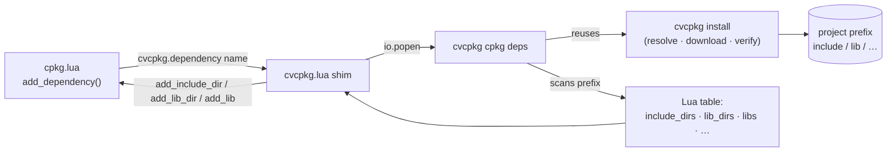

# cpkg Integration

[cpkg](https://getcpkg.net/) is a Lua + Ninja project/dependency tool for
C/C++.  cvcpkg integrates with it so a `cpkg.lua` build script can pull a
pinned, **prebuilt** binary from the cvcpkg archive (<https://cvcpkg.org>)
into a project-local prefix instead of building the dependency from source.

cpkg keeps its Lua build scripting; cvcpkg supplies the reproducible binary
package manager underneath — the catalog, signing, LTS pins, and the
cross-platform archive.

## How it works



Two pieces ship with cvcpkg:

1. **`cvcpkg cpkg deps`** — a CLI command that installs the named packages into
   a prefix (reusing `cvcpkg install` verbatim: resolution, download, signature
   checks, mirrors) and prints a machine-readable description of the prefix — a
   Lua table by default, or JSON.
2. **[`integrations/cpkg/cvcpkg.lua`](../integrations/cpkg/cvcpkg.lua)** — a Lua
   module that `cpkg.lua` scripts load.  Its `cvcpkg.dependency()` shells out to
   `cvcpkg cpkg deps`, parses the table, and wires the include/lib paths into
   the cpkg build.

## Prerequisites

- The `cvcpkg` CLI on `PATH` (`pip install cvcpkg`).
- Network access to a cvcpkg server (default `https://cvcpkg.org`), or a local
  mirror.  `CVCPKG_SERVER_URL` / `CVCPKG_TOKEN` are honoured for private/org
  packages.

## Usage

### In `cpkg.lua`

```lua
local cvcpkg = require("cvcpkg")   -- if integrations/cpkg is on LUA_PATH

add_project("myapp")

add_dependency(function()
  -- Installs boost into ./cvcpkg_deps and registers its include/lib dirs
  -- with the cpkg build.  Returns the full prefix description.
  local boost = cvcpkg.dependency("boost")

  -- Pin a version and a cvcpkg release:
  local hdf5 = cvcpkg.dependency("hdf5", { version = "1.14.3", release = "v2.0.0" })

  -- Paths are also available directly if you need them:
  -- boost.include_dirs, boost.lib_dirs, boost.libs, boost.pkgconfig_dirs,
  -- boost.cmake_dirs, boost.bin_dir
end)
```

### Getting the shim

The shim is not served by cvcpkg-server; it ships in the cvcpkg repository at
[`integrations/cpkg/cvcpkg.lua`](../integrations/cpkg/cvcpkg.lua). Vendor that
one dependency-free file into your project (recommended), or — since cpkg can
execute external Lua scripts over HTTP — pull it from GitHub at build time:

```lua
local cvcpkg = load(io.popen(
  "curl -fsSL https://raw.githubusercontent.com/transfix/libcvc-deps/master/integrations/cpkg/cvcpkg.lua"
):read("*a"))()
```

### Calling the CLI directly

```bash
# Install into a project-local prefix and print the Lua description:
cvcpkg cpkg deps boost hdf5 --prefix ./cvcpkg_deps

# JSON instead of Lua (for non-cpkg consumers):
cvcpkg cpkg deps boost --prefix ./cvcpkg_deps --format json

# Only describe an already-populated prefix (no install / no network):
cvcpkg cpkg deps --prefix ./cvcpkg_deps --no-install
```

## Options

| Option | Meaning |
|---|---|
| `--prefix DIR` | Project-local install directory (required). |
| `--format lua\|json` | Output format (default `lua`). |
| `--release TAG` | Install from a specific cvcpkg release. |
| `--arch ARCH` | Override the target architecture. |
| `--server URL` | cvcpkg-server URL (env `CVCPKG_SERVER_URL`). |
| `--token TOKEN` | Bearer token for private/org packages (env `CVCPKG_TOKEN`). |
| `--require-signatures` | Fail unless every archive is validly signed. |
| `--no-install` | Skip install; scan an existing prefix only. |

## Output schema

Both formats describe the same fields:

| Field | Type | Meaning |
|---|---|---|
| `prefix` | string | The install prefix. |
| `include_dirs` | string[] | Header search dirs (`<prefix>/include`). |
| `lib_dirs` | string[] | Library search dirs (`lib`, `lib64`). |
| `libs` | string[] | Linkable names (e.g. `boost_system`, `z`). |
| `pkgconfig_dirs` | string[] | `.pc` search dirs. |
| `cmake_dirs` | string[] | CMake package config dirs. |
| `bin_dir` | string | `<prefix>/bin` if present, else `""`. |

The `stdout` of `cvcpkg cpkg deps` is *only* the Lua/JSON document; install
progress and errors go to `stderr`, so the shim can `load()` stdout directly.
