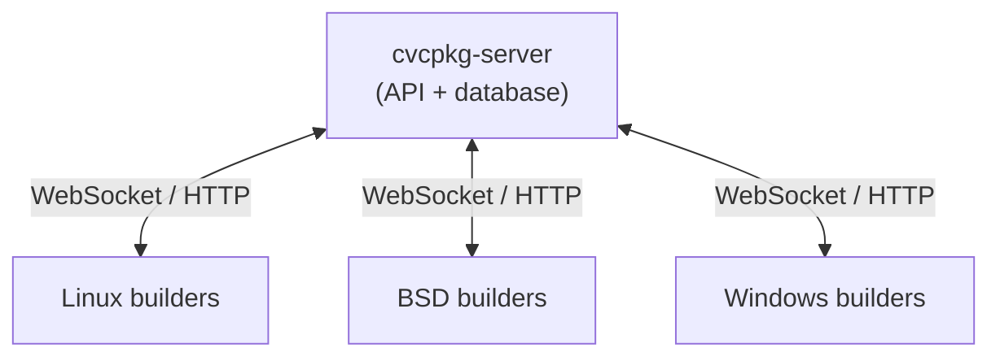

# Remote Builders

This document describes the cvcpkg remote builder system — the distributed
build fleet that compiles packages across multiple platforms.

## Architecture



Builders connect to the server, register themselves, and poll for jobs.
When a job is dispatched, the builder downloads the recipe, executes the
build, streams logs via WebSocket, and publishes the resulting archive.

Each builder auto-detects its platform/arch (override with `--platform` /
`--arch`) and can advertise cross-compilation targets with `--cross-platform`
(e.g. `--cross-platform wasm`). The scheduler dispatches a job to any builder
whose platform/arch — or advertised cross target — matches.

## Builder Registration

Builders register with the server on startup and maintain presence via
periodic heartbeats. If a builder misses heartbeats, it transitions to
"offline" status and won't receive new jobs.

```bash
cvcpkg builder run \
  --server https://cvcpkg.org \
  --token $BUILDER_TOKEN \
  --name $(hostname) \
  --max-jobs 4 \
  --work-dir /tmp/cvcpkg-builder \
  --daemon
```

### Key Options

| Option | Description |
|--------|-------------|
| `--server URL` | Server to connect to (env: `CVCPKG_SERVER_URL`) |
| `--token TOKEN` | Publisher-role auth token (env: `CVCPKG_TOKEN`) |
| `--name NAME` | Unique builder name |
| `--org SLUG` | Home namespace / identity (empty = public) |
| `--serve NS` | Additional namespace to accept jobs for (repeatable; `''` = public) |
| `--max-jobs N` | Maximum concurrent build jobs |
| `--work-dir DIR` | Scratch directory for builds |
| `--daemon` | Fork to background (Unix only) |
| `--pidfile PATH` | Write PID file for daemon management |
| `--platform` | Override auto-detected platform |
| `--arch` | Override auto-detected architecture |
| `--cross-platform` | Advertise a cross-compilation target (repeatable) |

## Ephemeral / drain builds (no persistent builder)

Sometimes you don't want a standing builder — you want to spin one up, have it
**consume the pending jobs for a platform, publish their packages, and exit**.
This is how macOS packages are built today: there is no persistent macOS builder
(GitHub-hosted runners are ephemeral), so macOS jobs sit *pending* on the server
until an ephemeral worker drains them. `.github/workflows/macos-drain.yml`
automates it (scheduled every 2 h + `workflow_dispatch`); you can also run it by
hand on any Mac:

```bash
cvcpkg builder run \
  --server https://cvcpkg.org --token "$CVCPKG_TOKEN" \
  --name "drain-$(hostname)-$(date +%s)" \
  --platform macos --max-jobs 2 --work-dir /tmp/cvcpkg-builder \
  --no-register --exit-when-empty --max-runtime 5400
```

| Option | Why it matters for draining |
|--------|------------------------------|
| `--no-register` | Claim, build, and publish jobs **without** joining the builder fleet. An ephemeral worker has no business appearing in the fleet — and can't clean itself up (unregister is admin-only, and it holds a publisher token). It is a *publisher that happens to consume queue items*, not a registered builder. |
| `--exit-when-empty` | Exit `0` as soon as the queue has no claimable jobs left (drain mode; forces HTTP long-poll instead of the persistent WebSocket). Omit it to keep polling forever. |
| `--max-runtime SEC` | Wall-clock budget: stop claiming new jobs after this many seconds and exit — bounds a CI run so it can't hang. |
| `--name NAME` | A run-scoped claimant name (e.g. `gha-run-$RUN_ID`) so each claim is attributable. |

Each job is built and **published under the job's own namespace**, at the recipe
revision it was submitted for — so draining only builds what is actually queued and
never rebuilds packages that already exist. (Contrast `macos-build.yml`, which
rebuilds the *whole* macOS recipe DAG via `pack-all` regardless of the queue.)

Trigger the automated drainer instead of running locally:

```bash
gh workflow run macos-drain.yml -R transfix/libcvc-deps   # drain the macOS queue now
```

The same pattern drains any platform's queue — pass the matching `--platform` and
run it on (or cross-compiling to) that platform.

### GitHub-hosted linux/arm64 lane

macOS is not the only platform without a standing builder: the fleet is
x86_64-only, so **linux/arm64** has the same gap.
`.github/workflows/linux-arm-build.yml` — deliberately a close sibling of
`macos-build.yml` — builds the full recipe DAG with `pack-all` on
GitHub-hosted `ubuntu-22.04-arm` runners in parallel shards and publishes
each package directly (default server `https://cvcpkg.org`). Run it via
`workflow_dispatch`, or let `populate-server.yml` call it when `arm64` is in
the requested arch list. The runner pin matters: 22.04 is glibc 2.35, the
fleet floor — a 24.04-arm runner (glibc 2.39) would emit `GLIBC_2.38+`
references that `cvcpkg pack` rejects outright.

## Multi-tenant / shared fleet

A builder can serve **several namespaces** and register with **several servers**
at once, so one machine (and one service unit) replaces separate per-org or
per-server builder deployments. See **[builder-fleet.md](builder-fleet.md)** for
the full guide.

- **Serve several namespaces on one server** — `--org` sets the home namespace
  and each `--serve` adds another. The scheduler dispatches a job to any builder
  whose served set contains the job's org. Each job's recipe fetch and publish
  use the *job's* namespace, never the builder's home `--org`.

  ```bash
  # One builder on cvcpkg.org taking BOTH public and cvc-org jobs:
  cvcpkg builder run --server https://cvcpkg.org --token $TOK \
      --name $(hostname) --org "" --serve cvc
  ```

- **Serve several servers (fleet supervisor)** — `cvcpkg builder fleet --config
  fleet.yaml` runs one worker per server listed in the config, under one
  process. Each worker holds only its own server's token, so credentials and
  build outputs stay isolated per server. This is how the previously separate
  dev and prod fleets consolidate into one.

  ```bash
  cvcpkg builder fleet --config /etc/cvcpkg/fleet.yaml --dry-run   # inspect
  cvcpkg builder fleet --config /etc/cvcpkg/fleet.yaml             # run
  ```

Org **package** namespaces remain fully isolated (org packages never populate or
shadow the public catalogue) — only *build execution* is pooled.

## Boot Persistence

Run the builder under whatever service manager the platform provides so it
survives reboots. The templates below use placeholders — substitute your own
token and paths.

### Linux (systemd)

```ini
# /etc/systemd/system/cvcpkg-builder.service
[Unit]
Description=cvcpkg builder agent
After=network-online.target
Wants=network-online.target

[Service]
Type=forking
User=<user>
ExecStart=/usr/local/bin/cvcpkg builder run \
  --server https://cvcpkg.org \
  --token <TOKEN> \
  --name %H \
  --max-jobs 4 \
  --work-dir /tmp/cvcpkg-builder \
  --daemon --pidfile /var/run/cvcpkg-builder.pid
PIDFile=/var/run/cvcpkg-builder.pid
Restart=on-failure
RestartSec=30

[Install]
WantedBy=multi-user.target
```

```bash
systemctl daemon-reload
systemctl enable --now cvcpkg-builder
```

### BSD (cron @reboot)

```bash
@reboot /usr/local/bin/cvcpkg builder run \
  --server https://cvcpkg.org \
  --token <TOKEN> \
  --name $(hostname) \
  --max-jobs 2 \
  --work-dir /tmp/cvcpkg-builder \
  --daemon
```

### Windows (scheduled task + supervisor)

`--daemon` is rejected on Windows, so a Windows builder is backgrounded by a
scheduled task that launches a small **supervisor wrapper** instead of
`cvcpkg builder run` directly. The supervisor loops: update cvcpkg, run the
builder with `CVCPKG_BUILDER_SUPERVISED=1`, and relaunch it on exit — keeping
the builder a singleton and applying self-updates without a manual restart.

When `CVCPKG_BUILDER_SUPERVISED` is set, a server-pushed `builder.update`
makes the builder exit with sentinel code `90` (`_SUPERVISOR_RESTART_CODE`)
instead of trying to re-exec in place (Windows `os.execv` cannot replace the
process there); the supervisor then pulls the latest cvcpkg and relaunches on
fresh code. Without a supervisor, the update is pip-installed and applies on
the builder's next start.

### WSL2 (Debian on a Windows host) — Linux builder

For Windows-only machines that should contribute **Linux** capacity, a
builder can run inside a Debian WSL2 instance. It registers as `linux/x86_64`
(optionally with a `wasm` cross target). The inside-the-distro setup is
identical to the systemd Linux case above; WSL adds a boot `schtasks` task
(WSL doesn't start with Windows) and either `networkingMode=mirrored` or a
`netsh portproxy` forward so SSH is reachable. Full walkthrough — SSH +
OpenSSL setup, the Windows-side plumbing, and disk cleanup / `vhdx`
compaction — in [cvcpkg-builder-wsl-debian.md](cvcpkg-builder-wsl-debian.md).

A WSL builder can additionally build **native `windows/x86_64` packages**
by registering with `--cross-platform windows`: the recipe's normal
`build.ps1` executes on the Windows host through WSL interop (staged via
an exchange directory in the host user's profile, MSVC found by
`env-windows.ps1`'s auto-import), while packaging and publishing stay on
the Linux side. See
[cvcpkg-builder-wsl-windows-cross.md](cvcpkg-builder-wsl-windows-cross.md).

## Haiku (SSH cross-build delegation)

`haiku` is a canonical platform (PR #431): recipes declare `platform: haiku`
matrix entries and the bundles publish as `haiku/x86_64` like any other
platform. What is different is that **a Haiku machine can never be a
builder**: cvcpkg cannot run natively on Haiku — HaikuPorts has no pip, and
its `cryptography` is stuck at 3.4.8 against cvcpkg's `>=41.0` floor — so a
Haiku box is a build *target* driven from a machine that does run cvcpkg.

The mechanism (`src/cvcpkg/haikuhost.py`, the Haiku analogue of the WSL
Windows-cross `winhost` above) keeps source fetch, patching, packaging and
publishing on the owning **Linux builder**; only the recipe's build script —
and its test script, since the install tree that comes back holds Haiku
binaries that cannot run on the Linux side — executes on the Haiku host, over
plain OpenSSH. Each job stages the source tree, the recipe dir (plus
`recipes/_common`) and the dependency prefixes into
`$CVCPKG_HAIKU_WORKDIR/jobs/<job>` on the Haiku side (rsync when both ends
have it, tar-over-ssh otherwise), runs a generated `run-job.sh` there while
streaming the log, and copies the install tree back so the normal
pack/publish path runs unchanged.

A haiku job that cannot be delegated is a **hard error, never a local
build**: there is no local Haiku toolchain, so the only thing a "fallback"
could produce is Linux binaries packaged as `haiku/x86_64`. An unconfigured
builder fails the job loudly, naming the missing setting.

Settings, read from the owning Linux builder's environment (the full
annotated list is the module docstring of `src/cvcpkg/haikuhost.py`):

| Variable | Meaning |
|----------|---------|
| `CVCPKG_HAIKU_SSH` | `user@host` of the Haiku box. Required — a haiku job fails until it is set. |
| `CVCPKG_HAIKU_SSH_KEY` | Identity file for the connection. |
| `CVCPKG_HAIKU_SSH_PORT` | Non-default SSH port. |
| `CVCPKG_HAIKU_WORKDIR` | Remote work root (default `/boot/home/cvcpkg-build`). |
| `CVCPKG_HAIKU_TRANSFER` | File exchange: `auto` \| `rsync` \| `tar`. |
| `CVCPKG_HAIKU_JOBS` | Overrides `CVC_JOBS` for the remote build. |
| `CVCPKG_HAIKU_KEEP_JOBS` | How many kept (failed / `--keep-build-dir`) remote job dirs to leave behind; the next job reaps the rest. `0` disables reaping. |
| `CVCPKG_HAIKU_JOB_TTL` | Seconds a job dir's liveness marker protects it from the reaper (default 86400). |
| `CVCPKG_HAIKUHOST` | `0`/`false` makes this builder **refuse** haiku jobs. It does not fall back to a local build. |

Routing is the normal cross-target mechanism: register the owning Linux
builder with `--cross-platform haiku` and the scheduler offers it haiku
jobs.

The Haiku VM itself can be provisioned from the published `haiku-image`
package — see [image-packages.md](image-packages.md). One related variable
that is **not** a delegation setting: `HAIKU_BUILDER_SSH_KEY` is the
environment variable named by `haiku-image`'s `test.vm.ssh.key_env` — the
private key the recipe's VM boot test uses to reach the guest — and is
likewise read from the builder process's environment.

## API Tokens

Builders authenticate with a publisher-role token; server administration uses
an admin-role token. Create tokens with:

```bash
# From within the server container:
docker compose exec backend cvcpkg server token create \
  --name <name> --role publisher --email <email>

# Or via API with an admin token:
curl -X POST -H "Authorization: Bearer $ADMIN_TOKEN" \
  -H "Content-Type: application/json" \
  -d '{"name":"<name>","role":"publisher","email":"<email>"}' \
  https://cvcpkg.org/v1/tokens
```

**Note:** Token hashes are HMAC-keyed using a secret stored at
`<state_dir>/.hmac_key` (in Docker: `/app/data/.hmac_key`). When creating
tokens via Python directly (bypassing the API), pass the same `state_dir` the
running server uses, otherwise the hashes won't match.

### Keeping the token out of `ps` — `--env-file`

`--token <TOKEN>` puts the secret in the process command line, and a command
line is not private: on Linux `/proc/<pid>/cmdline` is world-readable, so **any
local user can read a builder's token out of `ps`**, and Task Manager's
command-line column does the same on Windows. Exporting `CVCPKG_TOKEN` keeps it
out of `argv`, but the value still has to be written somewhere to get there —
in practice a plaintext literal in the launcher script.

Put it in a file with its own permissions instead:

```bash
install -m 600 /dev/null /etc/cvcpkg/env
cat >> /etc/cvcpkg/env <<'EOF'
CVCPKG_TOKEN=cvctok_...
CVCPKG_SERVER_URL=https://cvcpkg.org
EOF

cvcpkg builder run --name my-builder          # no --token, no export
```

cvcpkg reads the file before resolving any option's environment variable, so it
serves **every** command that takes `--token`, not just the builder.

Read automatically when present, most specific first:

| location | scope |
|----------|-------|
| `$CVCPKG_ENV_FILE` | explicit, wins over the rest |
| `./.cvcpkg.env` | project-local |
| `~/.config/cvcpkg/env` | per-user (`$XDG_CONFIG_HOME` honoured) |
| `/etc/cvcpkg/env` | system-wide (POSIX) |
| `%APPDATA%\cvcpkg\env`, `%PROGRAMDATA%\cvcpkg\env` | Windows |

Or name one explicitly — note it goes **before** the subcommand, since it has
to be read before that subcommand's options resolve:

```bash
cvcpkg --env-file /etc/cvcpkg/env builder run --name my-builder
```

Precedence, most specific first. **Nothing already in the environment is ever
displaced**, so adding a file cannot change what an existing deployment
resolves to:

```
--token on the command line     (still supported; still visible in ps)
CVCPKG_TOKEN already exported   (a real env var beats a file)
the env file
```

Format: `KEY=VALUE`, one per line, `#` comments, optional `export` prefix (so
the same file can be `source`d by an existing shell wrapper), optional quoting.
There is deliberately **no** `$VAR` interpolation or command substitution — a
file whose only job is to hold credentials should not be able to execute
anything, and a token containing `$` must survive verbatim.

cvcpkg warns if the file is group- or world-readable. It is a warning rather
than a refusal, because shared builders and CI images cannot always tighten the
mode at that moment — but `chmod 600` it.

The loaded variables are **scoped to the invocation**: cvcpkg removes the ones
it added when the command finishes, so an embedding process (the server, a test
session, an IDE plugin) does not inherit one command's env file as standing
configuration. Anything already in the environment is never touched, and
subprocesses started during the command still see the settings.

> Fleet configs have their own indirection for the same reason: prefer
> `token_env:` over a literal `token:` in `fleet.yaml`, and supply the named
> variable from an env file. See [builder-fleet.md](builder-fleet.md).

## Monitoring

### Live Monitor (top-like)

```bash
cvcpkg builds monitor --server https://cvcpkg.org --token $TOKEN
cvcpkg builds monitor --interval 2 --dag-id <dag-id>
```

Shows: builder fleet status, active jobs, recent completions, capacity utilization.

### Check Builder Status

```bash
# List all builders
curl -H "Authorization: Bearer $TOKEN" https://cvcpkg.org/v1/builders | python3 -m json.tool

# Public builders (no auth required for public builders)
curl https://cvcpkg.org/v1/builders
```

### Build Job Queries

```bash
# List recent jobs
cvcpkg builds list --server https://cvcpkg.org --token $TOKEN

# Filter by status
cvcpkg builds list --status failed --limit 20

# View / stream a build log
cvcpkg builds log <job-id> --server https://cvcpkg.org --token $TOKEN
cvcpkg builds log <job-id> --follow
```

## Submitting Builds

### Single Build

```bash
cvcpkg builds submit \
  --recipe zlib \
  --platform linux \
  --arch x86_64 \
  --server https://cvcpkg.org \
  --token $TOKEN
```

### Bulk DAG (all recipes, multiple platforms)

```bash
cvcpkg builds submit-dag \
  --platform linux,freebsd,netbsd,openbsd,win \
  --arch x86_64 \
  --config release \
  --link shared \
  --dag-id "populate-$(date +%Y%m%d)" \
  zlib boost openssl curl ...
```

### Wait for Completion

Both `submit` and `submit-dag` support `--wait` (`-w`) to block until all
jobs finish:

```bash
cvcpkg builds submit --recipe zlib --platform linux --arch x86_64 --wait
cvcpkg builds submit-dag --platform linux --arch x86_64 --wait zlib boost
```

## Troubleshooting

### Builder shows "offline"

The builder daemon may have crashed or the machine rebooted without the
persistence mechanism triggering:

```bash
# Check if the process is running
pgrep -f 'cvcpkg builder run'

# Check logs
journalctl -u cvcpkg-builder --since '1h ago'   # systemd
cat /tmp/cvcpkg-builder/builder.log             # if logging to a file
```

### Build job stuck in "dispatched"

The assigned builder may have gone offline mid-build. The server times out the
job after `--timeout` seconds (default: 3600). To cancel:

```bash
cvcpkg builds cancel <job-id> --server https://cvcpkg.org --token $TOKEN
```

### Updating builders

Pull the latest cvcpkg and reinstall:

```bash
cd <libcvc-deps checkout> && git fetch origin && git checkout origin/master && \
  pip install --quiet .
```

The new code takes effect when the builder next (re)starts, not mid-run — a
long-lived process keeps the modules it imported at startup. Restart via the
platform's service manager (systemd / cron / scheduled task); Windows builders
under the supervisor wrapper restart automatically.
