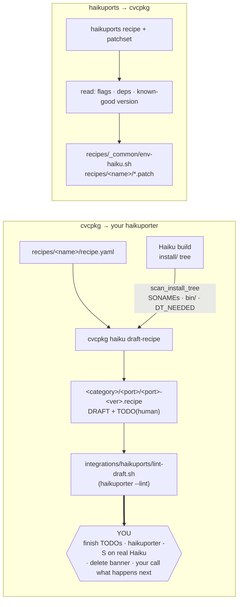

# cvcpkg on Haiku, and HaikuPorts

You are a Haiku developer.  This page is for you.  There are three things
cvcpkg offers, in the order you are likely to want them:

1. **Build software for Haiku** — `cvcpkg build <name>` drives a recipe's
   upstream tarball, patches, and build system into a relocatable prefix.
2. **Pull a pre-built bundle** instead of building — `cvcpkg install <name>`
   fetches an archive from cvcpkg.org, checks its sha256, and unpacks it into
   a prefix you name.  (No `haiku/x86_64` bundles are published *yet*; see
   below.)
3. **Draft a HaikuPorts `.recipe`** from any cvcpkg recipe —
   `cvcpkg haiku draft-recipe <name>` — so you can run it through your own
   `haikuporter`.  If you later decide to send it upstream, that is your
   call, your name, and your pull request.

Read [How to get cvcpkg on Haiku](#how-to-get-cvcpkg-on-haiku) first: parts of
(1) and (2) work today and parts do not, and the difference is not obvious.

> **cvcpkg has no code path that can open a HaikuPorts pull request.**  There
> is no `--submit`, no `gh pr create`, no bot account, no batch mode.  This is
> deliberate: HaikuPorts' PR template opens with "You are not a robot" and
> asks the submitter to attest they built the port on their own machine, and
> only you can say that.  The tool stops at a file on disk.

---

## How to get cvcpkg on Haiku

```
pkgman install click_python310 pyyaml_python310
python3.10 -m ensurepip --default-pip
python3.10 -m pip install --no-deps cvcpkg
```

The `--no-deps` is load-bearing, and here is why.  The folklore answer —
*cvcpkg cannot run on Haiku: HaikuPorts pins `cryptography` at 3.4.8 against
cvcpkg's `>=41.0` floor* — is about the **declared** dependency list, never
about what the code actually loads.  `pyproject.toml` currently lists
`cryptography`, `sqlalchemy`, `greenlet`, `httpx` and `jsonschema` as
mandatory, so a plain `pip install cvcpkg` insists on packages the client
path never imports — and at least `cryptography >= 41` (needs a Rust
toolchain) and `greenlet` (hand-written stack-switching assembly) are not
buildable on Haiku.  Skip the resolver with `--no-deps` and the client works,
because at runtime it only ever loads `click` and `PyYAML`, both of which
HaikuPorts ships.  Splitting the heavy dependencies into role-keyed extras so
the flag becomes unnecessary is proposed separately (see
[Ranked options](#ranked-options)).

### What `cvcpkg install` really imports

Traced at runtime, not read off `pyproject.toml`.  Importing the entire CLI
surface (`import cvcpkg.cli`, which pulls every command module) and then
running a real `cvcpkg install zlib bzip2` against the live cvcpkg.org catalog
— fetch catalog, resolve, download, verify sha256, extract, write lockfile,
CMake config and activation scripts — loads exactly two third-party
distributions:

| Package | Needed for | HaikuPorts has |
|---|---|---|
| `click` | the CLI itself | `dev-python/click` 8.1.3 ✅ (cvcpkg wants `^8.1`) |
| `PyYAML` | recipes, catalog, lockfile, manifests | `dev-python/pyyaml` 6.0 ✅ (cvcpkg wants `^6.0`) |

Nothing else.  In particular:

- **HTTP is stdlib.**  `storage.py`'s `https`/`http` backend is
  `urllib.request`.  `httpx` is the client for the *server API* — publish,
  recipe push/pull, builds, search, webhooks, the builder agent — and every
  one of its imports is inside the function that uses it, so the install path
  never reaches one.
- **`cryptography` is signing-only, and lazily imported.**  Every
  `from cryptography…` in `signing.py` is inside a function body;
  `installer.py` imports `cvcpkg.signing` only when an entry carries a
  signature or `--require-signatures` was passed.  Integrity on the normal
  path is `hashlib.sha256`, which is stdlib.
- **`jsonschema` is validate-only, and lazily imported.**  Both
  `Draft202012Validator` imports in `validation.py` sit inside the functions
  that use them, so only `cvcpkg validate` (and schema-checked `pack`) reach
  one.
- **`sqlalchemy`, `greenlet`, `fastapi`, `uvicorn`, `alembic`, `asyncpg` are
  server-side.**  They belong to `cvcpkg-server`, not the client.

Verified in a clean virtualenv containing **only** `click` and `PyYAML`, with
cvcpkg installed `--no-deps`:

```
$ cvcpkg --help                                    # → full CLI, no import errors
$ cvcpkg install zlib bzip2 --prefix /tmp/p        # → 2 components installed
$ cvcpkg haiku draft-recipe zlib                   # → draft on stdout
$ cvcpkg haiku draft-recipe zlib --output ~/hp     # → sys-libs/zlib/zlib-1.3.1.recipe
```

So the blocker is **packaging metadata, not code**.  None of the mandatory
heavy dependencies is satisfiable from the ports tree: HaikuPorts has
`cryptography` 3.4.8 (cvcpkg wants `>=41`, which needs a Rust toolchain) and
`sqlalchemy` 1.3.24 (cvcpkg wants `^2.0`), and has no `greenlet` or `httpx`
port at all — `greenlet` being a C extension with hand-written
stack-switching assembly, not a wheel you can drop in.

### Ranked options

**1. `pip install --no-deps cvcpkg` — works today.**  Contrary to the
folklore, pip *is* obtainable on Haiku: the `dev-lang/python` recipes configure
with `--with-ensurepip=no`, so pip is not installed by default, but the
`ensurepip` module ships and each recipe's own `DESCRIPTION` spells out the
incantation — *"Note: to install 'pip' for this Python version, use the
following commands: `python3.10 -m ensurepip --default-pip`"* (the 3.11–3.14
recipes say `--altinstall`).  Then:

```
pkgman install click_python310 pyyaml_python310
python3.10 -m ensurepip --default-pip
python3.10 -m pip install --no-deps cvcpkg
```

HaikuPorts' `click` and `pyyaml` satisfy the two imports the client path
actually makes, so nothing is built.  You do not get `--require-signatures`,
`cvcpkg validate` or the `cvcpkg-server` commands, because their libraries
(`cryptography`, `jsonschema`, the server stack) are not installed; reaching
for one raises `ModuleNotFoundError` at the point of use.  Everything on the
install/build/draft path works.

*Caveat:* HaikuPorts' `click` 8.1.3 and `pyyaml` 6.0 recipes both declare
`PYTHON_VERSIONS=(3.10)`, so they land in `python3.10`'s `vendor-packages`
only.  Use `python3.10` unless you install click/pyyaml yourself.

**2. Extras keyed to roles — proposed, not yet landed.**  The clean fix is to
move `cryptography`, `sqlalchemy`, `greenlet` and `httpx` out of
`[tool.poetry.dependencies]` into extras keyed to the role that needs them
(`signing`, `server`, `remote`/`publish`/`builder`), leaving `click` + `PyYAML`
as the base install, with each guarded import reporting the extra to install
instead of a traceback.  That refactor was prototyped on the original Haiku
branch (PR #441) and has not merged; until it does, option (1)'s `--no-deps`
is the workaround.

**3. Unpack the source tree onto `PYTHONPATH` — does not work.**  The no-pip
route fails on import:

```
File "src/cvcpkg/__init__.py", line 8, in <module>
    __version__ = _pkg_version("cvcpkg")
importlib.metadata.PackageNotFoundError: No package metadata was found for cvcpkg
```

`__version__` is read from installed distribution metadata with no fallback,
so cvcpkg cannot be imported from a bare source checkout.  Use pip (option 1),
which writes the metadata even with `--no-deps`.

**4. The PyInstaller single binary — not available for Haiku.**  This repo
builds a self-contained `cvcpkg` (and a combined multi-call `cvcpkg` /
`cvcpkg-server`) via `packaging/cvcpkg.spec`, but PyInstaller ships no Haiku
bootloader and HaikuPorts has no `dev-python/pyinstaller`.  Porting the
bootloader is a real project, not a workaround.

**5. A `dev-python/cvcpkg` HaikuPorts recipe.**  The idiomatic Haiku answer,
and the one that would make `pkgman install cvcpkg` work.  It is blocked on
(2): a recipe that has to carry `cryptography >= 41` is not portable, so the
extras split has to land first — after which the `REQUIRES` list is just
`python3.10`, `click` and `pyyaml`.  If you want to write it then,
`cvcpkg haiku draft-recipe` will not help: cvcpkg has no recipe for itself.

---

## Using cvcpkg on Haiku

### Pre-built bundles — not yet

Be clear-eyed about this: **cvcpkg.org publishes no `haiku` bundles today.**
The live catalog covers `linux`, `macos`, `windows`, `freebsd`, `openbsd`,
`netbsd`, `wasm`, `wasi`, `cosmo` and `any`, and zero Haiku.  The `any`
(noarch) column does not rescue it either — those entries depend on a
platform-specific `python3XX`, so they will not resolve for `haiku` either.

`cvcpkg install --platform haiku` therefore fails to resolve at the moment.
It is not a stub: `platform.py` already detects Haiku natively (including the
`haiku1` / `haikuR1~beta5` spellings CPython reports) and maps it to a
`haiku-libroot` ABI tag.  What is missing is builds.

### Building from source — mostly there

`recipes/_common/env-haiku.sh` exists and sets up a Haiku build environment,
but its header says plainly `UNVERIFIED-ON-HARDWARE`: it was written from the
Haiku R1/beta5 documentation and the HaikuPorts layout, and the marked lines
have not been executed on a live Haiku host.  Separately, no cvcpkg recipe yet
declares a `platform: haiku` row in its `build.matrix`, so
`cvcpkg build <name>` for Haiku has nothing to select.

`src/cvcpkg/haikuhost.py` drives Haiku builds *from* a Linux builder over SSH
(Haiku ships sshd), staging sources onto the Haiku box and copying the install
tree back.  That is how a Linux CI fleet can produce Haiku bundles without a
Haiku toolchain — but per the section above it is the *convenient* topology
for a CI fleet, not the only possible one: cvcpkg's client path runs on Haiku
(via the `--no-deps` install), so a Haiku box can also just build for itself.

**If you are on Haiku and want to help:** getting one leaf library (`zlib`)
through `cvcpkg build` on real hardware is the single highest-value
contribution, because it converts `env-haiku.sh` from documentation into a
tested file and unblocks every bundle above.

---

## Drafting a `.recipe` for your own haikuporter

`cvcpkg haiku draft-recipe` is a rule-based transpiler with no model in the
loop.  It reads a cvcpkg `recipe.yaml`, transcribes the fields cvcpkg already
knows into `<category>/<port>/<port>-<version>.recipe`, and marks everything
else `# TODO(human):`.

This is the same shape as a tool HaikuPorts already ships,
[`haikuporter/tools/cargo-to-recipe.sh`](https://github.com/haikuports/haikuporter/blob/master/tools/cargo-to-recipe.sh):
it emits `COPYRIGHT=""` for a human to fill in, prints a hand-off message when
it hits a custom licence, calls its output a *"recipe template … filled with
information at hand"*, and writes a file rather than opening a PR.

```bash
# Print a draft.  Without build evidence, PROVIDES/REQUIRES stay TODOs.
cvcpkg haiku draft-recipe zlib

# Ground the resolvables in a real Haiku build's install tree.
cvcpkg haiku draft-recipe zlib --install-tree ./build/zlib/install

# Write it into your haikuports checkout.
cvcpkg haiku draft-recipe nfft3 --output ~/src/haikuports

# See where it would land without writing anything.
cvcpkg haiku draft-recipe cgal --output ~/src/haikuports --dry-run

# Then haikuporter's own linter (runs on Linux too, no Haiku box needed):
integrations/haikuports/lint-draft.sh ~/src/haikuports nfft3
```

### Options

| Option | Meaning |
|---|---|
| `--install-tree DIR` | Install tree from a **real Haiku build**.  Grounds `PROVIDES`/`REQUIRES` in actual SONAMEs, `bin/` entries and ELF `DT_NEEDED` instead of leaving them as TODOs. |
| `--output DIR` | haikuports checkout root; writes `<category>/<port>/<port>-<ver>.recipe`. |
| `--dry-run` | With `--output`, report the path and write nothing. |
| `--revision N` | HaikuPorts `REVISION` (default `1`). |
| `--force` | Overwrite an existing file under `--output`. |
| `--lint / --no-lint` | Run cvcpkg's local copy of HaikuPorts' lint rules (default on). |
| `--recipes-dir DIR` | Extra recipes overlay, as everywhere else in cvcpkg. |

There is deliberately no `--submit`, `--pr`, or `--push`.

`stdout` is *only* the recipe; the lint report and the TODO list go to
`stderr`, so `cvcpkg haiku draft-recipe zlib > z.recipe` does the obvious
thing.

### What ships

1. **[`src/cvcpkg/haikuports.py`](../src/cvcpkg/haikuports.py)** — the pure
   library.  No network, no subprocess.  Curated tables (Haiku licence names,
   SPDX↔Haiku mapping, cvcpkg-name → HaikuPorts `<category>/<port>`), an
   install-tree scanner with a small self-contained ELF `DT_NEEDED`/`DT_SONAME`
   reader, the draft emitter, and a local re-implementation of HaikuPorts' own
   lint rules.
2. **`cvcpkg haiku draft-recipe`**
   ([`src/cvcpkg/cli/_haiku.py`](../src/cvcpkg/cli/_haiku.py)) — the CLI.
3. **[`integrations/haikuports/lint-draft.sh`](../integrations/haikuports/lint-draft.sh)**
   — runs HaikuPorts' *actual* `haikuporter --lint` the way their
   `.github/workflows/lint.yml` does (clone haikuporter, throwaway
   `haikuports.conf`, fetch `waddlesplash/haiku-licenses`), on Linux, so a
   draft can be CI-green before anyone reads it.
4. **[`tests/unit/test_haikuports.py`](../tests/unit/test_haikuports.py)** —
   offline unit tests, including golden checks that the emitter never produces
   trailing whitespace and that a draft never lints clean.

### Field mapping

| cvcpkg | HaikuPorts | How |
|---|---|---|
| `recipe.name` | port dir + filename stem | Curated table (`KNOWN_PORTS`), dash→underscore fallback.  **Not** an algorithm — `libgeos`→`geos`, `xz`→`xz_utils`, `c-ares`→`c_ares`, `fftw3`→`fftw`. |
| — | `<category>/` | Curated table, read off the live tree.  Mirrors Gentoo; not derivable from the name (zlib is `sys-libs`). |
| `recipe.upstream_version` | filename `-<version>`, `$portVersion` | Never written as a variable. |
| `recipe.description` | `SUMMARY` | Leading `"<name> — "` stripped, first sentence, capitalised, trailing stop removed; length/word-count checked. |
| `recipe.description` | `DESCRIPTION` | Wrapped at ≤100 chars with `\` continuations — **plus a TODO**, because cvcpkg's one-liner *is* a summary. |
| `recipe.homepage` | `HOMEPAGE` | Verbatim + a TODO to check the trailing slash with `curl --head`. |
| `recipe.license` (SPDX) | `LICENSE` | `SPDX_TO_HAIKU` table.  Unmapped ids pass through as the name of a port-local `licenses/<Name>` file, with a TODO. |
| — | `COPYRIGHT` | **Always empty + TODO.**  No cvcpkg field exists. |
| `recipe.cvc_revision` | — | Deliberately *not* mapped; see below. |
| — | `REVISION` | Always `1` for a new port, with a TODO explaining the difference. |
| `source.url` (+ `source.mirror`) | `SOURCE_URI` | Version re-interpolated as `$portVersion` / `${portVersion}`. |
| `source.sha256` | `CHECKSUM_SHA256` | Verbatim. |
| archive basename | `SOURCE_DIR` | Emitted only when it differs from `$portVersionedName` (`CGAL-6.0.1`, `spatialindex-src-2.1.0`), with a TODO to verify. |
| `patches[]` | `PATCHES` | **Not emitted.**  Reported as a TODO — see the patch-format gap below. |
| `depends.build` / `host_tools` (tools) | `BUILD_PREREQUIRES` | `TOOL_COMMANDS` table → `cmd:cmake`, `cmd:libtoolize`, … plus `cmd:gcc`/`cmd:ld`. |
| `depends.build` / `runtime` (libraries) | `BUILD_REQUIRES` | `<hport>_devel` when the dep maps to a known port; otherwise reported, never invented. |
| install tree `lib/*.so.*` | `PROVIDES` `lib:` / `PROVIDES_devel` `devel:` | From real SONAMEs: `lib:libz = 1.3 compat >= 1` — tracking the SONAME, *not* the port version. |
| install tree `bin/*` | `PROVIDES` `cmd:` | One per executable, dashes → underscores. |
| install tree ELF `DT_NEEDED` | `REQUIRES` `lib:` | Minus the port's own libs and `BASE_SYSTEM_LIBS` (covered by `haiku`). |
| `test.script` (presence) | `TEST()` stub | Body is a TODO. |
| `build.matrix` | — | Discarded: a HaikuPorts recipe is Haiku-only by construction. |
| `abi.link`, Release/Debug pair | — | No analogue.  Haiku ships one build; static libs are conventionally deleted (`rm $libDir/libz.a`). |
| `provides` / `conflicts` slots | — | Near-but-not-equal to `PROVIDES`/`CONFLICTS`; Haiku's are namespaced resolvables, not a mutual-exclusion group.  Not mapped. |
| `requires_capabilities`, `cross_toolchain`, `host_platform`, `timeout_seconds`, `kind`, `tags`, `maintainer*` | — | No counterpart. |

Emitted in the exact order the
[Guidelines](https://github.com/haikuports/haikuports/wiki/HaikuPorter-Guidelines)
prescribe, with tab-indented multi-line values, `PROVIDES`/`REQUIRES`/… sorted
alphabetically with `haiku`/`haiku_devel` and the port's own self-provide
first, no line over 100 characters, and no trailing whitespace anywhere.

### What it will not do for you

**Mechanizable, and done:** file placement and naming, field order, tab
indentation, trailing-whitespace hygiene, the 100-character rule, `SUMMARY`
derivation with all five of haikuporter's hard checks, `DESCRIPTION` wrapping,
`SOURCE_URI` version interpolation, checksums, `SOURCE_DIR`, SPDX→Haiku licence
translation, tool-vs-library dependency classification, and — **given a real
Haiku install tree** — `PROVIDES`/`REQUIRES`/`PROVIDES_devel`/`REQUIRES_devel`
derived from SONAMEs, `bin/` contents and ELF `DT_NEEDED`.

**Not mechanizable, and deliberately not attempted:**

- **`PROVIDES` / `REQUIRES` without `--install-tree`.**  These are a property
  of the *installed tree*, not of recipe source: haikuporter's `Policy.py`
  cross-checks every `cmd:` against `bin/`, every `lib:` against the real
  SONAMEs, and every `REQUIRES` against ELF `DT_NEEDED`.  Without build
  evidence they degrade to TODOs rather than being guessed, and the draft
  banner says so.
- **`COPYRIGHT`.**  Year plus holder, transcribed from upstream's
  `COPYING`/source headers; `sci-libs/gsl`'s block is ~45 hand-entered names.
  cvcpkg has no such field.  Generating it from SPDX metadata would produce a
  plausible-looking lie — the highest-severity failure mode here.
- **`BUILD()` / `INSTALL()`.**  cvcpkg builds fat, relocatable, FHS-layout
  prefixes with `$ORIGIN` rpaths and a `cvc_rewrite_install_paths` pass.  A
  Haiku port installs one shared library into packagefs' fixed layout
  (`develop/headers`, `develop/lib`, `data/`, `documentation/man`), deletes the
  static lib, and splits `_devel` off with `packageEntries`.  A translated
  autotools `BUILD()` also silently changes the meaning of `--includedir` — the
  exact class of change that breaks packages hard-coding `$prefix/include`.
  The `$ORIGIN` rpath must be *dropped*, not carried: packagefs mounts at fixed
  paths, and a relocatable-`$ORIGIN` port reads to reviewers as a foreign
  smell.  The emitter therefore quotes cvcpkg's `build.sh` as a comment and
  leaves a stub that `exit 1`s.
- **`DESCRIPTION` proper.**  Two to three sentences, seeded with search terms
  because HaikuDepot's full-text search only sees summary and description.
- **Slot vs bump.**  HaikuPorts keeps `boost1.69/1.83/1.88/1.90/1.91`,
  `hdf5` + `hdf5_103`, `gsl` + `gsl25`, `yaml_cpp0.7` + `yaml_cpp0.8` side by
  side.  "Newer version" often means "add a slot", which depends on a
  downstream consumer graph the tool cannot see.
- **`REVISION` policy.**  HaikuPorts bumps `REVISION` only when the built
  package's *contents* change and explicitly **not** for a cosmetic recipe
  edit; it resets on a version bump.  cvcpkg's `cvc_revision` is bumped for
  pure rebuilds and is derived from a server-side "next revision above
  published" oracle that does not exist here.  They are false friends; the tool
  refuses to copy the number.
- **`SECONDARY_ARCHITECTURES` / `x86_gcc2`.**  Omitted rather than guessed.
  `ARCHITECTURES` is emitted as `x86_64` — what cvcpkg actually builds and
  tests — with a TODO to widen it only after a real build elsewhere.
- **Patch relevance.**  cvcpkg's patches are NetBSD/wasm/toolchain-motivated;
  Haiku needs its own class of fix (no `libpthread` — pthreads are in
  `libroot`; sockets in `libnetwork`, not libc; no `/usr`).  Which cvcpkg
  patches matter on Haiku is a per-patch judgement.

### What it refuses outright

`cvcpkg haiku draft-recipe` exits with a clear message rather than emitting
something plausible-but-wrong for:

| Shape | Why |
|---|---|
| `-cpXXX` Python column recipes (370 of cvcpkg's 558) | HaikuPorts models Python as one `dev-python/<name>` port with a `PYTHON_VERSIONS` array over its own `python3.10`–`3.14` slots, built with `setup.py` into `lib/pythonX.Y/vendor-packages`.  cvcpkg's per-interpreter columns are the opposite shape, and `cp313t` has no Haiku counterpart. |
| `source.type: python_wheel` / `python_sdist` | Same. |
| `source.type: vendored` | No upstream `SOURCE_URI`, which is a required field. |
| `source.type: prebuilt` | HaikuPorts builds every port from source. |
| `source.type: vcpkg` / `brew` / `apt` | Reference to another package manager, not an upstream archive. |
| `recipes/haiku-image` | Builds a Haiku *image* on a Linux host; not a Haiku package. |

---

## If you want to upstream your recipe

Entirely your call — cvcpkg neither helps nor hinders.  What follows is so you
know the bar before you spend the effort.

**The PR checklist.**  HaikuPorts'
[pull request template](https://github.com/haikuports/haikuports/blob/master/.github/pull_request_template.md)
(added 2026-05-26) opens with:

```
- [ ] You are not a robot.
- [ ] The modified recipe was confirmed to build on your Haiku machine.
- [ ] The license and copyright information in modified recipes are correct.
- [ ] The recipe follows one of the templates from haikuporter/generic
      (in particular, the fields are in the right order).
- [ ] The recipe is in the right category (matching Gentoo's overlays;
      use https://gpo.zugaina.org to check).
```

That checklist is read as a signed attestation, and it is enforced.  PR
[#14460](https://github.com/haikuports/haikuports/pull/14460) was opened and
closed the same day with the comment *"You deleted the checklist, which
contains a 'not a robot' check, and … replaced it with a robot's output."*  PR
[#14209](https://github.com/haikuports/haikuports/pull/14209) — a tool that
called `gh pr create --title --body`, thereby bypassing the template — was
closed with *"This PR ignores the provided PR template."*  So: do not delete or
edit the checklist, and open the PR through the web UI.

**Checkbox 2 is the real one.**  Build it with `haikuporter -S <port>` on an
actual Haiku machine and fix what the policy checker says.  A Linux-driven
cross-build does not let you tick it; if that is how you built it, say so
plainly in the body instead.

**Generators are fine; unbuilt model output is not.**  This is worth knowing
because the two get conflated.  On the HaikuPorts mailing list (2026-05-20),
waddlesplash:

> Copying from other recipes is fine … **Writing old-style code generation
> tools to auto-generate recipes sounds fine by me too.** But any tool that is
> designed to replace human intelligence I am going to be against. There is no
> substitute for thinking.

and PulkoMandy (2026-05-30):

> The same thing can be implemented without an LLM. A script that generates a
> recipe skeleton, maybe ask a few questions or tries to detect the build system
> type, license and copyright.

The tree already ships exactly such a tool
(`haikuporter/tools/cargo-to-recipe.sh`), so a deterministic generator is
normal there.  What is not welcome is an unbuilt, model-generated submission.
Disclose the tool in your own words — something like *"the recipe metadata was
transcribed from a cvcpkg package definition by a deterministic script,
`cvcpkg haiku draft-recipe` (no LLM involved); I wrote the BUILD()/INSTALL()
phases and the copyright block by hand and built and tested the port on my own
Haiku machine."*

**Mechanics.**  Port names are lowercase with underscores, never dashes
(`c_ares`, `xz_utils`).  The category mirrors Gentoo's overlays — check against
<https://gpo.zugaina.org>, since it is not derivable from the name (`zlib` is
`sys-libs`).  No line over 100 characters, no trailing whitespace, fields in
the order the Guidelines prescribe.  One squashed commit, titled
`nfft3: new recipe` or `gsl: bump to version 2.8` (the tree's de facto format).
Delete the draft banner first.

**Expect it to take a while, and consider whether it belongs upstream at all.**
HaikuPorts runs ~44 open PRs and ~491 open issues against a reviewer pool of
five or six.  Reviewers have asked, of niche and first-party software, *"why
publish this project on HaikuPorts? … There are alternatives"*, and
waddlesplash has pointed contributors at third-party repositories: *"Third-party
repositories can be set up, and when configured on a Haiku install, HaikuDepot
will show all the packages from them, too."*  General-purpose third-party
libraries belong in the main tree; a project's own libraries often do not.

### Where cvcpkg's catalog and HaikuPorts differ

If you are looking for something worth porting, this is where the two catalogs
diverge.  Two honest observations, and the first constrains the second.

**HaikuPorts' general C/C++ stack is not stale — it is ahead of cvcpkg's on
most of the shared surface.**  Measured against cvcpkg's own recipes: boost
1.91.0 (cvcpkg 1.86.0), libxml2 2.15.3 (2.12.9), openblas 0.3.30 (0.3.28),
geos 3.14.0 (3.13.0), qt6 6.10.3 (6.8.2), llvm 22.1.8, cmake 4.1.6, ninja
1.13.2, python 3.14.6, curl 8.21.0, ffmpeg 8.1.2, harfbuzz 14.2.0, mesa 25.3.3.
Roughly 122 of cvcpkg's ~188 native recipes already have a HaikuPorts
counterpart, usually at a newer version.

**The scientific corner is thin, and that is exactly cvcpkg's catalog.**
Verified absent from all 3,992 recipes in the tree:

| cvcpkg package | Would be | Note |
|---|---|---|
| `nfft3` 3.5.3 | `sci-libs/nfft3` | Nonequispaced FFT.  Tiny; `sci-libs/fftw` 3.3.10 already present. |
| `levmar` 2.6 | `sci-libs/levmar` | Levenberg-Marquardt; `sci-libs/lapack` 3.10.0 present.  (cvcpkg vendors the source, so it needs an upstream URL before it can be drafted.) |
| `lerc` 4.0.0 | `sci-libs/lerc` | Needed by modern tiff/gdal. |
| `log4cplus` 2.1.2 | `dev-libs/log4cplus` | |
| `vcglib` 2025.07 | `sci-libs/vcglib` | Mesh processing; MeshLab's core. |
| `joltphysics` 5.6.0 | `sci-physics/joltphysics` | `sci-physics/` currently holds only bullet + a demo. |
| `vtk` 9.5.0 | `sci-visualization/vtk` | No VTK, ParaView, ITK, PETSc or Trilinos anywhere in the tree; `sci-visualization/` contains exactly gnuplot, gri and labplot.  Every non-vendored VTK dependency is already there (hdf5, netcdf, libxml2, freetype, glew, mesa, libglvnd, glu, jsoncpp, pugixml, double_conversion, utfcpp, libfmt, nlohmann_json, eigen, qhull, libharu, lz4, expat, sqlite, proj, qt6-base).  Note Haiku's OpenGL is Mesa 25.3.3, largely software rasterisation, so it would be functional but slow. |

And materially stale where cvcpkg is current — bumps or slots, the lowest-noise
kind of change:

| Port | HaikuPorts | cvcpkg | Note |
|---|---|---|---|
| `sci-mathematics/cgal` | 4.13 (2018) | 6.0.1 | CGAL 6.x is header-only; gmp 6.3.0, mpfr 4.2.0, boost 1.91, eigen 5.0.1 all present.  Best effort-to-value ratio in the list. |
| `sci-libs/hdf5` | 1.12.0 (2020) | 1.14.4 | Already slotted (`hdf5_103-1.10.6`), so an `hdf5_114` slot is idiomatic. |
| `sci-libs/gsl` | 2.6 (2019) | 2.8 | Already slotted (`gsl25-2.5`); textbook bump. |
| `sci-libs/libspatialindex` | 1.9.3 (2019) | 2.1.0 | |

**Probably not a first PR:** protobuf 3.20.1 / re2 2022.06.01 / grpc 1.53.0
(cvcpkg has 28.3 / 2024.07.02 / 1.68.2).  One coupled ABI cluster, already
mismatched against `abseil_cpp` 20250127.0 — high blast radius.

---

## The other direction: cvcpkg reusing HaikuPorts' work

For completeness, since this repository is the other half of the bridge.
HaikuPorts is a decade of Haiku portability knowledge, and cvcpkg's Haiku
column is downstream of it.



Nothing in this direction is automated yet, and the honest reason is that the
valuable part is not mechanical.  What extracts cleanly is metadata:
`<port>-<version>.recipe` → name + version; `SOURCE_URI[0]` → `source.url`;
`CHECKSUM_SHA256` → `source.sha256`; `SOURCE_DIR` → `strip_components`;
`SUMMARY` → `description`; `LICENSE` → SPDX via the reverse table;
`BUILD_PREREQUIRES cmd:*` → `depends.build`; `REQUIRES lib:*` →
`depends.runtime` (dropping `haiku`, which is the platform).

What does *not* extract is the part worth having: the `BUILD()`/`INSTALL()`
bodies are written against Haiku's directory variables and Haiku-only helpers
(`runConfigure`, `$cmakeDirArgs`, `prepareInstalledDevelLib`, `fixPkgconfig`,
`packageEntries`, `defineDebugInfoPackage`) with no cvcpkg counterpart.  The
real prize is (i) the **1,597 `.patchset` files** — years of Haiku portability
fixes already reviewed by people who know the platform; (ii) the `REQUIRES`
graph as ground truth for what is in the base system versus what cvcpkg must
build; and (iii) the per-port gotchas recorded only as comments.

Two notes for whoever implements it:

- **Do not regex-parse `.recipe` files.**  They are bash, and recipes
  legitimately construct `PROVIDES`/`REQUIRES` in loops and with `eval` (the
  generic python template, and hybrid recipes branching on
  `$targetArchitecture`).  haikuporter parses by sourcing them under `bash`
  with a pre-seeded variable table (`ConfigParser.py`).  Do the same, or import
  haikuporter (MIT) as a library on the Linux builder.
- **`.patchset` ≠ `.patch`.**  Patchsets are `git format-patch` mailbox series
  applied with `git am`; cvcpkg's schema says `patch -p1`.  Split them or teach
  the applier a `git am` mode — and **keep the authorship headers and a link
  back to the source port.**  HaikuPorts is MIT
  ([`LICENSE.md`](https://github.com/haikuports/haikuports/blob/master/LICENSE.md)),
  so reuse is legally clean *provided attribution is preserved*.

---

## Output schema

`HaikuDraft`, returned by `haikuports.draft_recipe()`:

| Field | Type | Meaning |
|---|---|---|
| `port` | string | HaikuPorts port name (underscored). |
| `category` | string | Gentoo-shaped category, or `TODO-category`. |
| `version` | string | Upstream version. |
| `text` | string | The `.recipe` body, banner included. |
| `todos` | string[] | Everything a human still owes, in prose. |
| `grounded` | bool | Were `PROVIDES`/`REQUIRES` derived from a real build? |
| `filename` | string | `<port>-<version>.recipe`. |
| `relpath` | string | `<category>/<port>/<port>-<version>.recipe`. |

`InstallFacts`, returned by `haikuports.scan_install_tree()`:

| Field | Type | Meaning |
|---|---|---|
| `origin` | string | The install tree that was scanned. |
| `commands` | string[] | `bin/` entries → `cmd:` resolvables. |
| `libraries` | `LibFact[]` | `name`, `version` (from the filename), `compat` (from the SONAME's major). |
| `needed` | string[] | ELF `DT_NEEDED` minus own libs and `BASE_SYSTEM_LIBS`. |

## Sources

Everything above is grounded in the following; check them before changing the
emitter, since HaikuPorts has no versioned schema (`FormatVersions` has said
`RecipeFormatVersion=1` throughout).

- [`haikuports` tree](https://github.com/haikuports/haikuports) — 3,992
  `.recipe`, 1,597 `.patchset`, 3,524 port dirs across ~120 Gentoo-shaped
  categories (master, 2026-08-03).
- [`dev-lang/python`](https://github.com/haikuports/haikuports/tree/master/dev-lang/python)
  (3.10.20 / 3.11.15 / 3.12.13 / 3.13.14 / 3.14.6, each documenting
  `python3.X -m ensurepip --altinstall`),
  [`dev-python/click`](https://github.com/haikuports/haikuports/tree/master/dev-python/click)
  8.1.3, [`dev-python/pyyaml`](https://github.com/haikuports/haikuports/tree/master/dev-python/pyyaml)
  6.0 — the three that decide whether cvcpkg runs on Haiku.
- [`pull_request_template.md`](https://github.com/haikuports/haikuports/blob/master/.github/pull_request_template.md),
  [`lint.yml`](https://github.com/haikuports/haikuports/blob/master/.github/workflows/lint.yml),
  [`lint-new-recipes.sh`](https://github.com/haikuports/haikuports/blob/master/.github/lint-new-recipes.sh)
- [HaikuPorter-Guidelines](https://github.com/haikuports/haikuports/wiki/HaikuPorter-Guidelines),
  [HaikuPorter-BuildRecipes](https://github.com/haikuports/haikuports/wiki/HaikuPorter-BuildRecipes),
  [DevelopmentModel](https://github.com/haikuports/haikuports/wiki/DevelopmentModel)
- [`RecipeAttributes.py`](https://github.com/haikuports/haikuporter/blob/master/HaikuPorter/RecipeAttributes.py),
  [`Port.py`](https://github.com/haikuports/haikuporter/blob/master/HaikuPorter/Port.py),
  [`Policy.py`](https://github.com/haikuports/haikuporter/blob/master/HaikuPorter/Policy.py),
  [`ShellScriptlets.py`](https://github.com/haikuports/haikuporter/blob/master/HaikuPorter/ShellScriptlets.py)
- [`generic/generic_lib-1.2.3.recipe`](https://github.com/haikuports/haikuporter/blob/master/generic/generic_lib-1.2.3.recipe),
  [`sys-libs/zlib/zlib-1.3.2.recipe`](https://github.com/haikuports/haikuports/blob/master/sys-libs/zlib/zlib-1.3.2.recipe),
  [`tools/cargo-to-recipe.sh`](https://github.com/haikuports/haikuporter/blob/master/tools/cargo-to-recipe.sh)
- [`waddlesplash/haiku-licenses`](https://github.com/waddlesplash/haiku-licenses) — the 40 well-known licence names.
- Mailing list, "LLMs policy", 2026-03-18 → 2026-05-31:
  [thread](https://www.freelists.org/post/haikuports/LLMs-policy),
  [waddlesplash on code generators](https://www.freelists.org/post/haikuports/LLMs-policy,26),
  [PulkoMandy on a skeleton generator](https://www.freelists.org/post/haikuports/LLMs-policy,76).
- Enforcement precedents:
  [#14161](https://github.com/haikuports/haikuports/pull/14161),
  [#14172](https://github.com/haikuports/haikuports/pull/14172),
  [#14209](https://github.com/haikuports/haikuports/pull/14209),
  [#14460](https://github.com/haikuports/haikuports/pull/14460).
