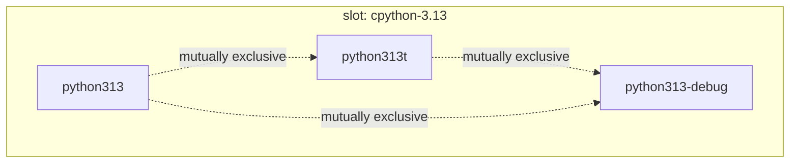

# Mutually exclusive packages

Some packages cannot share a prefix — most often because they install the same
files and would clobber each other. cvcpkg has two mechanisms for this, and
they do different jobs.

| | `conflicts:` / `provides:` | file-overlap detection |
|---|---|---|
| kind | **declared** in the recipe | **computed** from bundle manifests |
| when | before anything is downloaded | after packages are built |
| used for | **enforcement** — refusing the install | **verification** — finding what nobody declared |

Declaration is what the installer enforces, and it has to be: a conflict must be
caught *before* fetching, and at that point all cvcpkg has is the catalog — you
cannot inspect the files of a package you have not downloaded. Computation is
what makes the declarations trustworthy.

## `provides:` — mutually exclusive groups

```yaml
provides:
  - cpython-3.13
```

Every package providing a slot is mutually exclusive with every other provider
of that slot. Prefer this whenever more than two packages are involved:



A group of *n* alternatives needs **n** declarations, not the **n×(n−1)**
pairwise entries `conflicts:` would need — and it **cannot be declared
asymmetrically**, which matters more than the brevity (see below).

Slot names live in their own namespace, so unlike package names they may carry
a dot: `cpython-3.13` is the expected shape.

Slots are also how hardware-specific peers work: requesting a slot name picks
the best provider the host's capabilities allow (e.g. `torch-cp311` resolves to
`torch-cp311-cuda` on a CUDA host) — see
[capabilities-and-hardware.md](capabilities-and-hardware.md).

## `conflicts:` — explicit pairs

```yaml
conflicts:
  - python313t
```

Fine for a one-off pair, with one sharp edge: **it must be declared
symmetrically**, and the reason is not cosmetic. `collect_recipe_conflicts()`
loads the recipes of the packages *being installed*. So if `A` declares `B` but
`B` stays silent:

- installing `A` while `B` is present → `A`'s conflicts name `B` → **caught**
- installing `B` while `A` is present → `B` declares nothing → **not caught**

A one-sided declaration is a hole, not a half-measure. `provides:` has no such
failure mode, because neither side names the other.

Symmetry across the shipped catalog is enforced by
`tests/unit/test_mutual_exclusion.py::TestShippedRecipes::test_shipped_conflicts_are_symmetric`.

## Computed: file overlaps

`cvcpkg.file_conflicts` works off the file lists already recorded in bundle
manifests (`contents.files`):

```python
from cvcpkg.file_conflicts import find_file_overlaps, undeclared_conflicts

find_file_overlaps({"a": ["bin/tool"], "b": ["bin/tool"]})
# [FileOverlap(a='a', b='b', paths=('bin/tool',))]

undeclared_conflicts(file_lists, declared=collect_recipe_conflicts(names, recipe_dirs))
# -> overlaps nobody declared: a clobber waiting to happen
```

Paths are normalised (`\` → `/`, leading `/` stripped) so a Windows-built
manifest compares correctly against a POSIX one. `ignore=` drops paths several
packages legitimately share.

**This cannot replace declaration.** It runs too late to gate an install and can
only see packages that have been built. It is a checker: an overlap with no
declaration is a latent clobber; a declaration with no overlap is probably
stale.

`asymmetric_conflicts()` reports the one-sided declarations described above.
