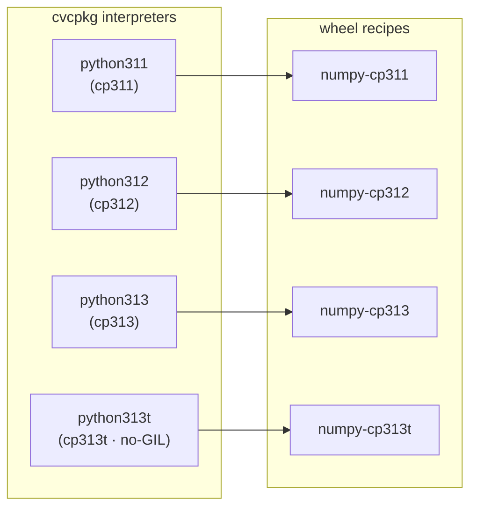

# Python wheels — the per-interpreter matrix (Phase 7)

cvcpkg ships CPython itself as recipes. Phase 7 closes the loop: cvcpkg installs
upstream Python wheels **into that same prefix**, so one activatable prefix carries
both the native C/C++ libraries (`find_package`-able) and a complete, pinned Python
environment (`import`-able).

A wheel package is therefore not one recipe — it is a **matrix**, one recipe per
interpreter ABI cvcpkg ships:



Each column resolves through the ordinary `depends` graph — there is no special
"wheel" machinery in the resolver. `numpy-cp313t` simply depends on `python313t`.

The matrix rule is **uniform**: every Python package — pure wheels included —
is a set of `-cp311/-cp312/-cp313/-cp313t` column recipes, each depending on
its interpreter and on its dependencies' matching columns, each installing
only into its own `lib/pythonX.Y[t]/site-packages`. What varies per package is
only which wheel backs a column (pure / abi3 / exact `cpNN` / from-source). A
column is emitted **only when its whole dependency closure has that column**
(`tools/gen_python_recipes.py` computes the fixpoint and logs every pruned
column), so the catalog never promises an import that cannot work. There is no
cross-interpreter copy fan-out: the graph, not a build-time copy step, decides
what each interpreter can import — and adding a future `python314` is a new
column, never a rebuild of existing ones.

## Source types

Two `source.type` values, additive to `schema_version: 1`:

| type | what it is | fetch behaviour |
|---|---|---|
| `python_wheel` | a pinned prebuilt wheel (numpy, torch, …) | downloaded + sha256-verified, **not** unpacked |
| `python_sdist` | a pinned sdist built with build-isolation off | downloaded + sha256-verified + extracted |

**cvcpkg fetches and verifies the artifact itself** rather than leaving it to each
recipe's build script. This differs deliberately from the older `prebuilt` recipes,
where the script hand-rolls a `curl` and the version is duplicated between
`recipe.yaml` and the script — several of those verify no hash at all. Here the pin
is enforced in one place, and a `python_wheel` artifact with no `sha256` is a hard
error, not a warning. The build script then installs from the on-disk file with
`--no-index`, which is what makes air-gapped installs work.

`python_wheel` keeps the wheel's upstream filename, because pip parses the
compatibility tags out of the name.

## The `python:` block

```yaml
python:
  interpreter: python313t     # cvcpkg recipe this artifact targets
  abi: cp313t                 # wheel ABI tag; trailing 't' = free-threaded
  manylinux_min: manylinux_2_28
  build_isolation: false      # python_sdist only
  build_requires: []          # pinned backends when isolation is off
```

The builder exports `CVC_PYTHON_ABI`, `CVC_PYTHON_INTERPRETER`, and (for
free-threaded ABIs) `PYTHON_GIL=0` into the build environment.

### Stable-ABI (`abi3`) wheels share one artifact across columns

`abi` also accepts **`abi3`**. A stable-ABI wheel is version-independent from
its `cpNN` floor upward, so the *same artifact* backs the `cryptography-cp311`,
`-cp312` and `-cp313` columns — the columns still exist as separate recipes
(each with the honest `pythonNNN` dependency), they just pin identical bytes.

`abi3` is never free-threaded: **the 3.13 free-threaded build does not
implement the stable ABI**, so an abi3 wheel never backs a `-cp313t` column.
That column exists only when upstream ships an exact `cp313-cp313t` wheel
(`bcrypt` does; `cryptography` at our pin does not, so there is no
`cryptography-cp313t` — and everything depending on it prunes its `cp313t`
column too). `PythonSpec.free_threaded` is correspondingly false for `abi3`.

## Platform-keyed artifacts

A wheel is per-platform, so artifacts reuse the same `platform-arch` keyed map the
`prebuilt` type already uses:

```yaml
source:
  type: python_wheel
  artifacts:
    linux-x86_64:
      url: https://files.pythonhosted.org/packages/…/numpy-2.4.6-cp313-cp313t-manylinux_2_28_x86_64.whl
      sha256: "ede83e07a75dd06bc501566c1eca2afc0d61677c1472ac9ad93fdee6e638a48d"
    windows-x86_64:
      url: …
      sha256: "…"
```

A pure-Python column pins the single `py3-none-any` wheel under the `any` key
and builds as `platform: any` / `noarch` (see [source-recipes.md](source-recipes.md)) —
built once, installable on every platform, but still one recipe **per
interpreter column**, because its dependency edge (`python312` vs `python313t`)
and its install dir (`lib/python3.12/` vs `lib/python3.13t/`) are per-column.

## Writing a wheel recipe

```bash
#!/usr/bin/env bash
set -euo pipefail
. "$(dirname "$0")/../_common/python-wheel.sh"

cvc_pip_install_wheel
cvc_python_check "
import numpy as np
assert np.arange(12).sum() == 66
"
```

`cvc_pip_install_wheel` installs with `--no-deps --no-index --prefix`. `--no-deps` is
deliberate: transitive Python dependencies are themselves cvcpkg recipes resolved by
the `depends` graph, so pip must not go behind cvcpkg's back and pull an unpinned
copy. Windows recipes use `python-wheel.ps1` (`Invoke-CvcPipInstallWheel`,
`Invoke-CvcPythonCheck`).

## The no-GIL guarantee

The `cp313t` column is the flagship. For a free-threaded ABI, `cvc_python_check`
does not merely run the snippet — it first asserts that the GIL is genuinely
**disabled** at runtime:

```python
if not sysconfig.get_config_var('Py_GIL_DISABLED'):
    sys.exit('interpreter is not a free-threaded build')
if sys._is_gil_enabled():
    sys.exit('GIL was re-enabled at runtime; no-GIL support unproven')
```

That second check is the substance of the claim. CPython will silently **re-enable**
the GIL at import time if a loaded extension is not marked free-threading-safe. A
cp313t wheel that only imports under a re-enabled GIL has not been shown to work
without one — so without this assertion cvcpkg would be publishing an unproven
guarantee. Failing the build there is the point: it means every published cp313t
package is *demonstrated* GIL-disabled on every platform we publish for, which
general-purpose indexes cannot claim.

The checks run under `-X gil=0` with `PYTHON_GIL=0`, on the real builder fleet, per
platform.

## Refreshing pins

Wheel pins are upstream filenames + hashes, so they are refreshed per numpy release.
Note that interpreter coverage moves: **numpy 2.5.x dropped both `cp311` and
`cp313t`** (its free-threaded column is now `cp314t`). The matrix is currently
pinned to **numpy 2.4.6**, the newest release that still carries all four ABIs
cvcpkg ships. Bumping the pin requires either a numpy that covers every shipped
interpreter, or shipping a `python314t` recipe first.
