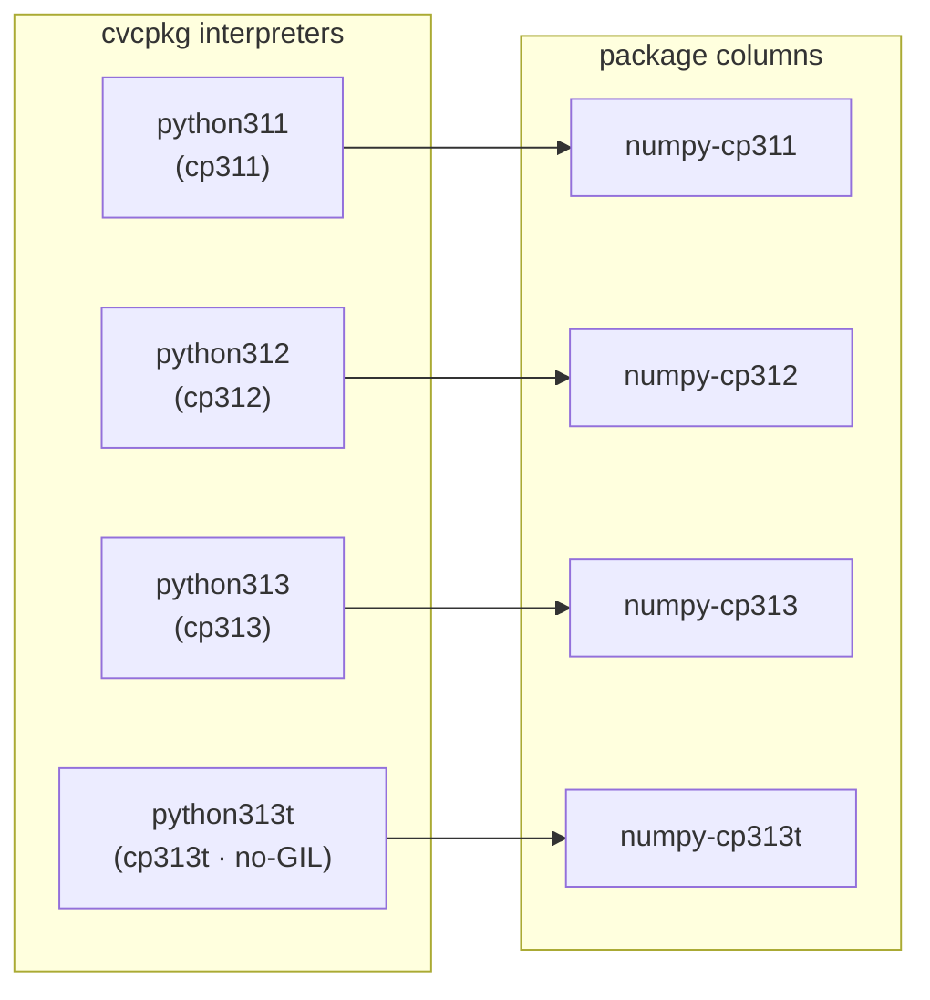

# Python wheels — the per-interpreter matrix (Phase 7)

cvcpkg ships CPython itself as recipes. Phase 7 closes the loop: cvcpkg installs
Python packages **into that same prefix**, so one activatable prefix carries
both the native C/C++ libraries (`find_package`-able) and a complete, pinned Python
environment (`import`-able). Most columns are now **built from source** from the
pinned PyPI sdist — see [from-source columns](#from-source-columns-the-default);
a documented minority stay pinned prebuilt wheels.

A Python package is therefore not one recipe — it is a **matrix**, one recipe per
interpreter ABI cvcpkg ships:



Each column resolves through the ordinary `depends` graph — there is no special
"wheel" machinery in the resolver. `numpy-cp313t` simply depends on `python313t`.

The matrix rule is **uniform**: every Python package — pure packages included —
is a set of `-cp311/-cp312/-cp313/-cp313t` column recipes, each depending on
its interpreter and on its dependencies' matching columns, each installing
only into its own `lib/pythonX.Y[t]/site-packages`. What varies per package is
only what backs a column: a from-source sdist build (the default today), or a
pure / abi3 / exact-`cpNN` prebuilt wheel. A column is emitted
**only when its whole dependency closure has that column**
(`tools/gen_python_recipes.py` computes the fixpoint and logs every pruned
column), so the catalog never promises an import that cannot work. There is no
cross-interpreter copy fan-out: the graph, not a build-time copy step, decides
what each interpreter can import — and adding a future `python314` is a new
column, never a rebuild of existing ones.

## Source types

A column is backed one of two ways:

| shape | `source.type` | fetch behaviour |
|---|---|---|
| from source (the default) | `tarball` | the pinned PyPI **sdist**, downloaded + sha256-verified + extracted (`strip_components: 1`); the build script compiles the wheel itself |
| prebuilt wheel (fallback) | `python_wheel` | a pinned upstream wheel (torch, the `nvidia-*-cu12` family, …), downloaded + sha256-verified, **not** unpacked |

**cvcpkg fetches and verifies the artifact itself** rather than leaving it to each
recipe's build script. This differs deliberately from the older `prebuilt` recipes,
where the script hand-rolls a `curl` and the version is duplicated between
`recipe.yaml` and the script — several of those verify no hash at all. Here the pin
is enforced in one place, and a `python_wheel` artifact with no `sha256` is a hard
error, not a warning. The build script then installs from the on-disk file with
`--no-index`, which is what makes air-gapped installs work.

`python_wheel` keeps the wheel's upstream filename, because pip parses the
compatibility tags out of the name.

An honest footnote: the schema and the builder also implement a third value,
`python_sdist` (a sha256-required sdist whose URL may be platform-keyed, fetched
like a tarball). **No recipe in the tree currently uses it.** Every from-source
Python recipe — hand-written and generated alike — pins the sdist as a plain
`type: tarball`, which is also the shape `tools/gen_python_recipes.py` emits.
Treat `python_sdist` as reserved until a recipe actually adopts it.

## From-source columns (the default)

The matrix started as prebuilt-wheel recipes; it has since flipped. As of this
writing, 446 of the 555 `python:`-block recipes in `recipes/` build from the
pinned PyPI sdist and 109 remain `python_wheel` — each fallback for a reason the
generator prints when it decides it (see below). The rationale: a PyPI wheel is
somebody else's compiled artifact, linked against libraries cvcpkg did not
build. Building from the sdist means the bundle contains only things cvcpkg
built — and it is the only path to platforms PyPI ships no wheels for.

The build shape (see `recipes/h5py-cp311/build.sh` or any generated
`build.sh`):

```bash
"${PY}" -m pip wheel --no-build-isolation --no-deps --no-index \
    --wheel-dir "${WHEELHOUSE}" "${CVC_SOURCE_DIR}"
"${PY}" -m pip install --no-index --no-deps --no-compile \
    --prefix "${CVC_INSTALL_DIR}" "${WHEEL}"
```

`--no-build-isolation` means pip does not download the PEP-517 backend into a
throwaway venv (non-hermetic, and impossible offline): the backend must already
be importable. Backends are themselves cvcpkg columns (`cython-cp311`,
`meson-python-cp311`, `flit-core-cp311`, …) declared as `depends.build` edges —
they land in `CVC_BUILD_PREFIX`, a different prefix from the one
`cvc_python_exe`'s interpreter imports, so each build script bridges them onto
the import path via `PYTHONPATH`. The result is still a real wheel installed by
pip (proper `dist-info`/`RECORD`/`METADATA`), so a consumer's later
`pip install <other>` coexists and pip's resolver sees the package as satisfied.

Two kinds of from-source column exist:

- **Generated** (the bulk): emitted by `tools/gen_python_recipes.py`, which
  reads each sdist's `[build-system] requires` and wires the backend edges.
- **Hand-written**: `numpy`, `h5py`, `cffi`, `pyyaml`, `markupsafe`,
  `greenlet`, `pillow`. These carry native-library edges the generator cannot
  infer — numpy links cvcpkg's `libopenblas.so.0` by soname, h5py links
  `libhdf5.so.310` — plus `$ORIGIN`-relative RUNPATH passes and per-platform
  gates. No auditwheel-vendored `*.libs/` directory ships; the native runtime
  is the corresponding cvcpkg package, resolved out of the same activated
  prefix. The generator never emits or prunes these families; it declares
  `numpy` in `HANDWRITTEN_DEP_BASES` so generated packages (matplotlib,
  gymnasium, …) can depend on its columns, which are read from disk.

For **new** packages, from-source is the generator default — pure `py3-none-any`
packages included, because even a pure wheel is a third-party binary artifact.
A column falls back to `python_wheel` only for a documented reason
(`source_mode_for` in `tools/gen_python_recipes.py`):

1. the package is on the `_PREBUILT_ONLY` list — `nvidia-*-cu12`, `torch`,
   `triton`: binary redistributables with no buildable source;
2. PyPI publishes no sdist for the pinned version;
3. a required PEP-517 backend has no cvcpkg recipe yet;
4. the operator asked for it (`--source-mode wheel` / `--pure-policy wheel`).

## The `python:` block

```yaml
python:
  interpreter: python313t     # cvcpkg recipe this artifact targets
  abi: cp313t                 # wheel ABI tag; trailing 't' = free-threaded
  manylinux_min: manylinux_2_28
  build_isolation: false      # python_sdist only
  build_requires: []          # pinned backends when isolation is off
```

The builder exports `CVC_PYTHON_ABI`, `CVC_PYTHON_INTERPRETER`, and (for
free-threaded ABIs) `PYTHON_GIL=0` into the build environment.

### Stable-ABI (`abi3`) columns share one pin

`abi` also accepts **`abi3`**. A stable-ABI artifact is version-independent
from its `cpNN` floor upward, so the `cryptography-cp311`, `-cp312` and
`-cp313` columns pin identical bytes — the columns still exist as separate
recipes (each with the honest `pythonNNN` dependency). When cryptography was a
prebuilt wheel that meant one shared `.whl`; today the three columns pin the
identical **sdist** and each compiles its own stable-ABI wheel (pyo3's `abi3`
feature / `Py_LIMITED_API`), so `abi: abi3` still describes what is built.

`abi3` is never free-threaded: **the 3.13 free-threaded build does not
implement the stable ABI**, so an abi3 artifact never backs a `-cp313t`
column. That column exists only when the package can genuinely target the
free-threaded ABI (`bcrypt-cp313t` builds an exact `cp313t` extension;
`cryptography` at our pin cannot, so there is no `cryptography-cp313t` — and
everything depending on it prunes its `cp313t` column too).
`PythonSpec.free_threaded` is correspondingly false for `abi3`.

## Platform-keyed artifacts (`python_wheel`)

A prebuilt wheel is per-platform, so artifacts reuse the same `platform-arch`
keyed map the `prebuilt` type already uses (this is `recipes/torch-cp311`):

```yaml
source:
  type: python_wheel
  artifacts:
    linux-x86_64:
      url: https://download.pytorch.org/whl/cpu/torch-2.8.0%2Bcpu-cp311-cp311-manylinux_2_28_x86_64.whl
      sha256: "cb06175284673a581dd91fb1965662ae4ecaba6e5c357aa0ea7bb8b84b6b7eeb"
    windows-x86_64:
      url: https://download.pytorch.org/whl/cpu/torch-2.8.0%2Bcpu-cp311-cp311-win_amd64.whl
      sha256: "7631ef49fbd38d382909525b83696dc12a55d68492ade4ace3883c62b9fc140f"
```

A pure-Python column that stays on a prebuilt wheel pins the single
`py3-none-any` wheel under the `any` key. Pure columns of either shape build as
`platform: any` / `noarch` (see [source-recipes.md](source-recipes.md)) —
built once, installable on every platform, but still one recipe **per
interpreter column**, because its dependency edge (`python312` vs `python313t`)
and its install dir (`lib/python3.12/` vs `lib/python3.13t/`) are per-column.

## Writing a prebuilt-wheel recipe

```bash
#!/usr/bin/env bash
set -euo pipefail
. "$(dirname "$0")/../_common/python-wheel.sh"

cvc_pip_install_wheel
cvc_python_check "
import torch
a = torch.arange(12, dtype=torch.float64).reshape(3, 4)
assert (a @ a.T).shape == (3, 3)
"
```

`cvc_pip_install_wheel` installs with `--no-deps --no-index --prefix`. `--no-deps` is
deliberate: transitive Python dependencies are themselves cvcpkg recipes resolved by
the `depends` graph, so pip must not go behind cvcpkg's back and pull an unpinned
copy. Windows recipes use `python-wheel.ps1` (`Invoke-CvcPipInstallWheel`,
`Invoke-CvcPythonCheck`).

## The no-GIL guarantee

The `cp313t` column is the flagship. For a free-threaded ABI, `cvc_python_check`
does not merely run the snippet — it first asserts that the GIL is genuinely
**disabled** at runtime:

```python
if not sysconfig.get_config_var('Py_GIL_DISABLED'):
    sys.exit('interpreter is not a free-threaded build')
if sys._is_gil_enabled():
    sys.exit('GIL was re-enabled at runtime; no-GIL support unproven')
```

That second check is the substance of the claim. CPython will silently **re-enable**
the GIL at import time if a loaded extension is not marked free-threading-safe. A
cp313t wheel that only imports under a re-enabled GIL has not been shown to work
without one — so without this assertion cvcpkg would be publishing an unproven
guarantee. Failing the build there is the point: it means every published cp313t
package is *demonstrated* GIL-disabled on every platform we publish for, which
general-purpose indexes cannot claim.

The checks run under `-X gil=0` with `PYTHON_GIL=0`, on the real builder fleet, per
platform.

## Refreshing pins

A from-source column's pin is the sdist tarball URL + sha256; a prebuilt
column's pin is the wheel's upstream filename + hash. Either way the pin is
refreshed per upstream release, and interpreter coverage still moves with
upstream: **numpy 2.5.x dropped both `cp311` and `cp313t`** (its free-threaded
target is now `cp314t`), and building from the sdist does not extend a release
to interpreters upstream no longer supports. The numpy matrix is currently
pinned to **numpy 2.4.6**, the newest release that still covers all four ABIs
cvcpkg ships. Bumping the pin requires either a numpy that covers every shipped
interpreter, or shipping a `python314t` recipe first.
