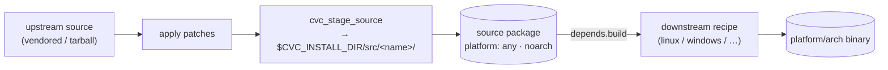

# Source Recipes (File-Artifact Packages)

Some cvcpkg packages are **just source files** — a header-only tree, a
vendored source drop, a patch set, a data blob — with no compilation.
cvcpkg publishes and consumes these directly, reusing the existing recipe
infrastructure rather than introducing a separate recipe *type*.

## What makes a recipe a "source recipe"

A source recipe is an ordinary recipe that **announces it is a file
artifact**:

- **`platform: any`** — source is valid everywhere, so it is built **once**
  and served to every platform.  Its architecture is `noarch` automatically.
- **No toolchain / no compilation** — the build script only *stages* the
  (patched) source tree; the output archive *is* the source.
- The only processing allowed is **patches** (applied before staging) and
  optional packaging scripts.

There is **no `source` recipe type** — it is a normal recipe whose build
matrix is entirely `platform: any` and whose build step stages files.

## Canonical layout

A source recipe stages its tree under a stable, discoverable path:

```
$CVC_INSTALL_DIR/src/<recipe-name>/
```

The `_common/stage-source.sh` (and `stage-source.ps1`) helper does this:

```bash
#!/usr/bin/env bash
set -euo pipefail
. "$(dirname "$0")/../_common/stage-source.sh"
cvc_stage_source                 # stage the whole (patched) source tree
# or: cvc_stage_source include src   # only these subpaths
```



## Downstream consumption

A platform/arch recipe consumes a source recipe by declaring a **build
dependency** on it.  The builder builds the source recipe first and merges
it into the shared prefix, so the consumer finds the staged tree at
`$CVC_DEPS_PREFIX/src/<name>/`:

```yaml
# downstream recipe.yaml
depends:
  build:
    - mathsrc          # the source recipe
build:
  matrix:
    - platform: linux
      script: build.sh
```

```bash
# downstream build.sh
. "$(dirname "$0")/../_common/stage-source.sh"
SRC="$(cvc_source_dir_of mathsrc)"      # $CVC_DEPS_PREFIX/src/mathsrc
cc -I "$SRC" -o "$CVC_INSTALL_DIR/bin/app" "$CVC_SOURCE_DIR/main.c" "$SRC/impl.c"
```

This gives a clean split: **one authoritative, checksummed source package**
feeds **many binary variants** — reproducible, mirror-friendly, and built
without re-fetching upstream for every platform.

## Why this shape

- **Reuses existing infrastructure** — the `platform: any` build class
  (already handled in the builder's build-order and matrix logic), vendored
  /`prebuilt` source staging, and the normal `depends` graph.  No new schema
  concepts.
- **Built once** — an `any/noarch` package is not fanned out per platform.
- **Deduplicated source of truth** — downstream recipes never each vendor
  their own copy of a shared source tree.

## Canonization

The end-to-end contract is locked in by
[`tests/integration/test_source_recipe_workflow.py`](../tests/integration/test_source_recipe_workflow.py):
it builds a source recipe (`any`), then a downstream recipe that consumes the
staged source and **compiles a real binary**, and asserts the binary runs —
so the source→binary workflow cannot silently regress.
